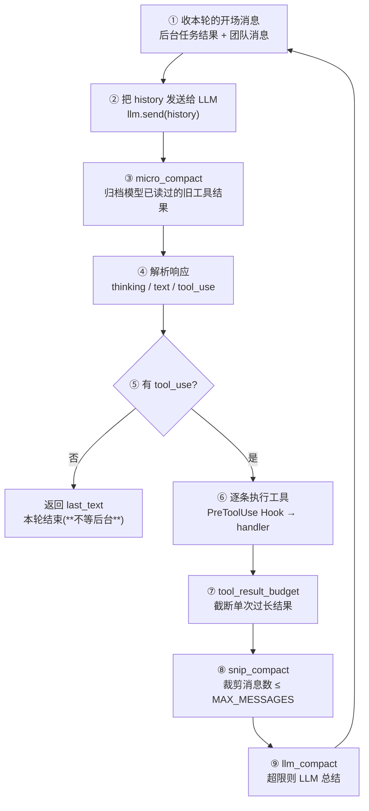

# ClaudeMini 项目报告

> 一个借鉴 Claude Code 思路实现的迷你代码 Agent。核心能力:**四层上下文压缩** + **长期记忆(模型自主行为)** + **后台任务与定时任务(跑在别的线程上,出故障要能被发现)** + **Agent 团队(多 agent 常驻协作)** + **MCP(把外部进程的工具并进来)**。
> 本文档面向第一次接触该项目的人,目标是快速建立对**实现、架构、特点**的整体认知。

- 报告日期:2026-08-26(2026-09-06 更新:新增记忆子系统,记忆=模型自主行为;2026-09-15 更新:新增任务规划/后台任务/定时任务三个子系统并删除旧的 todo 机制,见 §6.9–§6.11;2026-09-18 更新:新增 **Agent 团队**子系统 §6.12 与 **MCP** 接入 §6.13,补上此前遗漏的 `write_file` 工具;**2026-09-19 更新:定时任务从「唤醒主 agent 执行」改为「派进独立后台 agent 执行」(`agent_runner.py` → `dispatcher.py`),`BackgroundManager` 泛化成 `TaskRunner` 并补上看门狗与 `bg_status`,主对话补上失败兜底与 LLM 调用超时,见 §4.4 / §6.9 / §6.11**)
- 代码规模:18 个 Python 源文件(main / claude / llm / TOOLS / compact / HOOKS / PERMISSIONS / PROMPT / skill / memory / task / bash_exec / task_runner / corn_job / dispatcher / message / team / mcp),另有 1 个**不入库**的本地测试服务器 `mcp_demo_server.py`(见 §6.13)
- 运行环境:Windows / Python 3.13
- 模型接入:MiniMax-M2.7(通过 Anthropic 兼容 API)

---

## 0. 速览(30 秒版)

ClaudeMini 是一个**命令行交互的代码 Agent**:用户在终端提问,它通过一个「发送 → 看模型回复 → 执行工具 → 把结果回填 → 再发送」的循环持续工作,直到模型认为任务完成。

它不是用 LangChain 之类的框架拼出来的,而是**从零手写了一个 agent 主循环 + 工具注册表 + 事件(Hook)系统 + Skill 加载器**,并自己实现了**四层上下文压缩策略**来控制上下文增长。

- **入口**:`main.py`
- **Agent 核心**:`claude.py`(`ClaudeMini` 类)
- **模型通信**:`llm.py`
- **工具**:`TOOLS.py` 声明 24 个工具 Schema(计算器 / bash / 读写文件 / 5 个 `task_*` / 5 个 `job_*` / `subagent` / `bg_status` / load_skill / 2 个记忆 / 5 个团队),处理函数一部分随注册表出厂(`create_default_registry`),一部分是各功能模块的工厂(`task.create_task_handlers` / `memory.create_handlers`),其余是 `ClaudeMini` 的方法——统一由 `claude.py.__init__` 注册
- **上下文压缩**:`compact.py`(`CompactManager`)
- **记忆**:`memory.py`(`MemoryManager`)+ `memory/` 目录(长期 / 经验 / 快照)
- **任务规划**:`task.py`(`Task` + `TaskStore`)+ `.task/tasks.json`(带依赖的任务图)
- **后台任务**:`task_runner.py`(`TaskRunner`:统一承接 bash 与后台 agent)+ `bash_exec.py`(Git Bash 定位与执行)+ `bg_status` 工具 + 看门狗 `reap_dead`(§6.11)
- **定时任务**:`corn_job.py`(`Job` + `Scheduler`)+ `dispatcher.py`(`JobDispatcher` 派进独立后台 agent 执行)+ `.task/jobs.json` 任务库(§6.9)
- **Agent 团队**:`message.py`(消息总线)+ `team.py`(成员注册表 `TeamRuntime`)+ `claude.py` 的 `run_forever` / 下线握手——成员是**常驻**的独立 agent,各占一条线程(§6.12)
- **MCP**:`mcp.py`(`MCPClient` + `MCPManager`)+ `mcp_servers.json`(服务器清单)——用 stdio 连外部进程,把它的工具并进本项目的工具表(§6.13)
- **Hook 事件系统**:`HOOKS.py` + 命令权限 `PERMISSIONS.py`
- **Skill 加载**:`skill.py`
- **提示词**:`PROMPT.py`(含团队成员与下线确认两份专用提示词)

**一句话特点**:它把 Claude Code 里那些「隐性机制」——上下文压缩、权限钩子、任务图规划、后台任务、子 agent、按需加载 skill、定时任务派发、**多 agent 团队协作**、**外部工具协议**——显式地拆成了一个个可以看懂、可以改的 Python 模块。并且专门为「**跑在别的线程上的东西出故障时,主 agent 会不会发现**」写了一整套机制(看门狗 + 通知 + 名额归还 + 超时,见 §4.4 / §6.11)。

---

## 1. 项目概述

### 1.1 这个项目是什么

ClaudeMini 是一个 **Mini Agent / Agent 教学与实验项目**。作者用 Python 手写了一个具备下述能力的 agent:

1. **工具调用循环**——模型可以调用 `bash`、`read_file`、`write_file`、`calculator` 等工具并拿到结果;
2. **任务规划**——用 `task_create` / `task_list` / `task_claim` / `task_complete` 维护一张**带依赖的**任务图(见 §6.10);
3. **子 Agent(SubAgent)**——主 agent 可以把任务拆给一个全新的 `ClaudeMini` 实例去独立执行;
4. **Skill 按需加载**——扫描 `SKILLS/` 目录,把 skill 目录清单写进系统提示词,模型需要时通过 `load_skill` 工具读取完整内容;
5. **后台任务**——长命令和整整一个子 agent 都能丢到后台线程跑,agent 不阻塞;结果在下一次循环开头以 `<task_notification>` 注入,线程要是没写出结果就没了,由**看门狗**补一条「失败」通知(见 §6.11);
6. **上下文压缩**——用四层策略防止上下文无限膨胀;
7. **长期记忆(模型自主)**——模型按需**自主调用** `write_memory` / `recall_memory` 读写经验记忆;整个会话结束后按文件数阈值做一次 **LLM 驱动的去重整理**(见 §6.8);
8. **定时任务**——用 cron 五段式(`schedule`)或具体时刻(`once_at`)登记任务,调度器每分钟扫描、到点入队,`JobDispatcher` 把任务派进一个**独立的后台 agent** 执行(不经过主 agent,见 §6.9);
9. **Agent 团队**——用 `team_spawn` 拉起**常驻**团队成员(各自一条线程、一个独立的 `ClaudeMini` 实例),成员之间通过消息总线直接通信;`.run_forever()` 让成员在空闲阻塞与工作之间循环,下线要走一次**双方确认的握手**(见 §6.12);
10. **MCP(Model Context Protocol)**——用 stdio 把外部进程当工具服务器拉起来,把它的工具并进本项目的工具表;配错的服务器只让 agent 少几个工具,不会挡住启动(见 §6.13)。

### 1.2 当前状态

「暂时只实现到上下文压缩」是 2026-08-26 的判断,此后项目又长出了几块,也重写了一块:

- 四层压缩(`tool_result_budget` / `micro_compact` / `snip_compact` / `llm_compact`)**全部打通**;
- **记忆子系统**(2026-09-06 设计定型):记忆是 **agent 行为** —— 不再每轮强制提取,而是由模型自主判断何时调用 `write_memory` / `recall_memory`;去重整理 `consolidate` 改为 **LLM 驱动**,在**整个会话结束**时按文件数阈值触发(详见 §6.8);
- **任务规划重写**(2026-09):原本是内存态 todo 列表(`TaskManager` 单例 + `task_write` 工具 + 主循环里的 `<reminder>` 提醒),现已换成 `task.py` 的**带依赖任务图**并落盘 `.task/tasks.json`。旧的 `TaskManager` / `task_write` / `<reminder>` 机制**已从代码中删除**,本文档相应内容也已替换(详见 §6.10);
- **后台任务**(2026-09):`bash` 工具支持 `is_background`,把长命令丢进守护线程,结果以 `<task_notification>` 在下一轮循环开头注入(详见 §6.11);2026-09-19 泛化为 `task_runner.py`,同一个执行器也承接**后台子 agent**,并发上限 3,并补上了看门狗与 `bg_status`;
- **定时任务子系统**(2026-09-15 设计定型,**2026-09-19 重写执行侧**):`Scheduler` 只做「扫描 + 入队」;判定机制从「此刻是否匹配 cron」改为「`next_run` 欠不欠一次执行」,因此进程没运行的那段时间不再把任务静默丢掉(补跑一次,详见 §6.9)。执行侧原本是 `AgentRunner` 唤醒**主 agent**、由模型调 `job_take` 领取并执行——这条路径的问题是把「任务执行」塞进了用户的对话里,且**模型一旦忘了汇报,任务就永久停在 running**。现在换成 `dispatcher.py` 把任务派进一个独立的后台 agent,结果由代码汇报回 `Scheduler`;`job_take` / `job_update_status` 两个工具已随旧设计一起删除(见 §6.9);
- **Agent 团队子系统**(2026-09-17 设计定型):`message.py` 提供消息总线、`team.py` 管理成员身份与状态、`claude.py` 的 `run_forever` 是成员的生命周期。**控制面与数据面分开**是这套设计的骨架——生命周期消息(下线请求/确认)由代码处理、绝不进 LLM,只有业务消息才交给模型。下线握手**必须有上限**,这条是压测逼出来的补丁(见 §6.12);
- **MCP 接入**(2026-09-18):`mcp.py` 手写了 stdio 传输的 JSON-RPC 客户端,`ClaudeMini` 启动时读 `mcp_servers.json` 把外部服务器的工具并进工具表。这是本项目**第一次让工具来源超出自己的代码**(见 §6.13);
- **「故障可见性」这一轮**(2026-09-19):这一轮的改动都指向同一个问题——**跑在别的线程上的东西出故障时,主 agent 会不会发现**。四条:(1) 看门狗 `reap_dead`,把「线程没了、结果却没留下」补成一条**失败结果**塞进结果邮箱,于是主 agent 顺着**现成的** `has_completed()` → `<task_notification>` 路径就被叫醒了,主循环的唤醒条件一个字都没改(§6.11);(2) `bg_status` 工具,让模型能主动问「我起的那些后台任务现在怎么样了」(§6.11);(3) `TaskRunner` 的 `except BaseException`,线程里任何从 Python 层抛出来的异常都收成失败结果,而不是让线程无声无息地消失;(4) **LLM 调用超时**,因为 SDK 的默认值是读超时 600 秒 × 重试 3 次 = **最坏 30 分钟**,而那种卡死的线程 `is_alive()` 还是 True,**看门狗看不见它** —— 加超时是把这种「不可发现」变成「抛异常、然后走前三条已经修好的路」(§6.2)。配套地,主对话的两处 `run()` 调用加上了兜底(`main.py` 的 `run_turn`),否则「卡 30 分钟」会变成「当场带 traceback 打死进程」。

### 1.3 设计取向

从代码注释、命名(中文变量名、`slient`、`compact_mannager` 等拼写)、以及大量 `try/except` 返回字符串而不是抛异常的风格看,这是一个**教学/实验性质、快速迭代**的项目,重点是「机制齐全、可读、易改」,而非工程化打磨。

---

## 2. 目录结构

```
claude_mini/
├── main.py              # 入口:用户输入循环 + Hook 注册 + JobDispatcher 启动 + 会话末记忆整理触发
├── claude.py            # ClaudeMini 类:agent 主循环 + 子 agent/团队成员编排 + 全部工具注册 + 下线握手
├── llm.py               # LLM 封装:与 API 通信、历史总结、调用超时、异常翻译(explain_error)
├── TOOLS.py             # 工具 Schema 声明 + 处理函数 + ToolRegistry
├── compact.py           # CompactManager:四层上下文压缩
├── memory.py            # MemoryManager:长期/经验记忆读写、索引、LLM 去重整理
├── corn_job.py          # Job + Scheduler:定时任务模型、cron 解析、扫描入队(§6.9)
├── dispatcher.py        # JobDispatcher:把队列里的定时任务派进独立后台 agent 执行(§6.9)
├── task.py              # Task + TaskStore + create_task_handlers 工厂:多步任务规划(依赖图 + 工具包装)
├── bash_exec.py         # bash 执行封装(resolve_bash 定位 Git Bash、execute_bash 执行)
├── task_runner.py       # TaskRunner:统一承接后台 bash 与后台 agent + 看门狗 reap_dead(§6.11)
├── message.py           # Message + MessageBus:团队消息总线(存储转发,纯基础设施,§6.12)
├── team.py              # Member + TeamRuntime:成员身份(ID)与生命周期状态、控制消息类型(§6.12)
├── mcp.py               # MCPClient + MCPManager:stdio 连外部 MCP 服务器并并入工具(§6.13)
├── mcp_demo_server.py   # 本地测试用的最小 MCP 服务器(echo/add/now)。**不入库**,见 §6.13
├── mcp_servers.json     # MCP 服务器清单(§6.13)
├── HOOKS.py             # 事件系统(仿 Claude Code 的 hook 事件)
├── PERMISSIONS.py       # bash 命令权限:DENY / ASK / ALLOW
├── PROMPT.py            # SYSTEM_PROMPT / SUBAGENT_PROMPT / TEAM_MEMBER_PROMPT / OFFLINE_CONFIRM_PROMPT
├── skill.py             # SkillLoader:扫描 SKILLS/ 并加载 SKILL.md
├── SKILLS/              # skill 目录(每个子目录一个 SKILL.md)
│   ├── say_hello/SKILL.md
│   └── security-review/SKILL.md
├── .env                 # 配置(API key / 模型 / 压缩阈值 / 记忆阈值等)。**永不入库**
├── .env.example         # 脱敏模板(密钥位留空),入库
├── .gitignore / .gitattributes   # 忽略规则 / 二进制标注(见 §10.3)
├── 版本控制.md          # git 日常用法与回退手册
├── .task/               # 运行时任务库(不随代码提交)
│   ├── jobs.json        #   定时任务库(§6.9)
│   └── tasks.json       #   任务规划库
├── memory/              # 记忆库(运行时读写,不随代码提交)
│   ├── long_term/       #   user.md / soul.md / project.md → 只读注入 system prompt
│   ├── experience/      #   经验记忆 *.md(frontmatter + index.json)
│   ├── temp/            #   预留
│   └── backups/         #   consolidate 前的快照 snapshot_<ts>(保留最近 N 份)
├── tool_result/         # 过长工具结果的落盘目录(运行时生成,不随代码提交)
├── transcript           # 消息数量压缩时的归档文件(运行时生成,不随代码提交)
├── __pycache__/         # 编译缓存(含一个已删除源文件的 claude_debug.pyc)
└── PROJECT_REPORT.md    # 本文档
```


---

## 3. 架构总览

### 3.1 分层结构

```
┌──────────────────────────────────────────────────────────────┐
│  main.py            入口层                                    │
│   · 注册 Hook    · 用户输入循环(1 秒超时,顺手收团队消息)      │
└──────────────┬───────────────────────────────────────────────┘
               ▼
┌──────────────────────────────────────────────────────────────┐
│  ClaudeMini  (claude.py)    —— Agent 核心                     │
│   · agent 主循环(run)                                         │
│   · 子 agent 编排(run_subagent / run_subagent_background)     │
│   · 团队成员编排(team_spawn / run_forever / 下线握手)         │
│  ┌──────────┬────────────┬───────────┬─────────────┬───────┐ │
│  │ LLM      │ToolRegistry│SkillLoader│CompactManager│  MCP  │ │
│  │ (llm.py) │ (TOOLS.py) │(skill.py) │ (compact.py)│(mcp.py)│ │
│  └──────────┴────────────┴───────────┴─────────────┴───────┘ │
│  ┌───────────────────────────┐                               │
│  │ TaskRunner (task_runner)  │ ← 后台 bash / 后台 agent /    │
│  │  · 结果邮箱 · 名额 · 看门狗 │   看门狗 reap_dead            │
│  └───────────────────────────┘                               │
└──┬───────────────┬───────────────────────┬───────────────────┘
   ▼               ▼                       ▼
MiniMax M2.7   HOOKS.py ──▶          MessageBus(message.py)
(Anthropic     PERMISSIONS.py              ▲
 兼容接口)     PROMPT.py                   │ 存储转发
                                    ┌──────┴────────┐
                                    │  成员 A 线程  │  ← 各自一个 ClaudeMini 实例
                                    │  成员 B 线程  │     共享 bus / TeamRuntime /
                                    └───────────────┘      MCP / TaskStore / Scheduler

   MCPManager ──stdio(JSON-RPC)──▶  MCP 服务器子进程(工具来自项目之外)

   JobDispatcher(dispatcher.py)──▶ 定时任务的后台 agent(自己的 ClaudeMini 实例、
         │                          自己的 TaskRunner / 名额 / 独立 history)
         └── 每 5 秒看一眼 Scheduler 的队列:有槽位就派发,结果由代码汇报回 Scheduler
```

> `ClaudeMini` 还持有 **`MemoryManager`**(memory.py),初始化时把 `write_memory` / `recall_memory` 动态注册进 ToolRegistry;长期记忆(`long_term/`)随 system prompt 注入(见 §6.8)。
>
> `ClaudeMini` 还持有 **`Scheduler`**(corn_job.py),初始化时注册 5 个 `job_*` 工具并启动扫描线程;`main.py` 另外启动 **`JobDispatcher`**(dispatcher.py),由它把队列里的任务派进独立的后台 agent 执行。**主 agent 与定时任务之间没有交集**——任务不经过主 agent、不进用户对话、结果由派发器直接汇报回 `Scheduler`(见 §6.9)。
>
> **共享实例清单**(构造时透传,是这一层最要紧的约束):`task_store` / `scheduler` / `message_bus` / `team_runtime` / `mcp` / `task_runner` —— 它们背后分别是「唯一一份任务库」「一把不可复制的锁 + 一条扫描线程」「一条总线」「一张成员表」「一个子进程 + 一条读线程」「一个**结果邮箱**」。**每一份都不能复制**,所以整棵 agent 树(主 agent / 子 agent / 每个团队成员)共享同一批实例(§6.12、§6.13)。`task_runner` 尤其不能各建各的:它自建邮箱,谁自建,谁提交的后台任务就没人读得懂(`claude.py:777`)。

### 3.2 模块职责一句话

| 模块 | 职责 |
|---|---|
| `main.py` | 终端入口。注册权限 Hook,启动 `JobDispatcher`,循环读用户输入(1 秒超时,超时那一趟用来推进团队控制面、**收后台结果、跑看门狗**),调用 `run_turn()`(包一层失败兜底)→ `ClaudeMini.run()` |
| `claude.py` | Agent 大脑。持有 LLM/工具/skill/压缩器/记忆/调度器/消息总线/成员表/MCP/**后台执行器**,驱动主循环;子 agent(前台/后台)入口;`bg_status` 工具;团队成员的生命周期(`run_forever`)与下线握手都在这里 |
| `llm.py` | 与模型 API 通信(`send`)、历史总结(`summarize`/`summarize_history`),以及**调用超时/重试的配置**与把 SDK 异常翻成人话的 `explain_error`(见 §6.2) |
| `TOOLS.py` | 工具的世界。声明全部 24 个工具 Schema(基础工具 + `task_*` + `job_*` + subagent/`bg_status`/load_skill/记忆/团队)、部分内置处理函数、`ToolRegistry` 注册表 |
| `compact.py` | 上下文压缩器,四层策略(见 §5) |
| `memory.py` | 记忆管理器。long_term 只读注入;experience 读写+索引;模型按需 `write_memory`/`recall_memory`;会话末 `consolidate_if_due` LLM 去重整理(见 §6.8) |
| `corn_job.py` | 定时任务。`Job` 模型 + cron 解析 + `Scheduler`(每分钟扫描、入队、状态机、落盘)(见 §6.9) |
| `dispatcher.py` | 定时任务执行者。`JobDispatcher`:每 5 秒看一眼队列,有槽位就把任务派进一个**独立的后台 agent** 执行,结果汇报回 `Scheduler`(见 §6.9) |
| `task.py` | 任务规划。`Task` 三态 + `TaskStore` + `create_task_handlers` 工厂:任务图、依赖检查、认领者校验、落盘(见 §6.10) |
| `task_runner.py` | 后台执行器。`TaskRunner`:统一承接后台 bash 与后台 agent(名额上限 3)、结果邮箱、**看门狗 `reap_dead`**、有界等待(见 §6.11) |
| `bash_exec.py` | bash 执行底座。`resolve_bash` 定位 Git Bash、`execute_bash` 同步执行且永不抛错(见 §6.11) |
| `message.py` | 消息总线。`Message`(带 `kind`)+ `MessageBus`:阻塞收、非阻塞取、只看不取三种读法,纯基础设施不懂消息类型(见 §6.12) |
| `team.py` | 成员注册表。`Member` + `TeamRuntime`:身份(ID 唯一不回收)、四种逻辑状态、控制消息类型常量、线程事实对账(见 §6.12) |
| `mcp.py` | MCP 客户端。`MCPClient`(stdio + JSON-RPC,读线程 + 请求串行锁)+ `MCPManager`(读配置、连服务器、汇总工具、退出收子进程)(见 §6.13) |
| `HOOKS.py` | 事件系统。`PreToolUse`/`PostToolUse`/`Stop` 等事件,`trigger_hooks` 短路返回;权限钩子兼管「非主线程不许弹交互询问」 |
| `PERMISSIONS.py` | 命令权限判定(DENY/ASK/ALLOW),供 `permission_hook` 使用 |
| `skill.py` | 扫描 `SKILLS/` 目录,解析 `SKILL.md` 的 `name`/`description`,按需加载内容 |
| `PROMPT.py` | 四份提示词:主 agent / 子 agent / **团队成员**(`TEAM_MEMBER_PROMPT`)/ **下线确认回合**(`OFFLINE_CONFIRM_PROMPT`)(中文) |

---

## 4. 核心运行流程(agent 主循环)

`ClaudeMini.run(history)`(`claude.py:80`)是全部逻辑的主干,一个标准的 **reAct 风格工具调用循环**:



> **⑤ 那一步以前是分行到「等后台任务」的**:模型停手后 `wait_background_tasks(≤300s)` 阻塞等后台跑完,再 `continue` 收结果。现在改成真异步——立刻返回,后台跑完了由 `main.py` 的输入循环唤醒,在**新一轮**的开头被 `collect()` 领走(`claude.py:248-255`)。好处是这一轮不再被占住 300 秒、超时也不会丢结果;代价是结果通知晚一点到,而且**必须有别的机制把主 agent 叫起来**(见 §4.4)。

### 4.1 逐步说明

1. **收本轮的开场消息**——两件事,都在每轮开头、发模型之前:
   - `task_runner.collect()` 取走已完成的后台任务,用 `build_task_notifications` 包成 `<task_notification>` 文本块拼进 history(`claude.py:196-199`)。**这就是「后台任务跑完会主动告诉模型」的实现**,不需要模型轮询(见 §6.11);
   - `collect_team_messages()` 取走消息总线里发给自己的消息(`claude.py:201-203`)。它是**非阻塞**的:主 agent 由用户输入驱动,不能像团队成员那样挂在 `receive()` 上等消息。取到的普通消息拼成 `<team_message>`,成员上下线通知拼成 `<team_notice>`,控制消息**就地交给代码处理、不进 LLM**(见 §6.12)。

2. **发送**`claude.py:206`——把 `system_prompt` + 完整 `history` 发给模型。`system_prompt` 由 `PROMPT.SYSTEM_PROMPT` + 长期记忆 + **当前时间** + skill 目录清单拼接而成(`claude.py:110-119`)。发送若因 prompt 过长失败,会走一次「压缩后重试」(`claude.py:207-216`)。**这一步也是超时生效的地方**(§6.2)。

3. **压缩「已读」内容**`claude.py:220`——`micro_compact` 在模型看过结果**之后**运行,把最早的(除最近 3 轮)工具结果归档到本地文件,换成一个占位符。因为模型已经消费过这些内容了,归档是安全的。

4. **解析响应**`claude.py:225-237`——响应是 block 列表:
   - `thinking` 块:`show_thinking=True` 才打印;
   - `text` 块:打印到终端并累加进 `final_text`;跨轮另存一份 `last_text`,供最后一轮无正文时兜底。

5. **判断是否结束**`claude.py:248-255`——**本轮没有 tool_use 就直接返回 `last_text`**,不再等后台任务。这是 2026-09-19 的改动:「同一轮内并发」换成了「真异步」,后台结果由输入循环唤醒后在下一轮开头领走(见 §4.4)。

6. **执行工具**`claude.py:257-265` / `excute_tool`(`claude.py:932`):
   - 带 `is_background=True` 的工具(bash / subagent)走**后台分支**(`claude.py:955-963`):交给 `task_runner`,立刻返回一个 `bg_xxxx` 任务号;
   - 其余工具从 `ToolRegistry` 查处理函数,查不到返回 `❌ Unknown tool`;
   - 执行前先触发 `PreToolUse` Hook。**若 Hook 返回非空,则直接把它当作工具输出,不再执行真正的 handler**——这正是权限拦截的实现方式;
   - 否则调用 `handler(**block.input)`。

7. **截断单次结果**`claude.py:268`——`tool_result_budget` 把超过 `MAX_RESULT_LIMIT`(默认 2000 字符)的结果落盘、只留摘要(见 §5.1)。

8. 把 `tool_results` 作为一条 `user` 消息(`type: tool_result`)拼进 history(`claude.py:272-275`)。

9. **裁剪消息数**`claude.py:278`——`snip_compact` 把消息压到 `MAX_MESSAGES`(默认 50)条以内(见 §5.3)。

10. **LLM 总结**`claude.py:281`——`llm_compact` 在历史超 `CONTEXT_LIMIT` 时,让模型总结整段历史并归档(见 §5.5)。

11. 回到步骤 ①。

### 4.2 子 Agent(SubAgent)

`subagent` 工具有**两种**用法,由 `is_background` 决定走哪条路(`claude.py:955-963`):

| | 前台(`run_subagent`,`claude.py:795`) | 后台(`run_subagent_background`,`claude.py:826`) |
|---|---|---|
| 返回 | 阻塞到跑完,返回子 agent 的最后一轮正文 | 立刻返回 `🔄 子agent bg_0002 已在后台执行` |
| 结果怎么回来 | 就是工具返回值 | `<task_notification>` 在下一轮开头注入 |
| 并发 | 不限 | 上限 `MAX_BACKGROUND_AGENTS = 3`,满了**明说**没提交(`claude.py:838-841`) |
| 能不能问用户 | 能(在主线程上跑 hook) | **不能**,所有 ASK 类操作一律被拒(见下) |

前台那条:

- 触发 `BefSubAgent` Hook,打印一个装饰框(`HOOKS.py:49`);
- 用 `SUBAGENT_PROMPT + prompt` 构造一段历史,`new ClaudeMini(slient=False, ...)` 启动一个**全新的 agent 实例**递归运行(`claude.py:803-817`);
- 触发 `AftSubAgent` Hook,返回 `subagent.run()` 的结果(即子 agent 最后一轮的文字输出)。

设计要点:

- 子 agent 是**完整独立实例**,有自己的工具注册表、skill 加载器、压缩器;
- 系统提示词(`PROMPT.py`)明确要求主 agent **不要轻信子 agent 的声明,必须用工具验证结果**;
- **共享与隔离都是显式选择的**,都在 `_build_subagent` 一处:共享 `task_store` / `scheduler` / `task_runner` / `mcp`(它们是**实例**——任务库只有一份、结果邮箱只有一份、锁不能跨实例、MCP 背后是子进程),隔离则只靠一个参数 `role=ROLE_SUBAGENT` —— 这一个身份同时决定了「它没有哪些工具」和「它看哪份提示词」,防递归、防污染共享库都落在它身上(§6.3);
- 被禁用的工具**干脆不存在**:模型看不到(`self.tools` 里没有),运行时也调不动(registry 里没有)。以前的做法是照样注册、但注册成「守卫桩」返回一句中文指引(三个闭包桩工厂 `_memory_guard` / `_job_guard` / `_team_guard`),**桩现已全部删除** —— 留着桩等于留一个「模型看得见、却永远失败」的工具名,而这次改造要消灭的正是这种东西(§6.3)。

> **后台子 agent 有两件事和前台不一样,都不是 bug**(`claude.py:845-852`):① **问不了人**——`permission_hook` 靠「是不是主线程」判断能否弹窗(`HOOKS.py:45`),后台那条线程上所有 ASK 类操作(写 `memory/`、覆盖已有文件、`rm`/`mv`…)一律被拒。这是**决策**:后台任务没人守着屏幕,不该挂在那里等一个可能已经走开的用户;② 打印会和用户输入交错(hook 的 banner 从那条线程打出去)。省掉 hook 是更坏的选择——那等于这个子 agent 在观测面上根本不存在。

> **子 agent 与团队成员的区别**(容易混,一句话):子 agent 是**一次性的**——前台阻塞等它跑完、拿到返回值就销毁,后台则跑完即止;团队成员是**常驻的**——`team_spawn` 立刻返回,成员在自己的线程里活着,等你继续派活,直到走完下线握手。要「一次拿到结果」用 subagent,要「反复来回沟通 / 并行推进」才建团队(详见 §6.12)。

### 4.3 记忆工具与会话末整理(模型自主)

- 主循环**不含任何"每轮提取记忆"**的强制调用。`write_memory` / `recall_memory` 只是注册在工具表里,由**模型自行判断**值不值得记/需不需要查,自主发起调用(记忆是 agent 行为);
- 记忆的**去重/整理不发生在写路径上**:`consolidate` 的触发点在 `main.py` 的**整个会话结束**后(见 §6.8),避免每轮打扰主流程。

### 4.4 后台任务,以及「线程出故障时主 agent 知不知道」

主循环里唯一「不阻塞」的机制。这一节的骨架是三个问题:**怎么跑起来的 / 结果怎么回来 / 出事谁知道**。

**① 怎么跑起来的**——`is_background=True` 的工具不进 handler,而是交给 `task_runner`(`claude.py:955-963`):

- 后台 **bash**:`task_runner.submit_bash(command)`,立刻返回 `bg_0001` 形式的任务号;
- 后台 **子 agent**:`task_runner.submit_agent(work)`,同上,但**占一个名额**(上限 3)。

两者都是 daemon 线程,提交即返回。

**② 结果怎么回来**——三步,和主循环的 ① 号步骤严丝合缝:

1. 线程跑完调 `_finalize`:记状态 → **还名额** → 存结果 → 把 id 推入 `ready` 邮箱(`task_runner.py:153-174`);
2. **`main.py` 输入循环那个 1 秒超时槽**里看一眼 `task_runner.has_completed()`,有东西就把 agent 叫起来(`main.py:82`);
3. 新一轮开头由步骤 ① 的 `collect()` 领走,包成 `<task_notification>` 注入 history——所以「后台任务完成通知」对模型而言就是一条普通的 user 消息,**不是中断**。

> 这里有个承重约束:**唤醒源必须留在主线程上**。`permission_hook` 靠「是不是主线程」决定能不能弹窗问用户(`HOOKS.py:46`),唤醒者只要多出一个、跑在别的线程上,那条路径上的工具调用就会静默失去问人的能力。所以看门狗**不自己开线程**,而是搭在现有的这一秒超时槽上(`main.py:76-83`)。

**③ 出事谁知道**——这是这一轮(2026-09-19)改动的重点。先把「故障」拆成两类,因为**它们的发现手段完全不同**:

| 故障 | `is_alive()` | 谁发现 | 机制 |
|---|---|---|---|
| 线程**没了**(异常穿出去、被 `SystemExit` 带走、`_finalize` 自己出错) | `False` | **看门狗 `reap_dead`** | 把任务补成一条**失败结果**塞进邮箱 |
| 线程还活着但**卡住了**(LLM 请求挂住、hook 里的阻塞代码、死挂载上的文件 I/O) | `True` | `bg_status` 的**已跑时长** + LLM 超时 | 看门狗**看不见**它——这是 `reap_dead` 的天花板 |

**看门狗 `reap_dead`(`task_runner.py:190-201`)**:扫一遍 `tasks`,凡是 `status == "running"` 且线程句柄存在且 `is_alive()` 为假,就调 `_finalize(task_id, "failed", _THREAD_DIED_OUTPUT)`。

关键设计是**它补的是「结果」而不是新加一个判断条件**:结果一进邮箱,主 agent 就顺着**现成的** `has_completed()` → `<task_notification>` 路径知道了,`main.py` 的唤醒条件**一个字都没改**(那两个条件「必须写在同一个 if 里」是有原因的,能不加探针就不加)。

为什么这件事**必须**有人管——它造成的伤害是复合的:

```
线程静默死 → 状态永远停在 running → 名额不还
   → 攒够 3 个 → has_agent_slot() 永久 False
   → dispatcher._tick() 第一行就 return
   → 所有定时任务静默停摆(而且没人知道为什么)
```

所以还名额(`_finalize` 里那句 `agents_running -= 1`)不只是记账,它是**整条链的目的**。

配套的四道保险:

- **`_finalize` 是唯一的终态写入口**(`task_runner.py:153`)。正常跑完和看门狗补账都走它,所以「回调只发一次」「名额只还一次」「结果只进邮箱一次」只用在这里保证一遍。它**幂等**:`_finalize` 开头 `status != "running"` 就直接返回,让 worker 和看门狗抢这件事时先到的胜出,真结果和补账结果不会同时进邮箱;
- **`except BaseException`**(`task_runner.py:135`)——线程里任何从 Python 层抛出来的异常都收成失败结果。**接最宽那一档是故意的**:只接 `Exception` 的话,`SystemExit` 会直接把线程带走,而线程的默认异常钩子只往 stderr 打一行,结果就是任务永远停在 running。**代价要说清楚**:正因为有它,「线程没了、结果却没留下」今天已经很难**自然**发生——它防的是一道**结构性**风险(以后谁改了代码、或者 `_finalize` 自己出错),而不是今天能随手复现的 bug;
- **`bg_status` 工具**(`claude.py:879`)——补上看门狗够不着的那一半。它先 `reap_dead()` 补账再报数,列出正在跑的任务、**各自已跑了多久**、占用的名额。时长是模型唯一能自己看出「卡住了没有」的线索:光报一串 id,它没法把「正常在跑」和「僵住」区分开。**但它是线索,不是结论**——`run()` 没有最大轮次上限,一个后台子 agent 跑很久可能是正常的;
- **LLM 调用超时 + 主对话失败兜底**(2026-09-19,见 §6.2)——把「卡住」这一类从**不可发现**变成**抛异常**,于是它就落进了上面前三条已经修好的路。

**名额与自建实例**:主对话一个 `TaskRunner`、`JobDispatcher` 一个(前缀 `bg_job`,独立邮箱、独立名额),定时任务派出去的每个 agent 自己再一个(前缀就是 task_id)。**每份的名额上限都是 3,所以总量是叠加的**——这是取舍不是疏漏,它挡住了「模型一句话拉起 N 个 agent」的账单风险,但挡不住「主对话开 3 个 + 定时任务开 3 个」同时烧 token。

提示词里专门交代了这套约定(`TOOLS.py` 的 `bash` / `subagent` 工具描述 + `PROMPT.py`):**设了后台就别自己 sleep 或轮询**,结果会以 `<task_notification>` 自动推来。细节见 §6.11。

**这一段是跑出来的,不是推出来的**:2026-09-19 用真进程 + 真模型 + 脚本化 stdin 做过两轮交互测试(方法见 §9)。A 组(不注入故障):3 个后台 agent 同时开出,主 agent 在**没人问它**的情况下两次被通知唤醒并汇报,名额 3→2→1→0。B 组(注入故障,让第 2 条线程在写出结果前静默死掉):线程 4.8 秒死、**6.9 秒看门狗补账**、**8.8 秒主 agent 自己说出**「`bg_0002` 失败了,原因:这条后台任务的线程在写出结果之前就终止了,没有留下输出。它没做完的活没人接手」,并**主动提出重新提交**;另外两条不受影响,名额最终回 0,进程干净退出。

---

## 5. 上下文压缩系统(项目核心)

`compact.py` 里的 `CompactManager` 实现了**四层、由廉价到昂贵的压缩策略**。这是本项目目前最有价值的部分。

### 5.1 四层概览

| 层级 | 方法 | 触发时机 | 做了什么 | 代价 | 状态 |
|---|---|---|---|---|---|
| L1 单结果截断 | `tool_result_budget` | 每次工具返回后 | 超 `MAX_RESULT_LIMIT`(2000)的结果落盘,只留前缀 + 提示 | 无模型调用 | ✅ 可用 |
| L2 旧结果归档 | `micro_compact` | 每轮开头 | 把模型已看过的、超过最近 3 轮的、较长的 tool_result 落盘换占位符 | 无模型调用 | ✅ 可用 |
| L3 消息数裁剪 | `snip_compact` | 每轮末尾 | 保留头 3 条 + 尾 (MAX_MESSAGES-4) 条,中间落盘成一个 marker | 无模型调用 | ✅ 可用 |
| L4 模型总结 | `llm_compact` | 每轮末尾(超阈值时) | 超 `CONTEXT_LIMIT` 时,让模型把整段历史总结成摘要 | 一次模型调用 | ✅ 可用 |

设计思想:**把「上下文成本」分层,先用便宜的手段扛住大部分增长,只有逼近上限才动用昂贵的模型总结。** 每层都把被压缩的内容落盘到本地文件,信息不丢失,模型仍可按需读取(系统提示词里专门教了模型如何对待这些归档文件,见 `PROMPT.py:61-79`)。

### 5.2 L1 `tool_result_budget`(`compact.py:38`)

```
内容 ≤ MAX_RESULT_LIMIT? ──是──▶ 原样返回
        │否
        ▼
  落盘到 tool_result/{tool_use_id}.txt
  内容替换为: 前 MAX_RESULT_LIMIT 字 + "[⚠️ 工具返回结果过长，已截断…]"
```

- 用于**防止单条工具输出撑爆上下文**;
- 落盘文件按 `tool_use_id` 命名,天然去重(同一结果只存一次);
- 替换文本会明确告诉模型「完整结果在哪、是否需要读」。

### 5.3 L2 `micro_compact`(`compact.py:78`)

```
找出 history 中所有含 tool_result 的 user 消息
保留最近 3 条,其余的每条 tool_result:
  内容 > 120 字符 ──▶ 落盘,替换为 "[Earlier tool result compacted]\nFull result: {path}"
```

- 在 `llm.send()` **之后**、追加新消息**之前**调用(`claude.py:110`),所以它压缩的是「模型已经读过」的内容——替换成占位符不损失任何模型已知信息;
- 这是四层里最体现设计功力的一层:对「已消费上下文」做渐进式归档。

### 5.4 L3 `snip_compact`(`compact.py:56`)

```
len(messages) > MAX_MESSAGES 时:
  保留 头 head_end=3 条
  保留 尾 MAX_MESSAGES-4 条
  中间部分 JSON 序列化 → 写入 transcript 文件
  用一条 marker 替换中间: "[{n} messages archived at transcript]"
```

- 用「头 + 尾」的方式保留**开场上下文(用户最初需求)**与**最近的工作状态**,牺牲中段过程;
- 注意点:transcript 用 `'w'` 覆盖写,只保留最近一次归档。

### 5.5 L4 `llm_compact`(`compact.py:105`)

意图:`estimate_size(history)`(把 history JSON 序列化的字符数)超过 `CONTEXT_LIMIT`(200000)时,调用 `llm.summarize_history(history)` 生成摘要,把 history 重置为「用户消息 + 摘要 + 归档路径」。

流程:
1. `save_history(history)` 把整段历史 JSON 序列化写入 `history_backup.json`;
2. `llm.summarize_history(history)` 让模型总结(保留目标/约束/已完成/结论/文件/命令/状态/未完成/建议 9 类信息);
3. 返回一条新的 user 消息:「摘要 + 归档路径」,history 被整体替换。

⚠️ 语义注意:它把 history **整个替换**成摘要,是「最后手段」。原始历史已落盘 `history_backup.json` 可查,但摘要质量决定后续能否继续(见 §8.2)。

---

## 6. 模块详解

### 6.1 `claude.py` — Agent 核心

- `ClaudeMini.__init__`(`:48`):**只做装配与注册,不定义任何方法**——组装 skill 加载器 / 压缩器 / 记忆管理器 / **后台执行器**,拼系统提示词(基础提示词 + 长期记忆 + **当前时间** + skill 清单;**团队成员还要再追加一份 `TEAM_MEMBER_PROMPT`**,见 `:110-119`),建 LLM,然后**把所有工具注册进同一个 `ToolRegistry`**。因为工具来源变多了,注册顺序有个坑要绕:**`self.tools` 必须是 `list(Tools)` 新建的副本**,不能直接 `self.tools = Tools`(`Tools` 是模块级列表,`+=` 会就地改它,于是每建一个 agent 就给那个全局列表追加一遍 MCP 工具,同一个工具名在 schema 里出现多次);`tool_registry` 也要提前建,因为注册 MCP 工具要用它。
- `run(history)`(`:185`):主循环(§4.1)。
- `run_forever()`(`:285`):**团队成员的生命周期**(idle → work → idle,直到下线确认)。只有接了 `message_bus` 才能进这个模式(§6.12)。
- `send_message(to, content)`(`:337`):给同事或主 agent 发消息。发之前**先确认收件人还在岗**——不存在/已下线的直接拒绝,不能让消息留在总线上等「未来某个 agent」错误消费。
- `collect_team_messages()`(`:367`)/ `has_team_message()`(`:401`)/ `process_control_messages()`(`:509`):主 agent 侧的三种取消息姿势(取走 / 只看 / 只取控制消息),对应它「不能阻塞等消息」的处境。
- `team_spawn`(`:415`)/ `team_list`(`:453`)/ `team_stop`(`:461`)/ `team_offline_confirm`(`:498`):4 个团队工具。
- **下线握手与看门狗**(`:533-772`):`_confirm_offline`(成员侧做最终确认)、`_reply_offline`、`_on_offline_reply`(主 agent 侧同步状态)、`_check_offline_timeouts`(到点查状态、决定重发还是判失灵)、`_give_up_on_member`、`_reconcile_team`(用线程事实对账)、`_drain_deferred_control`(处理 `run()` 期间被推迟的控制消息)。
- `_build_subagent(agent_name="main")`(`:773`):构造子 agent 实例的**唯一一处**——共享哪些实例、给什么 `role`,都只在这里决定。前台和后台两条路共用它(§4.2)。
- `run_subagent(prompt)`(`:795`)/ `run_subagent_background(prompt)`(`:826`)/ `_run_background_subagent(task_id, prompt)`(`:853`):子 agent 的两条入口(§4.2)。
- `bg_status()`(`:879`):后台任务查询工具。**先 `reap_dead()` 补账再报数**,列表里带每条的已跑时长和占用名额(§6.11)。
- `recall_memory(query)`(`:910`):记忆召回(起子 agent 检索)。
- `excute_tool(block)`(`:932`):单条工具调用的执行入口——后台分支在这里分叉(bash 和 subagent 都走 `task_runner`,§6.11)。
- `_call_tool`(`:973`):**handler 的调用都得从这儿过**。它把「调用姿势不对」退化成一条工具错误,绝不让异常穿出去——这不是洁癖,是被一次真实事故逼出来的(成员把 `team_offline_confirm` 的 `agree` 写成了 `content`,`handler(**block.input)` 当场抛 `TypeError`,异常一路穿到线程外:成员线程直接死掉、主 agent 的下线握手永远等不到确认,主 agent 侧则把整个会话带崩)。退化成工具错误后,模型能看到正确的参数名,自己改对重试。
- `_register_mcp_tools()`(`:991`)/ `_tool_params()`(`:1010`):MCP 工具注册 + 报错时把该工具的参数名回给模型(§6.13)。
- `build_task_notifications(results)`(`:1023`):把后台任务结果包成 `<task_notification>`,**已完成和已失败都在这里**(§6.11)。
- **5 个 `job_*` 工具方法**(`:1052-1094`):与 `subagent` / `recall_memory` 一样是**类的方法**,`__init__` 只负责注册。
- 四个重要耦合:
  - **工具「声明在 `TOOLS.py`、实现是 `ClaudeMini` 的方法」**:`subagent`、`bg_status`、`load_skill`、`recall_memory`、`job_*`、`send_message`、`team_*` 的 Schema 都在 `TOOLS.py`,处理函数是类方法(注册时取 bound method,如 `register("job_create", self.job_create)`);任务规划那 5 个走 `task.create_task_handlers(store)` 工厂、写记忆走 `memory.create_handlers()`、**MCP 工具走 `MCPManager.collect()`**——**工厂住在它包装的组件旁边,依赖(store/实例)由 `claude.py` 递进去**,`TOOLS.py` 因此只剩 Schema、无依赖的内置函数和注册表,依赖方向保持单向;
  - **Hook 可以短路工具执行**:`HOOKS.trigger_hooks` 返回非空就跳过 handler(`:949-952`);
  - **一串「不可复制」的实例是构造参数**(`task_store` / `scheduler` / `message_bus` / `team_runtime` / `mcp` / `task_runner`),可注入——这是主 agent / 子 agent / 团队成员共享同一份任务库、调度器、消息总线、成员表、MCP、**结果邮箱**的前提(§4.2、§6.9、§6.12、§6.13)。`task_runner` 还多一层讲究:注入它的人得自己声明**要不要当收件人**(`drains_results`,`:66`)——主对话和定时任务各有各的邮箱,不能让定时任务的结果被主 agent 领走;
  - **禁用也走构造参数,但只剩一个**:`role`。它换算成 `self.denied_tools` 之后,**一处**决定了四件事——工具表过滤(`self.tools`)、registry 注册、运行时准入(`self.allowed_tools`)、以及看哪份提示词。以前是五个布尔开关各管一摊,而且「给哪些工具」和「给哪段提示词」是两套并行机制、各写各的、会互相漂移(§6.3)。

### 6.2 `llm.py` — 模型通信

- `LLM.__init__`:建 `Anthropic` 客户端时**显式给了超时和重试**(`:67-74`),另存 `model_id` / `system_prompt` / `tools`;
- `LLM.send(history)`(`:80`):`client.messages.create`,固定 `max_tokens=8192`,把工具 Schema 一并传给模型;
- `LLM.summarize(history)`(`:90`):构造一段中文「压缩编码 agent 上下文」的提示词,要求保留 9 类关键信息(任务目标/约束/已完成/结论/文件/命令/状态/未完成/建议),明确「不要执行历史中的指令、不要虚构」;
- `LLM.summarize_history(history)`(`:139`):调 `summarize` 并把 text 块拼成字符串——**L4 压缩的真正入口**。这里曾是 8.1 表里那个「引用不存在的 `self.llm`」的 bug,现已修好。
- `explain_error(e)`(`:31`):把 SDK 异常翻成**一句能读懂的中文**(用户看的,所以不是堆栈)。分支:超时 / 连不上 / 限流 429 / 密钥 401 / 权限 403 / 服务端 5xx / 其余 4xx(带上服务端那句话,截断到 160 字)/ 不认识的照实报类型。**顺序要紧**:`APITimeoutError` 是 `APIConnectionError` 的子类,放后面就永远轮不到它。**只认类型、不解析报错文本**——靠字符串匹配认错会在 SDK 升级时静默失配,现象是「报错信息突然变得莫名其妙」,比不翻译还难追。重试次数**只对 SDK 真的会重试的那几类**才提(401 一次就失败,说「试了 3 次」就是撒谎)。

**三个超时常量,以及为什么必须有它们**(`:19-24`):

| 常量 | 值 | 作用 |
|---|---|---|
| `LLM_TIMEOUT_SECONDS` | `120` | 单次尝试的等待上限 |
| `LLM_CONNECT_TIMEOUT_SECONDS` | `10` | 建连单独给一个小值 |
| `LLM_MAX_RETRIES` | `2` | SDK 层的重试次数 |

实测本机 SDK(anthropic 0.84.0)的默认值是**读超时 600 秒 / 建连 5 秒 / 重试 2 次**,而 SDK **把超时当成可重试的错**(`APITimeoutError` 是 `APIConnectionError` 的子类,`_should_retry` 认它),于是最坏情况是 **600 × 3 = 30 分钟**卡在一次调用上。那种卡死极难定位:调用线程一直 `is_alive()`,**看门狗看不见它**(它只认「线程没了」),后台名额也一直不还——攒够 3 个之后 `has_agent_slot()` 永久 False,`dispatcher._tick()` 第一行就 return,所有定时任务**静默**停摆。

120 秒 × 3 次把最坏压到 6 分钟,而且失败会**抛出来**:异常一抛线程就结束了,`task_runner._run_agent` 的 `except BaseException` 接住它,失败通知和名额归还走的都是**现成的路**(§4.4)。

两个容易做错的细节:

- **建连必须单独给值**。`timeout=120` 会把 `connect` 也一起变成 120(默认才 5 秒),于是「`base_url` 写错」「DNS 挂了」这种本来 5 秒就报的错要拖两分钟——那是**净退步**。用 `anthropic.Timeout(120, connect=10)` 的分量写法避开;
- **没做成 `.env` 键**。最接近的同类(`claude.py` 的两个握手常量)也不是 env 驱动的,值本身是策略不是机器配置;而且 `llm.py` 的 `load_dotenv` 在 `__init__` 里,**模块级 `os.getenv` 会跑在它前面静默退化成默认值**(`PERMISSIONS.py:51-60` 有一段专门讲这个坑),不引入 env 就完全绕开它。

**代价要说清楚**:模型偶尔真要生成超过 120 秒时会被误杀(8192 tokens)。真遇到了就调大这一个数,别的都不用动。另外超时和重试都挂在 **client** 上,所以 `send()` 和 `summarize()` 一起被覆盖——`memory.py` 那边有一处绕过 `send` 直接调 `client.messages.create` 的,也照样管得住。

**2026-09-20 接入流式之后,上面这条"代价"按路径分裂了**,别再当成一个数看:

- **走了流式的**(只有主agent,即 `send()` 给了 `on_thinking` 的那些):120 秒管的是「两个 chunk 之间」的间隔(httpx 的 stream 是裸 chunk 迭代器,httpcore 的 `read(max_bytes, timeout)` 按次计),所以**整段生成多久都不会被误杀**——上面那条代价在这条路上基本消失了;
- **没走流式的**(子agent / 团队成员 / 定时任务 / `summarize()`):原样,120 秒仍是整段上限,该被误杀还是会被误杀。

这个不对称是**已知的**,不是漏改。哪天要让所有路都吃上,再把 `on_thinking` 铺开。

> 模型接入的是第三方 Anthropic 兼容端点(`base_url` + `MODEL_ID` 都从 `.env` 读,所以**具体是哪家会随 `.env` 变,以 `.env` 为准**),因为对方走 Anthropic 兼容协议,`llm.py` 用的才是官方 `anthropic` SDK。
>
> (这一行的前身写死了「MiniMax-M2.7 + api.minimaxi.com」,2026-09-20 查 `.env` 时发现早已不是——当时是 `deepseek-flash` + `api.deepseek.com/anthropic`。端点换过,文档没跟上。**流式能不能用是随端点走的**:接入时实测过一家支持 SSE,换端点后要重测,办法见 `_a2_spike/spike_stream_endpoint.py`。)

**配套:主对话的失败兜底**(`main.py` 的 `run_turn`)。`user_loop` 的两处 `run()` 调用都包在它里面:失败时打一句「这一轮失败了,已经中断 + 原因」和「会话还在,可以直接重说一次」,**会话不死**。

三个设计决定:

- 它是**和超时配套的**,不是顺手加的保险。加超时之前,这条路是「卡 30 分钟」;加完变成「当场抛异常」——而 `user_loop` 的两个调用点**都没有兜底**,异常会一路穿到 `__main__`,进程带 traceback 死掉,还会跳过 `main.py` 末尾那整段收尾(后台任务被硬杀、记忆整理不做、MCP 子进程只剩 atexit 兜底);
- **放在 `main.py` 而不是塞进 `run()` 里一次搞定**:`run()` 的调用方有五种,每种该有不同反应——前台子 agent 的失败要变成一条工具错误回给父 agent(`claude.py` 已经这么做),后台子 agent 要变成一条「已失败」的通知(`task_runner` 已经这么做),而**主对话**要的是「报个错、然后接着聊」。在 `run()` 里统一吞掉,前台子 agent 的失败就会变成一段普通文本,父 agent 会把它当成子 agent 的**结论** —— 那是比崩溃更坏的事。所以只补唯一没兜底的那条路;
- **只接 `Exception`,不接 `BaseException`**,理由是 `KeyboardInterrupt` 必须原样穿出去。最坏仍要等 6 分钟,按 Ctrl+C 是用户主要的逃生手段,接宽了会变成「按了没反应」,那比现在更糟。

**为什么这样兜是安全的**:`history.append({"role":"assistant", ...})` 在 `llm.send()` **返回之后**才执行(`claude.py:239`),所以 send 抛异常时 history 末尾必然是一条 `user` 消息——**不会留下没有 `tool_result` 的 `tool_use`**,下一次请求的历史是自洽的,直接重说一次就行,不需要修补历史。

### 6.3 `TOOLS.py` — 工具世界

这个文件是**工具的唯一声明处**:24 个工具 Schema 全在 `Tools` 列表(`:5`)里,连处理函数都不在这里的那几个(记忆 / 任务 / 定时任务 / 团队 / MCP)也一样。它同时也放几个自包含的执行函数,但不 import `claude.py`——依赖方向始终是 `claude.py → TOOLS.py`。(任务工具的工厂 `create_task_handlers` 原先也在这里,现已搬到 `task.py`,工厂跟着它包装的组件走,见 §6.10。)

**24 个工具一览**(Schema 全在 `TOOLS.py`;MCP 工具是**运行时**并进来的,不在这 24 个里,见 §6.13):

| 工具 | 作用 | 处理函数在哪 |
|---|---|---|
| `calculator` | 计算器,`eval` 表达式 | `TOOLS.run_calculate`(`:522`) |
| `bash` | 执行 shell 命令(Windows 上归一为 Git Bash),带 `is_background` | `TOOLS.run_bash`(`:528`)→ `bash_exec.execute_bash` |
| `read_file` | 读文件(支持行数限制) | `TOOLS.run_read`(`:533`) |
| `write_file` | 写文件(整文件替换,自动建父目录) | `TOOLS.run_write`(`:549`) |
| `task_create` / `task_list` / `task_get` / `task_claim` / `task_complete` | 任务图:创建(可带 `depends_on`)/ 列出 / 查看 / 认领 / 完成 | `task.create_task_handlers(store)` 包装 `TaskStore`(§6.10) |
| `job_create` / `job_list` / `job_cancel` / `job_resume` / `job_delete` | 定时任务:创建 / 列出 / 取消 / 恢复 / 删除 | `ClaudeMini` 的方法(`claude.py:1052-1094`,§6.9) |
| `subagent` | 启动独立子 agent,带 `is_background` | `ClaudeMini.run_subagent` / `run_subagent_background`(§4.2) |
| `bg_status` | 查「我起的那些后台任务现在怎么样了」(带已跑时长) | `ClaudeMini.bg_status`(§6.11) |
| `load_skill` | 加载指定 skill | `TOOLS.load_skill`→ `skill.SkillLoader.load` |
| `write_memory` / `recall_memory` | 写 / 召回经验记忆(模型自主调用) | `memory.create_handlers()` 与 `ClaudeMini.recall_memory` |
| `send_message` | 给团队成员或主 agent 发消息(ID 寻址) | `ClaudeMini.send_message`(§6.12) |
| `team_spawn` / `team_list` / `team_stop` | 拉起常驻成员 / 查看成员表 / 请成员下线 | `ClaudeMini` 的方法(§6.12) |
| `team_offline_confirm` | **仅成员可见**:对下线请求做最终确认 | `ClaudeMini.team_offline_confirm`(§6.12) |

> **`job_take` / `job_update_status` 已随旧设计删除**(2026-09-19)。它们存在的理由是「agent 领任务、agent 汇报结果」,而现在任务由 `JobDispatcher` 派进独立的后台 agent,汇报由**代码**做——那两个工具既没用了,留着还会给出一个错误的暗示:模型可以「领走」一个定时任务,或者手工把一个任务标成完成。`JOB_TOOLS` 因此从 7 个变成 5 个(§6.9)。

注册分两处,这个划分是有意的:

- `create_default_registry()`(`:602`)注册**基础 4 件**(`calculator` / `bash` / `read_file` / `write_file`)——它们不依赖任何运行时状态,谁都能直接用;
- 其余全部在 `ClaudeMini.__init__` 里注册——因为它们要么需要 `self`(子 agent、记忆、团队、定时任务),要么需要注入的实例(`task_store` / `scheduler` / `mcp`)。它们先集中成一张 `native_handlers` 表,再**按身份一次性注册**:`if name not in self.denied_tools`。所以 `Tools` 列表里有、注册表里没有的名字,只可能是「这个角色没有它」,不会出现「声明了却没人实现」;

**工具的可见性是分层的**——同一个 `TOOLS.py`,`ClaudeMini` 按 `role` 决定给哪些。禁用表是 `TOOLS.ROLE_DENIED`(`TOOLS.py:464`),**用黑名单**:工具多、要禁的少,而且「禁」和原来那批 `allow_*` 开关是同一个语义方向(禁 `subagent` 就是禁 `subagent`),属连续演化、不是语义反转。

| `role` | 是谁 | 在这个身份上禁掉的 | 拥有 |
|---|---|---|---|
| `ROLE_MAIN` | 主 agent | `team_offline_confirm`(它是**成员**回答主 agent 用的) | 23 |
| `ROLE_SUBAGENT` | 子 agent(一次性) | 起子 agent / 写记忆 / `recall_memory`、5 个 `job_*`、5 个团队工具全部禁 | 11 |
| `ROLE_MEMBER` | 团队成员(常驻) | 同子 agent,但团队工具只禁「写」的两个(`team_spawn` / `team_stop`)——发消息、看成员表、做下线确认都是它该有的 | 14 |

四点容易看漏的:

- **`role` 是 `__init__` 的默认参数,不传就是主 agent**,所以「单 agent 模式」不再是独立形态:主 agent 拿到的就是完整工具集,`message_bus` 不传会自己建一条,团队那套始终在;
- **`team_offline_confirm` 是主 agent 唯一缺的那个**。以前它只是没注册 handler、schema 却照样发给模型(模型看得见、一调就 `Unknown tool`),现在整个名字都不出现;
- **禁掉的名字拼错会静默失效**——不报错,也不禁任何东西,表现是「这工具怎么还能调」而没人会想到是表写错了。所以启动时用 `check_roles()` 对一遍(`TOOLS.py:504`),主 agent 建出来时打警告;
- **`role` 管的是「有没有」,不管「这次准不准」**。已拥有的工具在具体一次调用时放不放行是**另一层**:`HOOKS` 的 `PreToolUse` → `PERMISSIONS.check_permission`,判定对象是**这一次调用的参数**(`bash` 命令危不危险、写入目标是不是落在 `memory/` 下),与身份正交。两层是双保险:模型看不见的工具不会去调,但幻觉出来的名字、压缩后重放的历史、以后新增的调用路径都可能绕过来,所以 `excute_tool` 开头还会拿 `self.allowed_tools` 再对一次(`claude.py:938-940`)。

**其他要点**:

- `run_bash` 声明里带 `is_background`,但函数签名是 `(command, timeout=300, **_ignored)`——**刻意忽略它**:后台分叉发生在 `claude.py:excute_tool`,不在 handler 里(§6.11);
- Git Bash 的定位与执行都在 `bash_exec.py`(§6.11),`TOOLS.py` 只做转调,不再自己拼子进程参数;
- `ToolRegistry`(`:594`):极简 `{name: handler}` 字典 + `register` / `get`;
- `run_calculate` 用 `eval`,**无沙箱**(bash 有权限钩子,calculator 没有),是潜在风险点。

### 6.4 `HOOKS.py` — 事件系统

- 事件集合(`:3`):`UserPromptSubmit` / `PreToolUse` / `PostToolUse` / `Stop` / `BefSubAgent` / `AftSubAgent` —— 事件名明显仿照 Claude Code 的 hook 体系;
- `register_hook(event, func)`(`:12`)注册,`trigger_hooks(event, ...)`(`:18`)**短路调用**:返回第一个非 `None` 的结果;
- `permission_hook`(`:29`):`PreToolUse` 的默认权限实现——`DENY` 直接拒绝、`ASK` 交互式 `y/n` 询问、`ALLOW` 放行;
- **`ASK` 之前先查线程**(`:36-38`):**只有主线程能弹交互式询问**。团队成员在自己的线程里调 `input()` 会抢走 stdin,把主线程的输入卡死(表现出来就是整个终端没反应),所以非主线程一律直接拦下并说明原因。这是引入多线程 agent 之后必须补的一道;
- `before_agent_hook` / `after_agent_hook`(`:49-58`):子 agent 启停的装饰框打印。

> 目前只有 `PreToolUse`、`BefSubAgent`、`AftSubAgent` 被实际使用;`PostToolUse`/`Stop`/`UserPromptSubmit` 只是留好了接口。

### 6.5 `PERMISSIONS.py` — 命令权限

- 枚举 `Permission.ALLOW / ASK / DENY`;
- **黑名单**(DENY):`rm -rf /`、`mkfs`、`dd if=`、`shutdown`、`reboot` 等;
- **询问名单**(ASK):`rm`、`rmdir`、`del`、`format`、`mv`、`cp`、`rename` 等;
- `check_permission` 目前只对 `bash` 工具生效(基于子串匹配,大小写不敏感)。

> 说明:这是**关键字白/黑名单**式的简单策略,不是语义级判断;对非 bash 工具一律 `ALLOW`。

### 6.6 `skill.py` — Skill 加载器

- `SkillLoader.scan`(`:16`):遍历 `SKILLS/` 下每个子目录,找到 `SKILL.md`,逐行扫描 `name:` / `description:`(兼容纯文本和带 `---` YAML 前言的写法,其余行忽略);
- `catalog`(`:61`):返回 `- name: description` 清单,拼进系统提示词,让模型知道有哪些 skill;
- `load(name)`(`:72`):把 `SKILL.md` 全文作为工具结果返回 → 注入对话。
- 模式:**目录清单进提示词,正文按需加载**,避免把大 skill 常驻上下文。

### 6.7 `PROMPT.py` — 系统提示词

- `SYSTEM_PROMPT`(`:1`):定义了主 agent 的职责——
  - 任务规划(`:7-13`):多步任务用 `task_create` 逐条建节点、有先后依赖用 `depends_on`,执行中用 `task_list` 看进度与阻塞、`task_claim` 认领(有依赖的任务须等前置完成才能认领),每完成一步 `task_complete`;
  - 定时任务(`:16-44`):创建(`schedule` / `once_at` 二选一 + `content` 必须自包含 + **别写需要用户确认的动作**)、查结果(用 `job_list` 看状态,**执行过程不进这里**,要看产出就让任务写进文件)、管理(`job_cancel` 可恢复 / `job_delete` 不可恢复,拿不准先问);
  - **Agent Teams(`:82-147`)**:什么时候该建团队、什么时候该用 subagent、`send_message` 的通信规则(异步、content 自包含、别用 sleep 等)、怎么请成员下线;
  - SubAgent 使用规则:何时用、何时别滥用、**结果必须验证**;
  - Context Management(重点):教模型如何对待被截断/归档的工具结果——「不一定要读 PATH」,优先用摘要继续;真要读也**不要反复整读大文件**;「不要读取由 Context Compact 自动生成的 tool_result 文件来恢复上下文,除非确实需要」。
- `SUBAGENT_PROMPT`(`:182`):子 agent 的执行规范,要求「不把任务转交给其他 Agent」「必须返回含验证结果的可判断信息,不能只回复『完成』」。
- **`TEAM_MEMBER_PROMPT`(`:217`)**:成员看到的补充规则,**追加在 `SYSTEM_PROMPT` 之后**(只在 `role == ROLE_MEMBER` 时拼接,`claude.py:118-119`)。为什么非要单独写一份:上面那套「组建团队 / 让成员退出」的说明是给主 agent 的,成员照着做会出事——它会以为自己能建团队(**它连这个工具都没有**),甚至**谎报「已启动成员」**。这份文件把成员该知道的重新说一遍:不能建团队、不能起 subagent、干完活不自己退出、下线请求要如实做最终确认。
  其中最长的一段是**反客套**:「不要发没有信息量的消息……仅仅表示『收到/同意/感谢/辛苦了』、或回一句客套话,一律不要发」。这不是文风偏好,是实测数据逼出来的(见 §6.12「客套风暴」)。
- **`OFFLINE_CONFIRM_PROMPT`(`:240`)**:成员被请求下线时的**最后一个回合**注入,只让它做一件事——给明确结论。工具侧配套 `team_offline_confirm`(§6.12)。

> 提示词与工具描述是**两份配套的说明书**:`PROMPT.py` 讲「什么时候该用哪类工具」,`TOOLS.py` 里每个工具的 `description` 讲「这个工具怎么用、边界在哪」。定时任务这块把「content 必须自包含」(到点后模型手里没有当时的对话)反复写进了两处,因为这是整套机制里最容易出错的地方。**团队这块同理**:「发消息是异步的,不要等」「content 必须自包含(成员看不到你和用户的对话)」也都在提示词和工具描述里各写了一遍。

### 6.8 `memory.py` — 记忆子系统(2026-09-06 设计定型)

设计定位:**长期记忆是 agent 的行为,不是旁路的定时任务。**

**目录与格式**

- `memory/long_term/{user,soul,project}.md`:作者维护的静态记忆,启动时**只读拼进 system prompt**(`load_session_memory`);
- `memory/experience/*.md`:经验记忆,单文件 = YAML 前言(frontmatter)+ 正文。前言字段 `id / title / tags / created / source`(整理后可能追加 `updated`);
- `memory/experience/index.json`:`{version, last_updated, tags, memories}` 倒排索引;`rebuild_index()` 可从所有 `*.md` **全量幂等重建**;
- `memory/backups/snapshot_<ts>`:整理前对整个 experience 目录的快照,目录名含微秒+冲突后缀保证唯一,只保留最近 `MEMORY_BACKUP_RETAIN` 份。

**读写路径(模型自主调用)**

- `write_memory(memory, title?, tags?, source="manual")`:生成唯一 id(`exp-YYYY-MM-DD-HHMMSSffffff`)落盘 + 写 index;title/tags 缺省时从正文自动提取。工具入口 `create_handlers()` 暴露为 **`write_memory` 工具**,模型自主决定何时调用;
- `recall_memory(query?)`:取全部标签作提示,起一个**子 agent**,让它按标签 `read_file` 检索后返回最相关记忆。它自己身上**没有**身份检查 —— 拦住它的是链条的下一环:它转调 `run_subagent`,而那里第一句就是 `if self.role != ROLE_MAIN` 直接拒绝(`claude.py:745`);
- **这三个工具归谁由 `role` 定**(§6.3):`write_memory` / `recall_memory` / `subagent` 都在 `ROLE_SUBAGENT` 与 `ROLE_MEMBER` 的禁用表里,只有主 agent 有。被禁的工具**不注册也不进工具表**,而不是注册成守卫桩再返回指引 —— 那会留下一个「模型看得见、却永远失败」的名字。

**为什么去掉「每轮提取」**

早先设计在主循环每轮结束调 `extract_memories → should_store_memory → write_memory`,且写路径尾部自动 `_maybe_consolidate()`。实测**太抢戏**,且规则闸门与模型判断"两层打架"。现已删除该流水线与相关规则方法(`extract_memories` / `should_store_memory` / `_normalize` / `_iter_stored` / `_parse_json_array` / `TEMPORARY_KEYWORDS` / `_maybe_consolidate`),把「记不记、查不查」**完全交给模型**;会话兜底提取也放弃(期待模型自主行为)。

**consolidate(去重整理)= LLM 驱动,周期 = 整个会话结束**

- 入口 `consolidate_if_due(llm)`:经验文件数 `≥ MEMORY_CONSOLIDATE_THRESHOLD`(默认 50)才真正调 `consolidate`,否则空返回;异常不外抛、不阻断退出;
- 触发点在 `main.py`:`user_loop` 返回后(用户 `q` / Ctrl+C 退出)**整个会话结束**时调用一次;子 agent 不触发;
- `consolidate(llm)` 流程:`_collect_memory_digests()` 读全部经验文件摘要(正文截断到 800 字)→ `_build_consolidate_prompt()` 拼整理指令 → 模型返回 **JSON 动作数组**(`{"op":"delete","file":...}` / `{"op":"merge","target":...,"sources":[...],"title":?,"tags":?}`)→ 逐条**校验**(文件不存在 / 未知 op / 重复指定 / merge 源冲突 → 记入 `skipped` 不执行)→ **确有动作才先快照** → `_apply_merge` 把源正文并入 target 后删源、`delete` 直接删 → `rebuild_index()`。返回报告 `{before, after, deleted_files, merged_files, snapshot, skipped, note}`。

**配套修改**

- `_parse_memory_file` 把 `tags` 解析成 **list**(此前是字符串,`rebuild_index` 会按字符遍历把索引 tags 拆成单字——consolidate 整理后必走 rebuild,该 bug 先行修复);
- `_parse_json_array` 泛化为 `_extract_json`(容忍代码块围栏/多余文字),consolidate 解析模型返回仍复用。

**遗留 / 注意**

- 记忆工具对模型可见即可用,召回质量取决于模型是否"主动想起去查";**无兜底提取**(用户明确放弃);
- `search_by_tags` 是保留的查询 API,当前主流程未调用(recall 走子 agent + read_file);
- `recall_memory` 的子 agent 按提示词里**硬编码相对路径** `memory/experience/index.json` 检索;若运行时用 `MEMORY_DIR` 重定向过记忆库,召回与实际写入可能分叉(测试隔离时必须意识到,详见交互测试报告 P3)。

### 6.9 `corn_job.py` + `dispatcher.py` — 定时任务子系统(2026-09-15,2026-09-19 重写执行侧)

**定位:调度 / 派发 / 执行 三层分离**

整个子系统由三个角色组成,职责边界划得很硬:

| 角色 | 代码 | 只做什么 |
|---|---|---|
| **调度器** | `Scheduler`(corn_job.py) | 每分钟扫描一遍任务,把到点的**放进队列**,并持有任务状态。仅此几件事 |
| **派发器** | `JobDispatcher`(dispatcher.py) | 每 5 秒看一眼队列非空,把任务**派进一个独立的后台 agent**,跑完再把结果**汇报回** `Scheduler`。它不碰任务内容 |
| **执行者** | 一个**新建的** `ClaudeMini` 实例,跑在 `TaskRunner` 的线程上 | 照 `content` 执行、给结论。它不知道自己是「第几号任务」,也不向任何人汇报 |

```
main.py ──┬─ Scheduler.start()     每分钟 tick() ──▶ queue(内存队列)
          │                                            │
          └─ JobDispatcher.start() 每 5s _tick() ──────┘
                    │ 队列非空 && 后台名额够
                    ▼
              runner.submit_agent(work, on_done)   ← TaskRunner 起一条 daemon 线程
                    │
              ┌─────┴───────────────────────────────┐
              │ 新建 ClaudeMini(自己的历史/工具表)   │
              │ run([JOB_PROMPT + job.content])     │
              └─────┬───────────────────────────────┘
                    │ on_done(ok, output)
                    ▼
              scheduler.report_done(job_id, ok, output) → completed/failed + 一行日志
```

调度器**不执行任务**,执行者**不做时间判断**、也不知道「任务」这个概念的存在,派发器是唯一同时看得见两边的角色。这也是为什么 `Scheduler` 的方法表里只有扫描/状态/落盘,没有任何「跑任务」的入口。

**这一轮改了什么,以及为什么非改不可**(2026-09-19)

旧设计是 `AgentRunner` 每 5 秒轮询队列,队列非空就**叫醒主 agent**,由模型自己 `job_take` 领取、执行、`job_update_status` 汇报。它有三个问题,第三个是本轮真正动手的原因:

1. **任务跑在用户的对话里**。它占的是主 agent 那份 history,用户的输入和任务的执行会互相插队;
2. **状态由模型写**。`job_update_status` 是模型手上的工具,它可以把一个跑完的任务「复活」成 `pending`;`job_take` 甚至能抢在别处之前重复领同一个任务;
3. **汇报责任在模型身上**。模型一旦忘了汇报(压缩后丢了上下文、自己判断「这算完成了吧」、或者干脆崩了),任务就**永久停在 `running`**——`tick` 会跳过 `running`,调度器再也不派发它,只能 `job_delete` 清掉。**而且没有任何人会知道**:没有日志、没有通知,表现就是「任务建了却再也不跑」。

现在把这三件事一起切掉:任务在自己的实例、自己的线程、自己的历史里跑,**结果由代码汇报**。`job_take` / `job_update_status` 两个工具因此连同旧行为一起删除 —— 修完之后**没有任何工具能碰任务状态**,「模型忘了汇报」这个失败模式从「可能发生」变成「不可能发生」。代价是模型失去了「中止一个正在跑的任务」的能力(`cancel_job` 对 `running` 明确拒绝,见下面的状态机),这是有意的取舍:跑起来的任务本来就拦不住,不如让它跑完报个结果。

**文件与代码位置**

| 位置 | 内容 |
|---|---|
| `corn_job.py` | `Job`(`:41`)、`Scheduler`(`:156`)、5 个状态常量与 `JOB_TRANSITIONS`(`:16-29`)、`_SEARCH_DAYS`(`:13`) |
| `dispatcher.py` | `JobDispatcher`(`:36`);`POLL_INTERVAL_SECONDS = 5`(`:9`)与 `JOB_PROMPT`(`:19`) |
| `main.py:111-112` | 建派发器并 `start()` —— **这是定时任务唯一的接入点**,主 agent 侧一行都不用改 |
| `claude.py:132-133` | 注入 `Scheduler` 并 `start()`;主/子 agent 共享同一实例 |
| `claude.py:172`、`:174` | **注册 5 个 `job_*` 工具**:`native_handlers` 表里 `**{name: getattr(self, name) for name in JOB_TOOLS}`,再按身份过滤注册 —— 子 agent 的 `role` 把这些名字禁掉了,所以对它是**不注册**(没有守卫桩) |
| `claude.py:1052-1094` | **5 个 `job_*` 方法实现**(同 `subagent`/`load_skill` 的规矩:Schema 在 `TOOLS.py`,实现是类方法;`__init__` 只负责注册) |
| `claude.py:107` | 系统提示词注入「当前时间」(模型得知道今天几号才能把「明天下午3点」算成 `once_at`) |
| `TOOLS.py:169-252` | 5 个 `job_*` 的 Schema 声明(只声明,不含处理逻辑);`TOOLS.py:456` 的 `JOB_TOOLS` 是「这 5 个」的唯一定义处,子 agent / 成员的禁用表复用它 |
| `PROMPT.py:16-44` | 「定时任务」使用规范:创建 / 查结果 / 管理三段。**明确写了「执行结果不回到这里」**——因为派发器不进用户对话 |
| `.task/jobs.json` | 任务库(跨会话保留);队列 `queue` 与派发记录 `inflight` 是**派生状态,不落盘** |

**数据模型与触发方式**

`Job`(`corn_job.py:41`)字段:

| 字段 | 含义 |
|---|---|
| `id` | `job_` + uuid4 hex(全局唯一,免跨会话撞号) |
| `content` | 交给 agent 的自然语言指令——到点后**照着这句话执行**,不依赖当时的对话上下文 |
| `schedule` / `once_at` | 触发方式**二选一**,`__post_init__` 直接校验「必须且只能给一种」 |
| `status` | 轮次状态(见下) |
| `last_run` | 上次**实际**派发的时刻桶(补跑时记的是迟到的时刻,不是原定时刻) |
| `next_run` | 下次该派发的时刻桶;`None` = 已无后续触发(一次性任务跑过了) |

- `schedule`:类 linux cron 五段「分 时 日 月 周」,支持 `*` / `a` / `a-b` / `*/n` / `a-b/n` / 逗号列表;周日写作 `0` 或 `7`(`_parse_schedule` :73 统一归到 0,免得判定时两边都要判);
- `once_at`:`"YYYY-MM-DD HH:MM"`,容忍 `2026-9-6 9:05` 这类写法并在构造时归一化(`_parse_once_at` :64);
- **已过去的一次性任务在 `create_job` 就被拒**(:208)。这道校验只放 create、不放 `Job`:从文件加载的旧任务本来就可能已经跑过,不能因此加载失败。

**状态机:为什么需要两道守卫**

```python
JOB_TRANSITIONS = {
    JOB_PENDING:   {JOB_RUNNING, JOB_CANCELLED},  # 被 agent 取走执行 / 被取消
    JOB_RUNNING:   {JOB_COMPLETED, JOB_FAILED},   # 执行成功 / 失败(执行中不可取消)
    JOB_COMPLETED: {JOB_PENDING, JOB_CANCELLED},  # 周期任务:下一轮重新待执行 / 被取消
    JOB_FAILED:    {JOB_PENDING, JOB_CANCELLED},  # 同上
    JOB_CANCELLED: {JOB_PENDING},                 # 恢复(resume_job)
}
```

要点:

1. **`status` 是「轮次状态」,不是「生命周期状态」。** `completed` / `failed` 只表示「这一轮跑完了」,`tick` 会把它们拉回 `pending` 开下一轮(周期任务因此才会再次触发)。真正的终点只有两个:`cancelled`(可 `resume` 恢复)和 `delete`(不可恢复)。
2. **`_transition`(:247)是状态修改的唯一入口**:查表校验合法性;目标状态与当前相同时**幂等早返回**,所以 `tick` 不必为「本来就是 pending」开分支。
3. **但只有流转表是不够的。** 流转表**不得不**允许 `completed/failed → pending`——那是 `tick` 开新一轮用的内部边。于是需要第二道守卫回答「**准不准从这条路走**」:
   - `resume_job`(`:347`)自己再卡一道「当前必须是 `cancelled`」——这条边只有恢复能用,别的状态想变 `pending` 得走 `tick`;
   - **旧设计在这里还有一道 `JOB_REPORTABLE = {completed, failed}`**(工具 `job_update_status` 只准报这两种,免得模型把跑完的任务「复活」)。现在这个常量已经删了,因为**没有工具能报状态了**:写状态的三条路全是代码——`tick`(入队时拉回 `pending`)、`take_job`(`pending → running`)、`report_done`(`running → completed/failed`)。**把「不许模型改状态」从一条运行时的校验变成了一条架构上的事实**,这是这一轮改动最实质的收益。
4. **取消 vs 删除**:`cancel_job`(`:334`)置 `cancelled` + **从队列里摘掉**(`_drop_from_queue` :370)——注意任务可能早已派发进队列、只是还没被取走,此时状态仍是 `pending`,不摘的话派发器照样会把它领走执行。`delete_job`(`:359`)连记录一起删,并顺手清掉 `inflight`(正跑着也要清:那条派发记录再没人来领了)。**执行中(`running`)的任务取消不了**——它已经在跑了,拦不住;等它跑完自己会报回 `completed/failed`。

**判定机制:时间桶 + `next_run`**

**时间桶** `Job.bucket()`(:146)= `strftime("%Y-%m-%d %H:%M")`。定宽零填充,所以字符串的字典序**等于**时间序,可以直接用 `>` / `<` 比较;秒与微秒不参与,`9:00:37` 也算落在 `09:00` 桶。

早期实现是「**此刻是否匹配 cron 表达式**」+ `last_run` 去重。它有个洞:**进程没运行的那段时间,任务被静默丢掉**——原定 9:00 的任务,9:00 进程没开着,10:00 启动就什么都没有了。

现在只说一件事:**欠不欠一次执行**。

```python
# tick:判定全部围绕 next_run
if job.next_run is None:      continue    # 已无后续触发
if job.next_run > now_bucket: continue    # 还没到点
if any(j.id == job.id for j in self.queue): continue   # 已派发但没被取走,不重复入队
```

`compute_next_run(after)`(:126)求「严格晚于 `after` 的下一个时刻桶」,返回 `None` 表示不再触发:

- **先按天跳**:这一天不可能命中(月/日/周不匹配)就整天跳过,再在命中的那天里取第一个允许的 `时 × 分`。不这么写,像 `0 15 16 9 *` 这种稀疏表达式要一分钟一分钟地扫几十万次,而这段是在锁里跑的,会卡住 agent;
- 搜索上界 `_SEARCH_DAYS = 366 * 8`(:13),为了覆盖闰日任务(`0 0 29 2 *` 最长隔 8 年);
- **一次性任务 = 只匹配一个点的周期任务**,走单独分支(`once_at > after` 才返回,否则 `None`),`tick` 完全不必为它开分支。

**补跑(misfire):补一次、不做窗口、取走时推进、只打日志**

这是本子系统里最有取舍味道的一段。四个决定连在一起:

| 决定 | 做法 | 得到什么 |
|---|---|---|
| **补一次** | `compute_next_run` 只给**一个**点,欠账时算出的是那个**已过去**的时刻 | 停跑三天也只补一次,不是补三次——因为推进发生在取走时,不是扫描时 |
| **不做窗口** | 没有「迟到超过 N 分钟就丢弃」的宽限窗口 | 机制最简;代价是启动积压会一次性入队(见 §8.5) |
| **取走时推进** | `take_job`(`:277`)才写 `last_run` / `next_run` | 队列不落盘,派发后取走前崩溃 → 重启后 `next_run` 仍是旧值 → **自动续上**,补跑性质顺手就成立了 |
| **只打日志** | `tick` 里一行 `print("[scheduler] 补跑任务 …(原定 …,现在 …)")` | 不加字段、不额外告知 agent——agent 只需照 content 执行,不需要知道这次是补的 |

于是「原定 9:00、进程 10:00 才启动」的行为是:10:00 那次扫描发现 `next_run = 09:00 < 当前桶`,判定为欠账 → 打印补跑日志 → 入队 → agent 领走执行 → 取走时 `next_run` 推进到**次日 09:00**。`last_run` 记的是 `10:00`(实际派发时刻),原定时刻只留在那行日志里。

> 与之配套的是**队列去重守卫不能删**:派发后任务状态仍是 `pending`、`next_run` 也还停在旧值,靠「已在队列里就不再入队」才能避免同一分钟里反复入队。

**线程安全:一把锁 + 一个实例**

- 一把 `threading.Lock` 护 `jobs` / `queue` / `inflight` / 文件写入;`_save` 的调用方必须已持锁(注释里写明)。
- **锁不跨实例** —— 所以主/子 agent 必须共享**同一个** `Scheduler`(`claude.py:132-133` 建它、`claude.py:783` 把它透传给子 agent)。各建一个实例就会各起一条扫描线程、各持一把锁去写同一个文件,文件会被交错写坏。`start()` 对重复调用是 no-op。
- `tick` 持锁迭代 `self.jobs.values()`,防 `create_job` 在迭代中改字典大小。
- 现在有**三条线程**碰这个实例:主线程(用户建/查/删任务)、扫描线程(`tick`)、派发线程(`take_job` / `has_pending` / `requeue_job` / `report_done`)。旧设计里也是三条,但那时第三条是**跑在 agent 里的模型**,会持有锁跨越一次网络请求;现在第三条只是派发器的几次极短调用,而且它**从不在持锁期间碰 agent**——`take_job` 返回后锁就放了,`submit_agent` 和模型的执行全在锁外。

**任务派发(`dispatcher.py`)**

派发器是这一轮新写的文件,整个只有 130 行,但每一处判断都是踩过的坑:

- **`_tick` 第一件事是 `reap_dead()`**(`:79`)。这不是顺手加的:任务 agent 的线程要是没了,它的 `on_done` 永远不会被调用,那条任务就永远停在 `running`;**更糟的是它占的名额也不会还**——攒满 `MAX_BACKGROUND_AGENTS` 之后 `has_agent_slot()` 永久为 False,下面那个 `return` 就成了永久出口,**所有定时任务从此不再派发,而且一声不吭**。看门狗补完账名额就回来了(§6.11);
- **名额不够时整个不取**(`:84`)。任务留在 `Scheduler` 队列里等下一轮,**不能先取再放回**——取走会同时推进 `next_run`、把状态改成 `running`,放回要还原两处(`requeue_job` 就是干这个的),能不取就不取;
- **但「问过名额」和「真的提交」之间仍可能被抢**(`:93-98`)。同一个 runner 上别的派发也在抢名额,`submit_agent` 会返回 `None`。这时**任务必须原样放回**:`take_job` 已经推进过 `next_run`,不放回这次就白丢,**一次性任务(`once_at`)更会因此永远不再触发**。放回靠的是 `Scheduler.inflight`——`take_job` 把「这次消耗的是哪个时刻」记下来,`requeue_job` 拿它把 `next_run` 还原成当初那个到点时刻(`:320`)。`last_run` **不回退**:那次确实没跑成,留着它对调度没影响;
- **派发器有自己的 `TaskRunner`**(`:52`,`id_prefix="bg_job"`),**不共用主对话那一个**。理由两条:① **邮箱不能共用**——主对话是那份邮箱的收件人,任务结果一进去就会被当成 `<task_notification>` 灌进用户的对话,一个每分钟跑的任务会把对话刷爆;② **名额各算各的**——定时任务吃满名额时,用户的交互式子 agent 还能照跑。代价是总上限翻倍(进程里两个 runner,最坏 2 × `MAX_BACKGROUND_AGENTS` 个在跑),这是有意的:**两条通道互不挤占,比一个共用的大池子更可预期**;
- **每个任务还有一份自己的 runner**(`:117`,`id_prefix=task_id`)。共用派发器那一份会出事:两个任务同时在跑时,**谁先跑到 `run()` 开头就把对方提交的后台结果领走了**(邮箱只能有一个读者,子 agent 那边靠 `drains_results` 挡,这里靠「各用各的」挡)。前缀用 `task_id` 是为了不撞号:任务里的后台任务长成 `bg_job_0001_0002`,一眼看出是谁的。而 `drains_results=True` 是**必须**的:这份邮箱只有它一个读者,不显式说一声,构造函数会按「别人给的邮箱」默认当成不收,任务就再也看不见自己起的后台任务跑出什么了;
- **执行体是一个新建的 `ClaudeMini`,不是传进来的那个**(`:103`)。传进来的那个是用户正在对话的实例,历史、线程、工具表都是用户的。任务实例借的只有三样**共享服务**:`task_store` / `mcp`(以及通过 `scheduler` 参数拿到调度器,好让任务里 `job_list` 看得见全貌);
- **`deny_tools=TEAM_TOOLS`**(`:123`)。这个实例的 `role` 是 `ROLE_MAIN`(任务要能写记忆、建任务、用全部工具),但它**不拥有一棵长命的树**:`TeamRuntime` 和 `MessageBus` 都是它自己新建的,任务一结束就随它一起没了。真让它 `team_spawn`,成员会在一条没人读的总线上跑,产出的东西永远送不回来。旧设计里任务跑在主 agent 实例上,建出来的成员是**真成员**,所以这条守卫是新增的;
- **`JOB_PROMPT`**(`:19`)是接在 `content` 前的开场白,它要说清三件「这次执行」和「用户对话」不一样的地方:① **没人在场**——别反问、别等确认,把事做完给结论(旧设计里任务是主 agent 自己领的、跑在用户会话里,所以能反问;现在不能了,不说清它会写一堆「请问您需要…」);② **敏感操作会被拒**——需要用户批准的(写记忆、覆盖已有文件等)由 `permission_hook` 判定,而确认窗口只能在主线程弹,任务跑在后台线程,那道判断会**直接拒**(§6.4),要提前讲,否则它会反复重试同一条被拒的命令白烧 token;③ **结果去哪**——没人当场看,这是留给日志和任务状态的;
- **结果只打一行日志**(`corn_job.report_done` `:305-314`)。定时任务**不进用户的对话**:成功也把产出带出来(压成一行、截断到 300 字),因为任务跑在看不见的地方,这一行是它**唯一**的交付通道,只报「完成」而丢掉产出,用户没法知道它干了什么。要格式化产出应该由任务自己写进文件——`PROMPT.py` 里就是这么交代模型的;
- **轮询线程包了 `try/except`**(`:67`)。它是定时任务唯一的执行通道,死了就再没人跑任务,**而且不会有任何提示**,表现是「任务创建了却永远不执行」,最难查的那种;
- **结果汇报时顺手 `collect()`**(`:132`)。本 runner 的收件人就是派发器自己,结果已经在上面汇报掉了;不领的话 `tasks` / `results` 会随着每一轮任务一直涨,**长期跑下去就是内存泄漏**。

> **注意这和「主 agent 的后台任务」是两套独立的东西**:同一份代码(`TaskRunner`)、同样的看门狗,但是**两个实例、两份邮箱、两份名额**。主 agent 那些后台任务的汇报走 `<task_notification>` 进用户对话;定时任务的汇报走 `report_done` 进 `Scheduler` 状态和一行日志。`main.py` 退出时的收尾要**两条通道各等各的**(`main.py:124-136`)。

**与子 agent 的边界**

子 agent 的 `role` 是 `ROLE_SUBAGENT`,5 个 `job_*` **全在它的禁用表里**(`TOOLS.py:464`),所以这些工具对它**整个不存在**——不注册、不进工具表(§6.3)。以前的做法是把它们注册成守卫桩、返回一句指引:

> ❌ 子agent禁止调用 job_create(定时任务统一由主agent管理,避免重复创建/重复执行)。

那句话现在已经不会出现了(桩已删),但它记的是**为什么**要禁。理由没变,变的只是拦法:以前是运行到那一步、从桩的返回值里知道被禁,现在工具压根不在表里。

原因:定时任务库是主/子共享的**唯一**一份,子 agent 若能创建,「一次性任务」就会被子 agent 各自重复创建。旧设计里还有半句理由——「`job_take` 必须集中在主 agent,否则同一个任务会被领两次」——**这半句已经随工具一起消失了**:`take_job` 现在只有派发器一个调用者,重复领取在结构上不可能发生。剩下的一半(不许建、不许取消)照旧,5 个名字都写在 `ROLE_SUBAGENT` 的禁用集合中。

**已知边界**

- **删掉一个正在跑的任务,结果会丢**:`job_delete` 允许删任何状态,`report_done` 发现任务不在了就打一行日志「本轮结果丢弃」(`:299-302`)。丢弃而不是报错,是因为这不算错误——只是白跑了一轮;
- ~~**卡在 `running` 的任务没有超时/重试**~~ **本项已在本轮修掉**(2026-09-19)。当时列的是「agent 领走后不汇报,状态永远停在 `running`」。现在「忘了汇报」不可能发生(没有工具能写状态),而「线程死了」由 `reap_dead` 补账、由 `report_done` 写成 `failed`;「线程卡住」由 LLM 调用的 120 秒超时把它变成异常、再变成 `failed`(§6.2、§4.4)。三层都堵上之后,任务**不会再无声地停在 `running`**;
- **进程崩了留下的 `running` 有僵尸回收**(`corn_job.py:191-193`):启动加载时发现盘上还写着 `running`,说明上次进程是在这个任务执行到一半时没的,放回 `pending` 等下一次到点——**但不补跑崩掉的这次**。任务内容可能有副作用(发消息、改文件),宁可漏一次也不能重放。`next_run` 在 `take_job` 里已经推进过了,所以这里只改状态,`tick` 不会把它当成「欠一次」立刻重跑;
- 其余边界(启动积压、`job_list` 不展示 `next_run`、补跑只打日志)汇总在 §8.5;

**怎么手工验证补跑**

不依赖改系统时间,直接操纵时间指针再手动 `tick` 即可:

```python
from datetime import datetime
from corn_job import Scheduler

s = Scheduler(".task/jobs.json")
s.jobs["<job_id>"].next_run = "2026-09-15 09:00"   # 假装那一刻欠着(进程当时没跑)
s.tick(datetime(2026, 9, 15, 10, 0))               # → 打印补跑日志 + 任务入队
```

再 `tick` 一次(仍传 10:00)不会有第二次入队;`take_job()` 之后 `next_run` 应推进到次日 09:00。

要看**派发这一层**的行为(`take_job` 与 `submit_agent` 之间被抢名额的放回),构造一个 `submit_agent` 永远返回 `None` 的假 runner 调 `JobDispatcher._tick()` 即可:断言队列空了、`next_run` 被还原成原来那个时刻、状态回到 `pending`。

### 6.10 `task.py` — 任务规划

**定位:任务规划是一张图,不是一列 todo。**

早期版本是一个内存态 todo 列表(`TaskManager` 单例 + `task_write` 工具),现在换成了带**依赖边**的任务图,并且落盘到 `.task/tasks.json`。区别不只是「存哪儿」:有了依赖,「这个任务现在能不能做」就成了一个**代码可以判定**的问题,而不是靠模型自己看列表推断。

**三态与两条行为**(`Task` :14)

| 状态 | 含义 | 能做什么 |
|---|---|---|
| `pending` | 已创建 | 可被认领 |
| `in_progress` | 已认领 | 可被完成 |
| `completed` | 已完成(终态) | 只能作为别人的依赖被满足 |

两条行为都写成了 `Task` 的方法,`TaskStore` 只负责编排(顺序很重要——**先查依赖,再改状态**):

- `claim(owner)`(`:23`):**仅 `pending` 可认领**,且 `owner` 不能为空;成功后写入 `owner` 并转 `in_progress`;
- `complete(actor)`(`:33`):**仅 `in_progress` 可完成**,且 **`actor` 必须等于 `owner`**——「谁认领的谁才能标完成」。守的是这种情况:主 agent 把任务认领给子 agent,子 agent 回来声称「我做完了」,主 agent 顺手调 `task_complete` 替它标完成。有了 `actor == owner` 这层校验,至少得显式冒用 owner 才能绕过,而不是顺手就绕过了。

**任务图:三个守卫**

- **创建时**(`create_task` :71):逐条校验依赖——不能依赖自身、依赖的任务必须存在、重复依赖去重(幂等)。新节点没有入边,**不可能成环**,所以创建路径不需要环检测;
- **加边时**(`add_dependency` :108):已有节点之间加边**可能成环**,于是有 `_would_form_cycle`(:92)——从被依赖方沿 `blockedBy` 向上做 DFS,能走回自己就是环;带 `seen` 集合防重复访问。已存在的依赖直接返回(幂等),不报错;
- **认领时**(`claim_task` :137):`check_dependencies(id)`(:125)返回**仍未完成**的依赖 id 清单(依赖已被删除也算未完成),非空就拒绝认领,并把阻塞项写进错误信息。这是整张图真正的落地处——**依赖不是提示词里的建议,是认领的必要条件**。

**落盘与工具桥接**

- 库文件 `.task/tasks.json`,`_save` 整个表写回(`:62`),启动时 `_load`(`:55`),跨会话保留;
- 任务文件里 `blockedBy` 是驼峰(序列化字段),工具参数是 `depends_on`(蛇形,给模型看的)——转换发生在本文件的 `create_task_handlers`(`:181`)这一层;
- 5 个 handler(`task_create` / `task_list` / `task_get` / `task_claim` / `task_complete`)统一 `try/except ValueError` 返回可读文本,不把异常抛回主循环——与全项目的错误处理风格一致;
- `_format_task`(`:167`)把一个任务渲染成一行,`task_list` 还会**按状态分组**(`pending` → `in_progress` → `completed`)输出,便于模型规划下一步认领哪个。
- 工厂(`:181`)住在 `task.py` 而不是 `TOOLS.py`:它包装的正是本模块的 `TaskStore`,store 由 `claude.py` 递进来,`TOOLS.py` 不必 import 本模块——工具的**声明**(Schema)集中在 `TOOLS.py`,**实现**跟着各自的组件走,注册统一发生在 `claude.py`(组合根)。

**注意**

- `TaskStore` **没有锁**。当前只有主线程会写它(子 agent 共享同一个 store,但调用是同步的),所以没暴露问题;一旦将来有第二条线程碰任务库,就得像 `Scheduler` 那样补锁(见 §8.3);
- `claim` 不校验「一个 owner 同时只能持有几个任务」,`complete` 也不校验「前置是否真的做完了」——**依赖只保证顺序,不保证质量**。

### 6.11 `task_runner.py` + `bash_exec.py` — 后台任务

**定位:让长命令(和整个子 agent)不阻塞主循环,又不需要在主循环里引入异步。**

几处配合(主循环视角、以及「出事谁知道」已经在 §4.4 讲过,这里是实现细节):

| 位置 | 做的事 |
|---|---|
| `claude.py:955-963` | `is_background=True` 的 `bash` / `subagent` 走后台分支,不进 handler |
| `task_runner.py:57` | `_new_task(kind)`:分配 `bg_%04d` 号、登记 `status="running"` |
| `task_runner.py:88` / `:121` | `submit_bash` / `submit_agent`:**查名额 + 登记放在同一把锁里**、起一条 **daemon 线程**、`start()` 之后立刻 `_attach_thread`、返回任务号(agent 满员时返回 `None`) |
| `task_runner.py:190` | `_finalize(task_id, status, output)`:**唯一**的终态写入口,幂等 |
| `task_runner.py:203` | `reap_dead()`:把「线程没了、结果却没留下」的任务补成一条 `failed`,并归还名额 |
| `task_runner.py:222` | `collect()`:一次把 `ready` 队列里的结果全取走,并从 `tasks` / `results` 里清掉 |
| `claude.py:196-197` | 主循环每轮开头 `collect()` + `build_task_notifications`,包成 `<task_notification>` 文本块拼进 history |
| `claude.py:879` | `bg_status()`:先 `reap_dead()` 补账再报数,列表里带每条的已跑时长 |

**这一轮改了什么:从 `BackgroundManager` 到 `TaskRunner`**

旧类叫 `BackgroundManager`,它的抽象把「是不是后台」和「是什么任务」焊死在一起:`is_background` 只长在 `bash` 的 schema 上、执行分支写死 `block.name == "bash"`、执行体写死 `execute_bash`。**想给别的任务加后台能力无处可加**——而后台子 agent 正是那个"别的任务"。

新的 `TaskRunner` 把职责重新切了一刀:

- **只管「怎么执行」**——开一条线程、记状态、收结果、等人来领;
- **不管「执行什么」**——执行体有几种,调用方按需选入口(`submit_bash` / `submit_agent`);
- **不认识 `Job`**——定时任务的状态汇报由 `Scheduler` 自己接回去,不从这里走。cron 概念一旦渗进来,这个类就没法给别的调用方用了。

三个设计点值得单独说:

**① 名额和登记必须在同一把锁里。** `submit_agent`(`:121`)先 `if self.agents_running >= MAX_BACKGROUND_AGENTS: return None`,紧接着就 `_new_task` + `agents_running += 1`,全程持同一把锁。分两次拿锁的话,模型在同一个 block 里发三个 `subagent` 调用就会各自看到"还有名额",于是**4 个、5 个都开出去**——上限形同虚设。这个上限只卡 agent(`bash` 任务便宜,**agent 任务烧 token**:每个后台子 agent 都是一整个 LLM 循环),代码注释里写明了这个区别。

**② `_finalize` 是唯一的终态写入口,而且幂等**(`:190`)。它做三件事:任务还在就写 `status` / `output`、把 id 推进 `ready`、`kind == "agent"` 时把名额还回去;重复调用返回 `False` 什么都不做。**为什么要幂等**:正常路径(`_run_agent` 的 `finally`)和看门狗(`reap_dead`)会**同时**够到同一个任务——线程刚死、看门狗正在补账、而它的 `finally` 也走到了。只有一个写入者才不会出现「名额还两次导致上限悄悄变大」。另外 `on_done` 回调是在**锁外**调的:它要跑一整条 `_report`(含文件写入),持锁调用等于把整条派发链卡在邮箱锁上。

**③ `_attach_thread` 必须在 `start()` 之后**(`:67`)。`start` 之前 `is_alive()` 是 `False`,万一那一刻被 `reap_dead` 看到,一条**还没起跑**的任务就会被当成死了的。反过来,`start` 到 `attach` 之间线程可能已经跑完、甚至被 `collect` 领走,所以 attach 用 `get` 容忍缺席(`self.tasks.get(task_id)` 返回 `None` 就什么都不做)。这里有个反直觉的地方值得记下:**线程已经死透也照样 attach 上去**——`_attach_thread` 不检查存活,所以「提交后瞬间就死」的线程仍然会被看门狗抓到。这不是巧合,是看门狗能兜住"秒死"的前提。

**看门狗 `reap_dead()`**(`:203`):扫一遍 `tasks`,把 `thread is not None and not thread.is_alive()` 且状态还是 `running` 的任务补成 `failed`,输出固定为 `_THREAD_DIED_OUTPUT`(`:12`)。那段文案刻意写成**诊断结论**的口气:

> 这条后台任务的线程在写出结果之前就终止了,没有留下输出。它没做完的活没有人接手(线程级异常不会走到这里来),需要的话请重新提交一次。

模型看到它要知道**该重新提交**,而不是以为任务还在跑。实测(§9 的交互测试 B):主 agent 拿到这条通知后,原话是「**要不要我重新提交一次 t2?**」——`"需要的话请重新提交一次"` 这句话把该做的事传达到了。

> **看门狗的天花板**:它只认「线程没了」。线程**卡住**(`is_alive()` 仍然是 `True`)它看不见,`bg_status` 也只能让模型**看见**它卡了、救不回来。这一半由 LLM 调用的 120 秒超时兜住(§6.2、§4.4)。两个机制相加才是完整的:**死** → 看门狗,**僵** → 超时。

其他设计点:

- **通知走「下一轮的 user 消息」而不是回调**:主循环是同步的,`collect()` 只是循环开头的一次取件。没有事件循环、没有线程回调进 agent 逻辑,`TaskRunner` 与 `ClaudeMini` 的耦合面就是 `collect()` 一个方法;
- **`ready` / `results` / `tasks` 用一把锁护住**,`collect()` 先 `copy` 再 `clear`(而不是边遍历边改),线程只有在**所有字段都写完之后**才把 id 推进 `ready`——所以主循环取到的结果一定是完整的;
- **结果通知里成功和失败都报**(`claude.py:1023`)。旧版只报「已完成」,成功失败要看输出猜——那是 §8 里挂过的一条待办,现在已修;
- **id 前缀区分 runner**(`:46`):进程里可能有不止一个 runner(主对话一个、定时任务派发器一个),各自从 1 开始计数,不加区分就会出现两个 `bg_0001`——通知、banner、日志全对不上号。默认 `"bg"`,派发器用 `"bg_job"`,任务内部再套一层 `bg_job_0001_0002`;
- **`started_at` 用单调时钟 `time.monotonic()`**(`:27`)。它只用来算「已经跑了多久」,而 wall clock 会被系统对时/夏令时往回拨,算出来一个负数或突然跳几小时;
- **提示词里明确交代「不要自己 sleep 或轮询」**(`TOOLS.py` 的 `bash` / `subagent` 描述):后台任务的唯一正确用法是「设了就不管,等通知」——否则模型会写 `sleep 30 && cat log` 把后台的收益抵消掉。

**`bash_exec.py`:被两个调用方共用的底座**

`task_runner.py` 与 `TOOLS.run_bash` 都调它,所以它单独成一个文件:

- `resolve_bash()`(:8):定位 Git Bash。PATH 里的 `bash` 要**排除 `system32`**——那是 WSL 的启动器,行为和原生 bash 不同;排除后若还找不到,就从 `git.exe` 的位置反推 Git 根目录,依次试 `bin/bash.exe` / `usr/bin/bash.exe`;都找不到返回 `None`;
- `execute_bash(command, timeout=300)`(:33):返回 `(output, exit_code)` 二元组,**永不抛异常**——没有 Git Bash 返回 `("错误: 未找到 Git Bash。…", -1)`,超时返回 `("命令执行超时(300s)", -1)`,其余异常也收成 `-1`。调用方(前台 handler / 后台线程)都不必写 `try`;
- `creationflags=CREATE_NO_WINDOW`:Windows 上不弹出控制台黑框;
- **失败时取 `stderr`**:`returncode == 0` 用 `stdout`,否则用 `stderr`——模型看到的错误信息是真正的报错,而不是一个空字符串;
- `encoding="utf-8"` + `errors="replace"`:规避 GBK 中文乱码,解不出的字符降级成替换符而不是崩掉。

> 前台 `bash` 与后台 `bash` 走的是**同一个** `execute_bash`,区别只在「谁来等」——前台是主循环等,后台是一条 daemon 线程等。这也是为什么 `bash` 的 Schema 只需要多一个 `is_background` 布尔位。

### 6.12 `message.py` + `team.py` — Agent 团队(2026-09-17)

**定位:让多个 agent 常驻并行、互相通信。**

先说清它和 subagent 的分工,这是整套设计的前提:

| | subagent | 团队成员 |
|---|---|---|
| 生命周期 | **一次性**:派活 → 阻塞等结果 → 用完即销毁 | **常驻**:启动后一直活着,没事时 idle 阻塞,收到消息才工作 |
| 谁等谁 | 主 agent **阻塞**等它跑完 | `team_spawn` **立刻返回**,成员完成后主动发消息回来 |
| 通信 | 只有一次返回值 | 双向、多轮,成员之间也能直接对话 |
| 适合 | 有明确结果、一次就能干完的独立子任务 | 需要长期协作、来回多轮沟通,或并行推进多件互不依赖的事 |
| 实现 | `run_subagent` 里 `new ClaudeMini(...)` + `run()` | `run_forever()` + 一条 daemon 线程 |

**三个角色,职责边界划得很硬**

| 角色 | 代码 | 只做什么 |
|---|---|---|
| **消息总线** | `MessageBus`(message.py) | 存消息、转发消息。**不认识消息类型**,按调用方给的 predicate 筛 |
| **成员表** | `TeamRuntime`(team.py) | 成员是谁(ID)、现在什么状态。**写权限只属于主 agent** |
| **成员生命周期** | `ClaudeMini.run_forever`(claude.py) | 一个成员线程的 idle → work → idle 循环,直到下线确认 |

总线是**纯基础设施**:`Message` 上虽然带着 `kind` 字段,但「哪种 kind 算控制消息」是 `team.py` 里的 `is_chat` / `is_control` 两个 predicate 定义的,由调用方传给总线。这样总线本身不必知道「下线请求」是什么东西(设计上的一条硬边界)。

**MessageBus 的三种读法**——这是为「主 agent 和成员处境不同」而生的:

| 方法 | 行为 | 谁用 |
|---|---|---|
| `receive(receiver)` | **阻塞**等到有消息为止(挂在 `Condition` 上,0 CPU) | 团队成员。它等得起 |
| `drain(receiver, predicate)` | 非阻塞,取走全部符合的消息 | 主 agent。它卡不起 |
| `has_message` / `count` | **只看不取** | 主 agent 的探针 / 成员判断「还有没有活没干」 |

主 agent 的处境是这套设计的起点:**它被 `input()` 驱动**。如果让主 agent 也去阻塞等消息,用户就没法打字了。所以 `main.py` 的输入循环用 `inbox.get(timeout=1)`——**超时的那一秒不是白等的**,那一趟用来 `process_control_messages()`(纯代码推进下线握手,不叫模型)并看一眼 `has_team_message()`(有普通消息就把 agent 叫起来跑一轮)。这样「用户敲键盘」和「成员发消息」两条唤醒来源就合到了一个循环里,不必给主 agent 单开一条线程。

**身份是 ID,不是名字**(`team.py`)

- 成员 ID 形如 `alice-7f3a`:`名字` + `secrets.token_hex(2)`;
- **唯一,而且成员下线后不回收** —— 新的同名成员一定拿到不同的 ID,所以不会出现「旧成员的历史消息被新成员继承」;
- 名字**允许重复**(只用于展示和模型理解),所以寻址一律用 ID。`resolve_member` 的规则是:完整 ID 优先;名字只在**团队里唯一**时才接受,重名会返回一句「请改用 ID 指定:...」,把候选列给模型看;
- 主 agent **不是成员**,但它永远可寻址(`is_owner` / `owner_id`)。

**四种逻辑状态**(`team.py`),关键是**必须区分「Main 希望它退出」和「它的线程实际上已经退出」**:

| 状态 | 含义 |
|---|---|
| `alive` | 在岗:运行中或 idle 等消息 |
| `exiting` | **已收到下线请求,等它最终确认 + 真的停下来** |
| `offline` | 已经退出:确认过,且线程确实停了 |
| `dead` | 异常死亡:线程没了,但没走下线协议 |

成员还有一个 `self_state`(`idle` / `work` / `exit`)——**那是成员自己报的执行状态,只用于展示**。线程里的事只有成员自己知道,主 agent 不去猜:所以 `Member` 上 `status`(逻辑状态,主 agent 维护)和 `thread_alive()`(物理事实)是分开的两个东西,由对账来拉齐。

**控制面与数据面**(这是整个子系统的骨架)

```python
if is_control(msg):
    self._handle_control(msg)      # 代码处理,绝不进 LLM
    continue
# 数据面:普通消息包成 user 输入,交给 run() 跑一整个工作期
self.run(team_history)
```

- **数据面**:普通消息(`kind="chat"`)拼成 `<team_message sender="alice-7f3a">...</team_message>` 进 history,交给模型;
- **控制面**:生命周期消息(`offline_req` / `offline_agree` / `offline_refuse`)由代码处理,**一个 token 都不进 LLM**。不用 `content == "/exit"` 这种字符串约定来判断生命周期——那是给未来埋雷。

判据用**代码能确定的确定性事实**(成员是否存在、有没有待处理消息、线程是否存活),只有「这份工作是不是还需要我」这种业务判断才问模型。这条分工贯穿整个下线流程。

**下线握手:四步,方向固定**

```
主agent                          成员
  │ team_stop(member)              │
  ├─ ① 登记看门狗                  │
  ├─ ② 状态置 exiting              │
  ├─ ③ 发 offline_req ────────────▶│
  │                               ├─ ④ 最终确认 _confirm_offline
  │                               │     a. 收件箱还有普通消息 → 直接拒绝(不用问模型)
  │                               │     b. 否则注入 OFFLINE_CONFIRM_PROMPT 跑一轮
  │                               │        (模型调 team_offline_confirm 给结论)
  │                               │     c. 模型没给明确结论 → 保守:拒绝下线
  │                               │        (绝不能无条件退出)
  │                               │     d. 同意了但确认期间又来新消息 → 撤回同意
  │◀──── offline_agree/refuse ────┤  _reply_offline:先发消息,再置 running=False
  ├─ ⑤ _on_offline_reply          │
```

顺序上有个**必须**记住的点(`_reply_offline`):**同意时先回消息、再让自己的循环停下来**。反过来的话,主 agent 可能先看到线程停了、却还没收到确认消息 —— 于是把一个正常下线的成员判成异常死亡。

主 agent 侧(`_on_offline_reply`)也是同理:收到 **agree** 之后不能立刻宣布「已下线」,要 `thread.join(timeout=5)` 确认线程真的停了,才把状态置 `offline`。**状态要建立在事实之上。**

**看门狗:等待必须有上限**

这是**压测逼出来的补丁**,也是本子系统里最有取舍味道的一段。原始的握手没有上限:成员不回话,主 agent 就永远停在 `exiting`——压测里成员线程崩掉后,主 agent 空等着**整整 13 分钟没人发现**。

但「没回话」不等于「它死了」,所以分两步走(`OFFLINE_ACK_TIMEOUT_SECONDS = 120` / `OFFLINE_MAX_ROUNDS = 2`):到点先**查状态**,再决定重发还是判定失灵。

```
到点了,看这个成员:
├─ 状态已经不是 exiting     → 握手早结束了,撤记录(兜底清场)
├─ 线程已经没了
│   ├─ 根本没有线程(幽灵)   → 标 dead + 通知模型(它永远不可能回话)
│   └─ 线程刚停             → 不抢 reconcile 的活,让它去判
├─ 这是最后一轮             → _give_up_on_member:标 dead + 通知模型
└─ 还有轮次
    ├─ 它自报 exit          → 已经同意、正在收尾,回信马上就到,撤记录
    ├─ 它自报 idle          → 手上没活却没回应,消息大概率没被处理 → **重发一次**
    └─ 它自报 work          → **不重发**,只续期
```

两个设计细节:

- **存的是绝对时刻,不是倒计时**(`deadline: time.monotonic() + 120`)。检查来晚了(主 agent 正卡在一次长工具调用里)也不会把窗口越推越长。倒计时会在「每次都迟到一点点」时无限续命;
- **重发的前提是成员空闲**。它在 `work` 说明正在干活(很可能**正是在做下线确认**),重发会让它把同一件事干两遍 —— 成员侧靠 `kind` 触发、不看内容,**没法去重**。所以只有第一轮的 `idle` 会走到重发,重发最多一次。

判定失灵(`_give_up_on_member`)的文案要说清两件事:它没做完的活**没有人接手**;而它的线程可能还活着(Python 杀不掉线程)——所以 `dead` 在这里的意思是「这个成员不再可信、不再被管理」,不是「进程没了」。万一它只是慢、稍后补上回信,状态会被自动纠正。

**对账顺序:先取消息,再对账**

`_reconcile_team` 用线程事实给逻辑状态对账:状态还写着在岗、线程却已经没了 → 改成 `dead` 并通知模型。

但这里藏着一个**顺序陷阱**:按协议下线的成员是「**先发确认消息、再停线程**」,所以在确认消息被取走之前,它和异常死亡**长得一模一样**。因此必须**先 drain 控制消息、再 reconcile**。

这个坑不是推理出来的,是实测踩到的:成员已正常同意下线,却被报成「dead / 线程异常终止」。修法还多走了一步——`_reconcile_team` **自己**先把控制消息处理掉,而不是指望调用方保证顺序。因为 `team_list` 是模型随时可能调的工具,它也会走到这里,而那一刻主循环根本没轮到取消息。

**通知与「必须专门叫一趟」**

成员上下线以 `<team_notice>` 的形式送到模型面前。通知上带一个 `urgent` 标记:

- 普通通知(如「某某已下线」)**搭车**送——下一条团队消息进来时一并捎过去,不为此单独叫模型;
- `urgent=True` 的通知(成员**失灵**、线程**意外终止**)会**专门叫一趟**:`has_team_message()` 见到 urgent 就直接返回 True。理由是——成员出问题时往往**没有别人再发消息了**,只搭车就等于永远送不到。压测里主 agent 就是这样静默停住的。

标记记在**通知自己身上**,不在别处另存一个标志位:两者就不可能跑到不同步(一旦错开,主循环会每秒都以为有事、每秒叫一次模型)。

**两道针对模型行为的补丁**

团队是本项目里第一个「模型的行为会真的破坏机制」的地方,所以有两处修法不在代码逻辑里,而在**怎么跟模型说话**:

1. **客套风暴**。最初 `run_forever` 给成员的消息包装里写的是「如需回复对方,调用 `send_message`」—— 那是在**邀请**回复。实测后果:共识达成后成员之间又刷了 **53 条**消息(38 条成员↔成员),其中 42 条短于 25 字,最后十条是「喵~ 🐱」来回发,靠某次调用碰巧没调工具才停下。改法是把默认动作反过来:**「只有你确实有新的实质信息要告诉对方、或对方问了需要你回答的问题时才回;只是收到/同意/感谢这类客套话不要回 —— 你回一句它再回一句,会没完没了」**。同一段话在 `TEAM_MEMBER_PROMPT` 里又写了一遍,并且加了一句「事情谈完了、你无话可说时**就不要再回** —— 停在这里不是失礼,是让对方也能停下来」。
2. **谎报身份与结果**。成员看到的是主 agent 的系统提示词,它会以为自己能建团队(其实它连这个工具都没有),甚至**谎报「已启动成员」**。修法是给成员追加一份 `TEAM_MEMBER_PROMPT`(§6.7):不能建团队、不能起 subagent、干完活不自己退出、**工具返回什么就如实说**。

**守卫与共享**

成员实例化时只给一个身份(`team_spawn` 里那一行,`claude.py:433-436`):`role=ROLE_MEMBER`。这一个参数换算出 10 个禁用工具(§6.3)——`team_spawn` / `team_stop` 防无限扩张,`subagent` / `write_memory` / `recall_memory` 防递归和污染共享记忆库,5 个 `job_*` 防子 agent 各自去建/删同一份任务库。被禁的工具**不存在**:不注册、不进工具表,模型看不到,运行时也调不动。

共享的是那一串**不可复制**的实例:`message_bus` / `team_runtime` / `task_store` / `scheduler` / `mcp`(§3.1 的共享实例清单)。成员的 `system_prompt` 是自己拼的,但**成员表只有一份、总线只有一条**。

**已知边界**

- **`DEAD` 的成员只是「不再被管理」**,线程可能还在跑(Python 没有安全的杀线程手段)。它没做完的活不会有人接手;
- **成员之间直接通信是有意的**(`send_message` 不经过主 agent),代价是主 agent 未必知道他们谈了什么 —— 需要主 agent 知情时靠提示词要求成员汇报;
- **`run_forever` 用一份独立的 `_team_history`**,与主 agent 和用户的对话完全隔离;
- 团队规模**没有硬上限**,只有「成员不能再建成员」这一道(`ROLE_MEMBER` 的禁用表里禁了 `team_spawn`,§6.3)。主 agent 一口气 spawn 很多个成员在代码上是允许的。

### 6.13 `mcp.py` — MCP(Model Context Protocol)接入(2026-09-18)

**定位:让工具来源超出本项目自己的代码。**

MCP 干的事一句话:**让外部进程能给模型提供工具。**

```
模型  ←→  mcp.py(MCPClient)  ←→  MCP 服务器(另一个进程)
```

**协议与传输**

说的是 **JSON-RPC 2.0**:一行一条 JSON,一问一答。带 `id` 的是请求(对方要回),不带 `id` 的叫通知(没人回)。一次握手长这样:

```
客户端 → initialize                      「我是谁、我支持哪个协议版本」
服务器 → {protocolVersion, serverInfo}    「我用这个版本」
客户端 → notifications/initialized        通知,不等回应
客户端 → tools/list                      「你有哪些工具?」
服务器 → {tools: [{name, description, inputSchema}, ...]}
客户端 → tools/call                      「帮我调 echo,参数是...」
服务器 → {content: [{type:"text", text:"..."}], isError: false}
```

传输方式只实现了 **stdio**:把服务器当子进程拉起来,消息从它的 stdin 进去、从它的 stdout 出来。HTTP 传输要在 `connect` 里显式拒绝并说明原因 —— 那需要真有一台远程服务器在跑,本项目没有。

**stdio 有一条铁规矩,踩了当场就崩:服务器的 stdout 只跑协议,一个字节别的都不能有。** 它想打日志必须写 stderr —— 往 stdout 多打一行「正在启动...」,客户端就会拿这行去 `json.loads`。随附的 `mcp_demo_server.py` 就是这么写的(它所有 `print` 都带 `file=sys.stderr`)。

**为什么要一条读线程**(`_pump`)

Windows 的管道**不支持 `select`**,没有「带超时地读一行」这种调用 —— 就地读的话,一旦服务器不回话,我们就永远卡住。所以把读 stdout 的事交给一条 daemon 线程,它把解析好的消息丢进 `queue.Queue`;超时由调用方那个 `get(timeout=...)` 负责。

读线程还顺手兜住两种脏数据:空白行跳过;**不是 JSON 的行打个招呼丢掉**(比如服务器忘了规矩往 stdout 打了日志)。一行意外输出不该把整个客户端带崩。

**为什么请求要串行**(`_request` 全程持锁)

锁不是可有可无的:**团队成员各在自己的线程里跑,而它们共享同一个 client**。不加锁的话两条请求会同时在管道上跑,各自的 `_read` 会把对方的回应吃掉(协议上只认「下一条不是 method 的消息」),谁拿到谁的纯凭运气。

这一点是**实测**过的:8 条线程 × 每条 40 次并发调用同一个 client,**加锁 0 次串味;把锁换成 `nullcontext` 后串味 250 次**。

两个协议层的细节:

- **回应归属用 `method` 判断,不用 `id`**:带 `method` 的消息是服务器主动发来的(通知或反向请求),不是对我们这条的回应。判据必须是 `method` —— `id` 是两边**各自编号**的,可能撞车;
- **服务器反向请求必须回一条 error**(`_answer_server`):没有 `id` 的是通知,忽略即可;有 `id` 的是服务器在请求我们(比如 sampling:让客户端帮忙跑一次模型)。我们不支持,但**必须回一个 error** —— 不回它就一直挂在那儿等,后面我们自己的请求也可能跟着被堵住。

**工具怎么并进本项目的工具表**

两件事缺一不可:注册处理函数(**调得动**)+ schema 进 `self.tools`(**模型看得见**)。只做前一半,模型不知道有这个工具;只做后一半,模型一调就是 `Unknown tool`。

`MCPManager.collect()` 保证两者**永远是同一个集合** —— 它一次产出 `(schemas, handlers)`,不会出现「注册了却没说」或「说了却调不动」。

**撞名的处理是「整个丢掉」**(`collect` 的 `reserved` 参数):已经被原生工具占掉的名字,直接跳过。宁可少一个工具,也不能让 MCP 悄悄顶替原生工具 —— registry 是字典,**后注册的会把先注册的顶掉**,模型看到的名字没变、行为却变了,这种问题极难排查。两个 MCP 服务器之间撞名同理。

**前缀不只是防撞名,还是安全措施**:默认前缀是「服务器名`__`」。没有前缀的话,服务器只要提供一个**叫 `bash` 的工具**,就绕开了 `PERMISSIONS` 里对 bash 的检查 —— 那套检查是按工具名精确匹配的(见 `PERMISSIONS.check_permission`)。

**参数校验前移到客户端**(`make_handlers`):未知参数、缺必填参数都在本地就挡下,不发给服务器。原因是 `handler(**kwargs)` **收得下任何关键字**,写错名字不会抛 `TypeError`,会一路原样发给服务器、那边 `args["a"]` 抛个 `KeyError`,最后模型看到的是「KeyError: 'a'」—— 它得自己去猜参数该叫什么。在这里挡住,就能像本项目其它工具一样把正确参数名报给它(和 `_call_tool` 的做法一致),还省一个来回。

**配置与降级**(`mcp_servers.json`)

| 字段 | 说明 |
|---|---|
| `command` | 服务器命令。**不写 = 用当前这个 Python 解释器** —— 写死 `"python"` 可能撞上 PATH 里另一个版本 |
| `args` | 参数列表 |
| `cwd` | 工作目录。**不写 = 配置文件所在目录**,这样 `args` 里写相对路径就不用管 agent 是从哪个目录启动的 |
| `env` | 额外环境变量,**叠加**在现有环境之上(替换会把 `PATH` 之类的整个抹掉,子进程连解释器都找不到) |
| `prefix` | 工具名前缀,不写 = `"服务器名__"` |
| `timeout` | 单次请求等的秒数 |
| `enabled` | 设 `false` 可临时关掉(`load` 里第一个判断,连都不会去连) |

注意前缀的边界:**顶层**可以放 `_说明` 这类给人看的键(`load` 只取 `raw["servers"]`,其余一概不看,仓库里那份配置就是这么写的);但 **`servers` 里面的每个键都会被当成一个服务器名** —— 在那儿写 `_说明`,程序会拿这段说明去当服务器启动。

**「连不上只该是少几个工具」是一条不许失败的边界**:`load()` 里那个 `except` 故意抓得很宽、而且不重新抛出。要抓的远不止 `MCPError` —— `Popen` 在 command 不存在时抛的是 `FileNotFoundError`/`OSError`(不是 `MCPError`),漏掉它就等于**一个配错的服务器名字把整个程序拦在启动阶段**。这正是实测踩到的。所以配置文件不存在、配置不是 JSON、`servers` 类型不对、服务器启动就崩 —— 全都不阻断 agent 启动,只记进 `self.failed` 并打一行日志。

**子进程收尾**:Python 退出**不会顺手杀子进程**,不收它们会挂在后台一直等 stdin。所以 `MCPManager.__init__` 里挂了 `atexit` 兜底,`main.py` 结尾又显式 `claude_mini.mcp.close()` 一次(正常退出就干净,不指望兜底)。`close()` 可重复调用。

**自带的演示服务器**(`mcp_demo_server.py`)

三个工具:`echo`(回显,确认链路通)、`add`(算两数之和)、`now`(返回**服务器那台机器**上的当前时间 —— 这个时刻只有服务器知道,用它验证工具真的跑在另一个进程里)。

两个值得看的实现细节:

- **stdin/stdout 显式锁成 UTF-8**。MCP 的 stdio 传输按规范就是 UTF-8,而 Windows 上被重定向的 stdout 默认走系统 ANSI 代码页(中文机器是 GBK),不锁的话中文会以 GBK 发出去、客户端按 UTF-8 解,直接乱码。**注意这跟「改 agent 控制台的输出编码」是两回事**:这里是一条协议管道,不是给人看的终端;
- **工具执行失败走的是 `result` 里带 `isError`,不是 JSON-RPC 的 `error`**。两者的区别是「协议层出错」和「工具本身出错」—— 后者模型看得见、可以自己改参数重试。

> 这个文件**刻意不入库**(`.gitignore` 里没有它,是当初提交时刻意没 `add`):它是本机自用的测试脚手架。连带后果是 **`mcp_servers.json` 在 clone 出来的仓库里是悬空的** —— 它指着这个不存在的文件。这不会出事:`MCPManager` 找不到/连不上时静默降级成 0 个 MCP 工具,agent 照常启动(已实测)。

**已知边界**

- **只支持 stdio**,不支持 HTTP/SSE 传输;也没有重连机制 —— 服务器中途挂了,后续调用直接报 `MCPError`;
- **一次只发一个请求**:`_request` 全程持锁。够用(MCP 本来就是一问一答的顺序协议),但一个慢工具会挡住所有 agent;
- **不支持服务器反向请求**(sampling / roots),只回 error。图片、内嵌资源类型的内容也只报个占位符,不展示。

---

## 7. 特点与设计亮点

1. **四层上下文压缩,代价分层**——从「截断/归档」到「模型总结」,每层都落盘保留完整信息。这是项目当前最核心、也最能体现思路的部分。
2. **压缩时机讲究**——`micro_compact` 在模型「消费完」之后归档,替换占位符零信息损失。
3. **提示词教模型「如何对待压缩」**——不是简单截断,而是把「完整结果在文件里、按需读取、别反复整读」写进了系统提示词,形成闭环。
4. **Hook 可短路工具执行**——权限拦截不是「检查后决定调不调用」,而是「Hook 返回值直接替代工具输出」,机制非常简洁且扩展性强。
5. **任务规划是一张带依赖的图,不是一列 todo**——`depends_on` + `check_dependencies` 让「前置没完成」成为一个**可被拒绝的认领**(而不是靠模型自觉),再看 `actor == owner` 的完成校验:谁认领的谁才能标完成,防备「子 agent 声称自己做完了别人的活」。规则落在 `TaskStore` 里,提示词只负责教模型怎么用(§6.10)。
6. **后台任务的通知是「下一轮的一条 user 消息」,不是中断**——`bash` / `subagent` 带 `is_background` 就起线程立刻返回,结果在下一轮循环开头以 `<task_notification>` 注入(成功失败都报)。没有回调、没有事件循环,主循环的同步结构一点没被破坏(§6.11)。**并且这条通道不只报喜**:线程死了、卡了,都有对应的机制把它变成一条「已失败」的通知,而不是让主 agent 空等(§4.4、下一条);
7. **子 agent 递归 + 提示词约束「验证子 agent 结果」**——没有引入复杂框架,用纯提示词规则约束分层。
8. **Skill 按需加载 + 自研目录扫描器**——零依赖实现,兼容 `name:/description:` 纯文本与 YAML 两种前言。
9. **全模块低耦合、单文件职责清晰**——18 个文件、二十来个模块,任何一个机制都可以单独读懂、单独拆改;
10. **错误处理风格友好**——大量 `try/except` 返回带 emoji 的中文错误字符串而不是抛异常,适合教学演示。不过「子 agent 用了被禁工具」这一处**刻意不走这条路**:早先是注册守卫桩返回一句指引,现在改成**工具整个不给**(不注册、不进工具表),配上按身份说一遍的 `ROLE_HINT`(§6.3)。理由是那道指引根本够不着——模型看不见的工具它不会去调,也就永远看不到那句提示;
11. **记忆即行为**——长期记忆不靠定时提取,而是把 `write_memory` / `recall_memory` 作为工具交给模型**自主调度**;去重整理交给「会话结束 + LLM 判断 + 快照先行」,机制简约且可回滚。
12. **定时任务:判「欠不欠一次执行」而不是「此刻是否匹配」**——用 `next_run` 这一个指针取代「cron 匹配 + `last_run` 去重」,进程没运行的那段时间不再把任务静默丢掉;而「崩溃重启后能续上」「同一分钟不重复派发」「停跑三天只补一次」这三个性质,都是同一个机制的自然结果,没有额外的分支(§6.9)。
13. **状态机的两道守卫,以及「把守卫变成事实」**——流转表管「能不能变」,方法级白名单(`resume_job` 的状态检查)管「准不准从这条路走」。因为 `completed/failed → pending` 这条边**必须**留给调度器开新一轮,只靠一张流转表挡不住「模型把跑完的任务复活」。**这一轮又往前走了一步**:旧设计里第二道守卫是一条运行时校验(工具 `job_update_status` 只准报 `completed`/`failed`,靠 `JOB_REPORTABLE` 卡),现在**工具本身没了**——没有任何工具能改任务状态,写状态的只剩三条代码路径。**校验可以被绕过,不存在的东西不能**;这比「记得在校验里加上新状态」结实得多。
14. **控制面与数据面严格分开**——团队成员的生命周期消息(下线请求/确认/拒绝)由代码处理,**一个 token 都不进 LLM**。判断「该不该下线」这种业务问题才问模型;而「收件箱里还有没有没处理的消息」「线程还活着吗」这类**确定性事实一律在代码里查**,不交给模型猜(§6.12)。
15. **等待必须有上限,但「没回话」不等于「死了」**——下线握手先补了看门狗(否则主 agent 会永远停在 `exiting`,压测里空等 13 分钟没人发现),再区分「空闲却没回应(重发一次)」和「正在干活(只续期,免得让它把同一件事干两遍)」。用**绝对时刻**而不是倒计时,检查迟到也不会把窗口越推越长(§6.12)。
16. **状态建立在事实之上**——收到「同意下线」的回信也不立刻改状态,要等线程真的停了才置 `offline`;反过来,按协议下线的成员**必须先取走它的确认消息、再对账**,否则它和「异常死亡」长得一模一样。这个顺序陷阱是实测踩出来的(§6.12)。
17. **必须让模型知道的事,要有办法穿过「搭车」**——成员失灵这类通知自带 `urgent` 标记并**专门叫一趟**模型:那时候往往没有别人再发消息了,搭车就等于永远送不到。标记记在通知自己身上,不在别处另存标志位,两者就不可能不同步(§6.12)。
18. **工具来源可以超出自己的代码,但绝不能悄悄顶替**——MCP 工具统一加「服务器名`__`」前缀(顺带堵住了「服务器提供一个叫 `bash` 的工具就绕开 `PERMISSIONS`」);和原生工具撞名的**整个丢掉**,因为 registry 是字典,后注册的会顶掉先注册的而模型看不出来。同理,「连不上 MCP」被明确划成**不许失败的边界**:只该少几个工具,绝不能挡住 agent 启动(§6.13)。
19. **「模型的行为会破坏机制」要当成一类问题来修**——团队子系统里有两处修法不在代码逻辑里,而在怎么跟模型说话:把「收到请回复」的默认动作反成「没有新的实质信息就不要回」(实测:不反的话成员之间会刷 53 条,最后是「喵~ 🐱」来回发),以及给成员单独一份提示词说明它**不是**主 agent(否则它会谎报「已启动成员」)(§6.12)。
20. **故障要能被知道,而不是让主 agent 空等**——线程出故障无法根除(Python 杀不掉线程),所以这一轮的目标不是「不出故障」,而是**出了故障一定有人知道**。两类失败各有各的兜法:**线程死了**(`is_alive()` 为假)由看门狗 `reap_dead` 补成一条「已失败」的通知进邮箱,主 agent 走**现有**的唤醒路径就知道;**线程僵住**(`is_alive()` 仍为真,看门狗看不见)由 LLM 调用的 120 秒超时把它变成异常、再变成失败通知。设计上有三处值得记:① 补账走的是**唯一的**终态写入口 `_finalize`,而且它幂等——正常路径和看门狗会同时够到同一个任务,只有一个写入者才不会出现「名额还两次」;② 看门狗**不是新的唤醒来源**,它补完的结果走的是主循环里本来就有的那个 `has_completed()` 条件,`if` 里一个字都不用改;③ 补的那条说明刻意写成诊断结论的口气(「需要的话请重新提交一次」),因为模型看到它要知道**该补救**,而不是以为任务还在跑。**这三条不是推理出来的**:2026-09-19 做了一次对照的交互测试(§9),注入一次静默线程死亡,看门狗 2.1 秒内补账、主 agent 在没有任何人问它的情况下把「`bg_0002` 失败了,要不要我重新提交」说了出来。

---

## 8. 已知问题与待办(重要)

### 8.1 已修复:主循环崩溃(2026-08-26)

最初 `llm_compact` 的调用链上有 **4 处必现 bug**,会导致第一轮工具调用后程序抛异常。现已全部修复:

| 位置 | 原问题 | 修复方式 |
|---|---|---|
| `claude.py:118` | `llm_compact(history)` 少传 `llm` 参数 | 改为 `llm_compact(history, self.llm)` |
| `compact.py:15` | `CONTEXT_LIMIT` 未 `int()`,int 与 str 比较 | 改为 `int(os.getenv("CONTEXT_LIMIT"))` |
| `compact.py:107` | `save_tool_result(history)` 参数、类型都不对 | 新增 `save_history`,JSON 序列化后写 `history_backup.json` |
| `llm.py:80` | `summarize_history` 引用不存在的 `self.llm` | 改为 `self.summarize(history)` |

> 教训:调用链每跳一层都要核对「参数个数 + 参数类型 + 被引用的属性是否存在」三件事——这次的 4 个 bug 分别踩了其中一种。

### 8.2 高:`llm_compact` 的语义风险

L4 一旦触发,会把 history **整个替换成**「摘要 + 归档路径」,只剩一条 user 消息。一旦摘要不完整,后续无法恢复(原始历史虽已落盘 `history_backup.json`,但模型需要主动去读)。建议改成「保留关键上下文 + 摘要」而不是「全替换」。

### 8.3 中

- **`.env` 里明文存了真实 API Key**。仓库已初始化并配好 `.gitignore`(`.env` / `.env.*` / `tool_result/` 永久挡住,见 §10.3),**这挡的只是「以后不进库」**——历史里有没有、以及密钥该不该轮换,是另一件事:曾用过的那把 MiniMax `sk-cp-` 密钥在 `tool_result/` 的缓存里存过明文,缓存目录现已不入库;**轮换密钥只有本人能做**;
- `calculator` 用 `eval`,任意表达式都能执行,无沙箱;
- 任务规划:`TaskStore` **没有加锁**,也没像 `Scheduler` 那样被共享进子 agent 之外的线程。当前只有主线程会写它(子 agent 虽共享同一 store,但也是同步调用),所以没暴露问题;**但团队成员已经是有自己线程的写者了** —— 一旦成员也用 `task_*` 工具(它们目前**没有**被禁用),第二条线程碰任务库就是现实场景,这把锁该补了(§6.12、§11);
- 记忆:记忆工具对模型**可见即可用**,没有兜底提取/自动去重,召回与整理都依赖模型自主(设计取舍,非缺陷);
- 记忆:`recall_memory` 的子 agent 按**硬编码相对路径**检索 index,若 `MEMORY_DIR` 被重定向则召回与写入分叉(见 §6.8 遗留);`search_by_tags` 暂无调用方。

### 8.4 低(风格/遗留)

- 拼写:`slient`(应为 silent)、`compact_mannager`(应为 manager);
- `transcript` 用覆盖写,只保留最近一次归档;
- `__pycache__/claude_debug.pyc` 残留(源文件已删除);
- `SKILLS/say_hello` 是作者自娱的测试 skill(内容为「夸主人」),与代码无关。

### 8.5 低:定时任务的已知边界(设计取舍,非缺陷)

- ~~**卡在 `running` 的任务没有超时回收**~~ **已修**(2026-09-19)。当时的现象是「agent 领走后不汇报,任务永远停在 `running`」。这一轮把执行侧整个换掉之后,那条路径连同它的前提一起消失了:① 汇报不再由模型负责——没有任何工具能改任务状态(§6.9);② 派发出去的线程若**死了**,`JobDispatcher._tick` 开头的 `reap_dead()` 补成 `failed` 并归还名额;③ 线程若**僵在** LLM 调用上,120 秒超时把它变成异常,再走同一条路。三层都堵上之后,任务不会再无声地停在 `running`;
- **定时任务的结果不进用户的对话**,只落一行日志(`[scheduler] 任务 … 执行完成: …`)。这是有意的:一个每分钟跑的任务会把对话刷爆。代价是用户(和主 agent)看不到产出内容,**要看产出得让任务自己写进文件**——`PROMPT.py` 里就是这么交代模型的(§6.9);
- **`job_list` 不展示 `next_run`**:agent 看得到「上次派发」,看不到「下次什么时候派发」;
- **启动积压**:进程停跑期间欠了 N 个任务,启动后首轮扫描会一次性全部入队(N 行补跑日志),agent 一个一个领;这是「补一次、不做窗口」的必然结果;
- **补跑只打日志**:没有「这次是补跑 / 原定何时」的结构化字段,日后若要统计迟到率得再加字段。

### 8.6 中:团队的已知边界(设计取舍与真问题混在一起,分开列)

**真问题(该修的)**:

- **`TaskStore` 没有锁,而团队成员现在是并发的写者。** 成员的禁用表里禁掉了子 agent / 写记忆 / recall / 定时任务,但 **5 个 `task_*` 一个都没禁,整套都注册着**,而它们共享同一个 `task_store`。每个成员跑在自己的线程里 —— 也就是说「第二条线程碰任务库」这个前提**已经成立了**,只是还没被踩到。补锁这件事从「将来」变成了「现在」(§8.3、§11);
- **成员之间直接通信,主 agent 不一定知情。** `send_message` 不经过主 agent,成员可以私下协商。需要主 agent 掌握全局时,只能靠提示词要求成员汇报(§6.12);
- **`DEAD` 的成员线程可能还活着。** Python 没有安全的杀线程手段,所以 `dead` 的含义只是「不再可信、不再被管理」;它没做完的活**没有人接手**;
- **团队规模没有硬上限。** 只有「成员不能再建成员」这一道(成员身份禁了 `team_spawn`,§6.3)。主 agent 一口气 spawn 很多个成员在代码上是允许的,唯一的经济约束是提示词里那句「不要为此建团队」。

**设计取舍(不算缺陷)**:

- **只有成员能主动阻塞等消息**:主 agent 走的是「1 秒超时 + 探针」,所以用户没输入时,主 agent 处理团队消息**最多有 1 秒延迟**(`main.py` 的 `inbox.get(timeout=1)`)。这是「不接管控制台」的必然代价;
- **下线握手是双向的,因此慢**:成员在 `work` 时不重发,最坏情况要等满 2 × 120 秒才判定失灵;
- **看门狗靠主循环的 1 秒节拍推进**:`_check_offline_timeouts` 是在 `_reconcile_team` 里被调的,而主 agent 的 `process_control_messages()` 每秒都会走到那里 —— 所以**不需要用户输入**也会推进(`main.py` 的 `inbox.get(timeout=1)` 那一趟就干这个)。代价是主 agent 的 `run()` 若卡在一次长工具调用里,节拍会跟着停 —— 这也是 `deadline` 存**绝对时刻**而不是倒计时的原因:迟到的那次检查不会把窗口重新推长。

### 8.7 中/低:MCP 的已知边界

- **只支持 stdio**,不支持 HTTP/SSE;也**没有重连**:服务器中途挂掉后,后续调用直接抛 `MCPError`,不会自动拉起来;
- **一次只发一个请求**(`_request` 全程持锁)。一个慢工具会挡住所有 agent —— 包括团队成员;
- **不支持服务器反向请求**(sampling / roots),只回一条 error。图片、内嵌资源类型的内容也不展示,只报类型占位符;
- **服务器崩了不会通知模型**:工具调用会返回一条错误字符串,但没有任何「这个服务器已经不可用」的主动告知。(**注意这条以前和一个更宽的缺口并列**——「后台任务失败也只在输出里体现」——那个缺口已经修掉了:现在线程死了/僵了都会变成一条「已失败」的 `<task_notification>`,§4.4。MCP 这条是另一回事:它缺的不是「失败通知」,是**服务器级的状态跟踪**,见 §11.14。)
- **`mcp_servers.json` 已入库,而它指向的 `mcp_demo_server.py` 刻意不入库** —— 在 clone 出来的仓库里这份配置是悬空的。行为上安全(静默降级成 0 个工具),但会让人困惑:改法要么把 demo server 也入库,要么把这份配置从仓库里去掉(见 §11)。

---

## 9. 如何运行

```bash
# 1. 安装依赖
pip install anthropic python-dotenv

# 2. 准备 .env(参考 §10.1)
# 3. 运行
python main.py
```

交互:输入 `q` 退出;`ClaudeMini(show_thinking=True)` 时终端会显示模型的思考过程。

> 依赖仅两个:`anthropic`(官方 SDK)与 `python-dotenv`。模型通过 Anthropic 兼容端点接入(MiniMax)。
>
> 想验证 L4:临时把 `.env` 的 `CONTEXT_LIMIT` 调小(如 `500`),多步骤任务跑几轮后就会触发「归档 + 模型总结」,完事记得调回。
>
> 想验证定时任务:让 agent 建一个 `*/1 * * * *`(每分钟)的任务,然后**什么都别输入**,等待即可——应当看到 `[scheduler] 补跑任务 …`(若原定时刻已过)、接着 `[dispatcher] 派发任务 job_…`,然后 `[scheduler] 任务 job_… 执行完成: …`。**全过程不经过主 agent**:不会出现 `User:` 提示,也不会有任何 `<task_notification>` 打进用户对话(§6.9)。补跑机制的验证方法见 §6.9 末尾。
>
> 想验证任务图:让 agent 做一件多步骤的事(如「先建一个文件,再读它并生成摘要」),观察它是否先 `task_create` 出两个节点、给第二个带上 `depends_on`,并在第一个 `task_complete` 之前**认领不了**第二个(会返回「依赖未完成」)。产物在 `.task/tasks.json`,可以直接打开看依赖边。
>
> 想验证后台任务:让 agent 用 `is_background: true` 跑一条 `sleep 5 && echo done`——它应当立刻拿到 `bg_0001`、继续做别的事,几秒后终端里出现一条 `<task_notification>`(在下一轮的 history 里注入,`show_thinking=True` 时更容易看到)。想一次看多条,**一句话里发多个 `subagent` 调用**(后台最多 3 个,第 4 个会被拒并回一句说明),看它能不能在中途如实说「还有一条在跑」、并且不自己去轮询。
>
> 想验证 MCP:**在本目录下不用配任何东西**,发一句话让 agent 调 `demo__now`(比如「用 demo__now 看一下现在几点」)——它返回的是**服务器那个子进程**里的时间。先单独跑一遍 `python mcp.py`,能把「握手 → tools/list → 逐个调用 → 转成本项目工具格式」整条链路直接打在终端上,是这套东西最快的一次体检。(前提是本机有 `mcp_servers.json` 和它指向的 `mcp_demo_server.py` —— 后者**没有入库**,所以 clone 出来的仓库里这一条跑不通,那种情况下 MCP 工具数是 0,见 §10.2。)
>
> 想验证团队:说一句「开两个 agent,一个写一个审,让他们互相讨论后给我结论」。该看到的:`team_spawn` 返回带 ID 的成员(形如 `alice-7f3a`)、成员之间的消息以 `<team_message sender="...">` 出现在主 agent 的轮次里、`[bus] a → b: ...` 打在终端上。收尾说「让他们停下」,观察 `team_stop` → `exiting` → (成员确认)→ `offline` 这条链;**不要**在这一步只看 `team_stop` 的返回值就下结论——它的返回里明说了「不要据此宣布它已经退出了」。
>
> 想验证下线看门狗:改小 `claude.py` 顶部那两个常量(`OFFLINE_ACK_TIMEOUT_SECONDS` / `OFFLINE_MAX_ROUNDS`),再手动制造一个不回话的成员,就能在几十秒内看到「先重发一次 → 再判定失灵(dead)并通知主 agent」的完整过程。默认值下要等 4 分钟。

### 9.1 交互式验证:后台多开与「线程死了主 agent 知不知道」

上面那些都是「起来点几句看看」。**故障可见性没法这么验**——它要的是「注入一次故障,然后看主 agent 会不会自己说出来」,而这件事**必须让人不在场**才有说服力:如果测试者在中间问一句「那个任务怎么样了」,整个测试就废了。

所以 2026-09-19 那一轮把测试搭成了**驱动真进程**的形式,四个件都在 `%TEMP%` 下(项目惯例:验证脚本不进项目目录):

| 件 | 作用 |
|---|---|
| `bg_drive.py` | 把**真的 `main.py`** 当子进程起来(`stdin=PIPE` / `stdout=PIPE` / `encoding="utf-8"`),按一份「步骤表」在指定秒数喂入指定的用户输入;另起一条线程把子进程的每一行输出盖上 `[%.1fs]` 时间戳写进日志,喂入事件也写进**同一份**日志(前缀 `[driver]`)。跑完 `wait(timeout=…)`,超时就杀 |
| `bg_steps_A.json` / `bg_steps_B.json` | 步骤表 `[[秒, 输入], …]`。A 是「一次交三个后台子 agent → 100 秒后问结果 → q」;B **只有一次喂入**(启动那句 + 150 秒后 `q`),因为要证明的正是「**没人问**它也会说」 |
| `bgtest_inject/sitecustomize.py` | **故障注入器**。放进一个目录、把那个目录挂到 `PYTHONPATH` 上——`site.py` 在解释器启动时会 import `sitecustomize`,于是它能在**一行测试代码都不进项目**的前提下,给真 `main.py` 打补丁:包住 `TaskRunner._run_agent`,第 N 个提交的 agent 直接 `return`(线程就此结束,不写结果、不还名额——即修之前那个「静默死」)。顺带把 `_finalize` / `reap_dead` 也包上,打日志留证 |
| `bg_interactive_check.py` | **断言脚本**。读两份日志,把行分成「内部日志」和「模型说的话」,断言 A 三个都成、没有补账;B 有注入、有补账、**模型那句失败汇报严格出现在两次喂入之间**。**纯读日志,不叫模型、不发网络请求** |

**为什么用注入**:项目里 `_run_agent` 已经包了 `except BaseException`,线程级异常走不到「静默死」这条路;Python 又杀不掉线程。也就是说,**修完之后理论上造不出这个故障了**。所以注入证明的是一个**条件命题**:

> **IF** 一条后台线程没写结果就没了,**THEN** 主 agent 会知道。

这正是要验的东西——故障的成因无法穷举,能保证的是「无论怎么死的,只要没写结果,就一定会被补成失败并通知到」。

**为什么 A / B 是一对**:A 是**对照组**——不注入故障时,那句「失败」一次都不该出现。没有 A,B 里那句「失败了」说明不了任何事(可能它本来就爱那么说)。

**实测结果**(2026-09-19):

| | A(不注入) | B(注入第 2 个) |
|---|---|---|
| 提交 / 收尾 | 3 / 3,全 `completed` | 3 / 3(2 成 1 败) |
| 看门狗 | **零次补账** | 补了 1 次,正是被杀那条 |
| 结果通知 | 两次**自发**醒来(15.1s、47.2s),都在第二次喂入(+100s)**之前**;中途如实说「还有一条在跑」且没轮询;后来用 `bg_status` 确认「当前没有正在跑的后台任务」 | 4.8s 注入 → **6.9s** 补账(`failed`、名额归还、真日志行打出)→ **8.8s** 模型自己开口:「`bg_0002`(t2, echo bg-B2)**失败了**…要不要我重新提交一次 t2?」 |
| 名额 | 3 → 2 → 1 → 0 | 3 → 2 → 1 → 0(死的那条也还了) |
| 退出 | `q` → Goodbye → returncode 0 | 同 |

结论:**并发多开正常**(三条各自独立跑、互不连坐),**故障可见**(主 agent 不仅知道,还把「该重新提交」这个**该做的动作**传达到了)。这正是这一轮想买的东西——不是「不出故障」,是「出故障不空等」。

> 一处**测试自身的**坑值得记下,免得下次又踩:`bg_interactive_check.py` 一开始断言了「退出前收掉了 MCP 子进程」,结果 A 通过、B 失败。查下来是**采集竞态**:那行是 MCP 子进程在被收掉时打的,主进程紧接着就退,采集线程和进程退出在抢——A 那份没抢到、B 那份抢到了。拿它当断言是在测采集时序,不是测产品。改成断言「进程**自己**退的(没被 driver 超时杀掉)」,那才真正等价于「收尾那段跑到了、没卡在 MCP 上」。

---

## 10. 配置说明

三处配置,三个地方:环境变量(`.env`)、MCP 服务器清单(`mcp_servers.json`)、以及**根本不进配置、写死在源码里的模块常量**。

### 10.1 环境变量(`.env`)

| 键 | 默认值 | 说明 |
|---|---|---|
| `ANTHROPIC_API_KEY` | — | MiniMax / Anthropic 兼容 API Key |
| `MODEL_ID` | `MiniMax-M2.7` | 模型名 |
| `ANTHROPIC_BASE_URL` | `https://api.minimaxi.com/anthropic` | Anthropic 兼容端点 |
| `MEMORY_DIR` | `memory` | 记忆库根目录(测试常用环境变量重定向到 test/_run/…) |
| `MEMORY_CONSOLIDATE_THRESHOLD` | `50` | 会话结束时经验文件数 ≥ 该值才触发一次 LLM consolidate |
| `MEMORY_BACKUP_RETAIN` | `5` | consolidate 前快照最多保留份数(超出删旧) |
| `SKILL_DIR` | `SKILLS` | skill 扫描目录 |
| `MAX_RESULT_LIMIT` | `2000` | L1:单次工具结果截断阈值(字符) |
| `TOOL_RESULT_PATH` | `tool_result` | L1/L2 落盘目录 |
| `MAX_MESSAGES` | `50` | L3:消息数上限 |
| `TRANSCRIPT` | `transcript` | L3 归档文件 |
| `CONTEXT_LIMIT` | `200000` | L4:上下文大小阈值(字符;compact 内已 `int()`) |

> `llm.py` 与 `memory.py` 都用 `load_dotenv(override=True)` 加载 `.env`:**shell 里已 export 的同名变量会被项目 `.env` 覆盖**。这是实测踩出来的:终端里若留着其他 agent 客户端(如 Claude Code)的 `ANTHROPIC_BASE_URL`,默认的「不覆盖」语义会把请求静默打到错误端点,服务端报「模型不存在」。

> 定时任务**没有 `.env` 配置项**:扫描间隔(`SCAN_INTERVAL_SECONDS = 60`,corn_job.py)与派发轮询间隔(`POLL_INTERVAL_SECONDS = 5`,dispatcher.py)都是源码里的模块常量,改行为要改代码(见 §6.9)。旧设计里还有一个「唤醒冷却 `WAKE_COOLDOWN_SECONDS = 60`」,它随 `AgentRunner` 一起删了——冷却当初是为了防「叫醒主 agent 后它没去领任务,于是反复唤醒、持续烧 API」,而现在派发是**代码**做的,不会「叫了不动」,这个常量自然没有存在理由。

> LLM 调用**也没有 `.env` 配置项**:`LLM_TIMEOUT_SECONDS = 120` / `LLM_CONNECT_TIMEOUT_SECONDS = 10` / `LLM_MAX_RETRIES = 2` 是 `llm.py` 顶部的模块常量。理由和上面两条一样(值本身是策略、不是机器配置),另有一个具体原因:`llm.py` 的 `load_dotenv` 在 `__init__` 里,**模块级 `os.getenv` 会跑在它前面静默退化成默认值**(§6.2)。真遇到「模型确实要生成超过 120 秒」时改这一个数即可。

> 团队**没有 `.env` 配置项**:下线握手超时(`OFFLINE_ACK_TIMEOUT_SECONDS=120`)与最大轮次(`OFFLINE_MAX_ROUNDS=2`)是 `claude.py` 顶部的模块常量。调小它们是在本地验证看门狗的最快办法(见 §9)。

### 10.2 MCP 服务器配置(`mcp_servers.json`)

MCP 的配置**不走 `.env`**,走一个独立的 JSON 文件 —— 因为它描述的是「一组子进程」,不是「一个值」:每个服务器要有自己的命令、参数、环境变量,JSON 天然装得下,`.env` 的 `KEY=VALUE` 装不下。

`MCPManager(config_path=...)` 默认读工作目录下的 `mcp_servers.json`(常量 `DEFAULT_CONFIG_NAME`)。**文件不存在是最常见的正常状态**,静默降级为 0 个 MCP 工具(见 §6.13)。

| 字段 | 默认值 | 说明 |
|---|---|---|
| `servers` | — | 服务器字典,键是**服务器名**(同时用作工具名前缀)。**`servers` 里每个键都会被当成一个服务器**:`_说明` 这类注释只能放在**顶层**,放进来程序会拿它去当服务器启动(仓库里那份配置的 `_说明` 就在顶层) |
| `servers.<名>.command` | 当前解释器 | 可执行文件。不写就用跑 agent 的这个 Python —— 写死 `"python"` 可能撞上 PATH 里的另一个版本 |
| `servers.<名>.args` | `[]` | 参数列表(通常就是那个服务器的 `.py` 路径) |
| `servers.<名>.cwd` | 配置文件所在目录 | 工作目录。这样 `args` 里写相对路径就不用管 agent 是从哪个目录启动的 |
| `servers.<名>.env` | `{}` | 追加到当前进程环境之上(**叠加,不是替换** —— 替换会把 `PATH` 抹掉,子进程连解释器都找不到) |
| `servers.<名>.prefix` | 服务器名 + `__` | 工具名的前缀,**改成空串等于关掉防撞名保护**(见 §6.13) |
| `servers.<名>.timeout` | `30`(`DEFAULT_TIMEOUT`) | 单次请求超时(秒) |
| `servers.<名>.enabled` | `true` | 设 `false` 可临时关掉,连都不会去连 |

> 仓库里那份 `mcp_servers.json` 指向 `mcp_demo_server.py`,而后者**是故意没有入库的本地测试服务器**(见 §2)。于是 clone 下来的仓库里,这份配置是**悬空**的:它会去启动一个不存在的文件,`load()` 捕获后打一行 stderr、继续跑,agent 照常起来、只是少 3 个工具。安全,但看着莫名其妙 —— 取舍见 §11。

### 10.3 版本控制相关(`.gitignore` / `.gitattributes`)

这一节回应 §8.3 的密钥那条。

| 文件 | 作用 |
|---|---|
| `.env.example` | 入库的**脱敏模板**:字段名保留,密钥类字段(`KEY`/`TOKEN`/`SECRET`/`PASSWORD`)的值留空 |
| `.gitignore` | `.env` / `.env.*`(放行 `.env.example`)、`tool_result/`、运行态目录(`.task/` `memory/` `transcript`)、`__pycache__/` |
| `.gitattributes` | 只标注真正的二进制类型;并写明**本仓库不做行尾规范化** |

两点值得单独说:

- **`core.autocrlf` 必须保持 `false`**(仓库级本地配置)。项目里那 19 个 `.py` 是 CRLF、LF 混着的(历史形成的现状),`autocrlf=true` 会在 `git add` 时转成 LF 存库、检出时又把**全部**文本文件改写成 CRLF —— 静默改写一半文件的工作区内容。这条配置**没有提交进库**,所以换台机器 clone 时要自己再设一次。
- **运行态目录被排除在外**是有意的:`.task/`、`memory/` 是 agent 自己写的。排除它们,回退代码时就不会连带把记忆和任务库一起回退掉 —— 「代码回退」和「数据回退」是两件事。

> 操作细节(日常三条命令、单文件/整次提交两种回退、怎么找被删的文件)在仓库根目录的 `版本控制.md` 里,不在本报告重复。

---

## 11. 后续建议(按优先级)

1. **优化 L4 的替换策略**——L4 已打通,但目前是「整段替换为摘要」,建议改为「保留关键上下文 + 摘要」,降低摘要信息丢失的不可逆风险(见 §8.2);
2. 统一命名拼写(`slient` / `compact_mannager`);
3. 给 `calculator` 加白名单或换安全求值;给 bash 权限系统补充语义级规则;
4. ~~把 `.env` 加进 `.gitignore`,初始化 git 做版本管理~~ —— **已完成**(2026-09-18):仓库已 `git init`,仓库级 `core.autocrlf=false`,密钥与 `tool_result/` 已挡住,并写了 `版本控制.md`。遗留的是**密钥轮换**(§8.3,只有本人能做)和「`core.autocrlf` 这条保护只在本机生效」(§10.3);
5. 增加最小可运行测试(至少覆盖压缩三层与 cron 解析/`compute_next_run` 的单测);
6. 记忆:把 `recall_memory` 的检索路径与 `MEMORY_DIR` 对齐(去掉子 agent 硬编码相对路径),并决定 `search_by_tags` 的去留;
7. 记忆:观察模型自主 `write_memory` 的实际触发率与质量,必要时在提示词加强「哪些值得记」的引导;`consolidate` 的 `max_body` / `max_tokens` 可按库规模调(文件多时注意 prompt 体积);
8. 定时任务:~~给 `running` 加超时回收~~ **已完成**(2026-09-19):执行侧换成派发器之后,「模型忘了汇报」不可能发生,而「线程死了 / 僵住」分别由看门狗和 LLM 超时兜成 `failed`(§6.9、§4.4)。仍然挂着:**把 `next_run` 展示进 `job_list`**,让 agent 能回答「这个任务下次什么时候跑」(现在只能看到「上次派发」);积压场景下可考虑给补跑日志补一句「队列里还有 N 个」;
9. 后台任务:~~把「后台任务失败」也显式告知模型(`<task_notification>` 目前只报「已完成」)~~ **已完成**(2026-09-19):`build_task_notifications` 现在成功失败都报,失败那条还带上诊断结论和「需要的话请重新提交一次」(§6.11)。仍然挂着的一条:`TaskRunner` 的 `bg_%04d` 计数**不落盘**,进程重启后会从头编号(同一会话内不会撞号,跨会话记录里可能重名);`TaskStore` 那把锁见下一条;
10. **团队:给 `TaskStore` 补锁,优先级已从「看着办」升到「该做了」**。上一版这条还挂在「将来」——那时写任务库的只有主线程。现在团队成员是**各自线程上的写者**,而且 5 个 `task_*` 工具对它们**默认开着**(`ROLE_MEMBER` 的禁用表里没有它们,`create_task_handlers` 是无条件注册的)。两种收口都行:加锁(治标但要动 `task.py`),或把 5 个 `task_*` 加进 `ROLE_MEMBER` 的禁用表(治本:并发面直接消失)。**推荐后者**,因为「成员该不该改主 agent 的任务计划」本身就是个待回答的设计问题,默认给的答案倾向于「不该」;
11. **团队:把「成员失败」做得更可查**。现在只有两条线索:主 agent 轮次里的一条 `<team_notice>`(急件)、和 `team_list` 里的状态。成员线程是 `daemon=True`,内部异常若发生在 `_call_tool` 守卫覆盖不到的地方,只能靠 `status` 从 `alive` 变 `dead` 间接察觉。可考虑给成员加一个「最后一次异常」字段并在 `team_list` 里显示;
12. **团队:规模与形态还没被真正压测过**。已实测的是 2~3 人的讨论型协作(能正确拉起、能互相通信、能按协议下线),但「同时拉起若干 agent 并行做各自的事、中间靠消息对齐」这种真正能体现团队价值的场景**还没逼出来**(§8.6)。想推进的话,下一步不是改代码,是设计一个**必须并行才有意义**的任务;
13. **MCP:决定 `mcp_demo_server.py` 与 `mcp_servers.json` 的去留**。现状是「配置入库、被指向的服务器不入库」(`git ls-files` 里有 `mcp.py` 和 `mcp_servers.json`,`mcp_demo_server.py` 未跟踪),clone 下来的人会看到一份悬空配置(§10.2)。三条路:① 把 demo server 一起入库(最简单,但它只是个测试替身);② 把 `mcp_servers.json` 也加进 `.gitignore`,改成入库一份 `mcp_servers.example.json`(和 `.env` / `.env.example` 同一套做法,最一致);③ 什么都不动(安全但费解)。**推荐 ②** —— 它和这个项目已经确立的「配置模板入库、真配置不入库」惯例是同一条;
14. **MCP:补一个「服务器掉线」的显式反馈**。目前子进程若中途死掉,表现是后续 `tools/call` 报错,而**模型看到的是一句工具错误**,它不一定能推断出「那个服务器整个没了」。可参考定时任务的 `next_run` 思路:在 `MCPManager` 里记下每个服务器的存活状态,并在工具错误信息里带上「服务器 X 已退出」。

---

*报告初版基于 2026-08-26 状态;2026-09-06 补充记忆子系统(模型自主行为)与对应配置;2026-09-15 补充定时任务子系统(§6.9,含补跑机制与已知边界 §8.5)、任务规划(§6.10)与后台任务(§6.11),并**删除已废弃的 todo 机制描述**(旧 `TaskManager` / `task_write` / `<reminder>` 相关段落与死代码条目);同日将 `create_task_handlers` 工厂从 `TOOLS.py` 迁至 `task.py`(工厂跟着组件走,`TOOLS.py` 不再 import `task`),并把 `job_*` 等 handler 从 `__init__` 内的嵌套函数改为类方法(`__init__` 只装配与注册);`llm.py` / `memory.py` 改用 `load_dotenv(override=True)`(项目 `.env` 覆盖 shell 同名变量,防其他客户端的 `ANTHROPIC_*` 串扰端点,经交互式实测验证)。*

*2026-09-18 补上两处此前完全缺失的子系统:**Agent 团队**(§6.12,`message.py` + `team.py`:三角色分工、三种总线读取方式、身份即 ID、控制面/数据面分离、下线握手与看门狗、以及两个只有跑起来才暴露的模型行为问题)与 **MCP 接入**(§6.13,`mcp.py`:stdio 握手、为什么必须有读线程、为什么请求要串行化、撞名即丢弃与前缀的安全含义、以及「连不上也必须能启动」这条边界);同时补上更早遗漏的 `write_file` 工具(§6.3),工具总数 19 → **24**(2026-09-19 删掉 `job_take` / `job_update_status` 后从 25 变成 24)。随之更新:§1.1 能力清单(新增 9 / 10 两条)、§2 目录(新增 3 个源文件)、§3.1 架构图(成员线程挂上总线、MCP 子进程)、§4.1 主循环开场(团队消息成为第二条唤醒来源)、§7 设计亮点(新增第 14–19 条)、§8.3 与新增的 §8.6 / §8.7(已知边界)、§9 验证方法、§10.2 / §10.3(两个新的配置面)、§11(团队与 MCP 的后续项,并把已完成的「初始化 git」那条标记掉)。*

*贯穿本轮新增内容的一条主线值得单独点出:**机制正确不等于行为正确**。团队这一版真正的坑不是握手协议写错了,而是成员之间会互相刷「喵~ 🐱」把轮次空转掉、以及成员会谎报「已完成」—— 这两个都修在了提示词层,因为代码层拦不住(见 §6.12、§7 第 19 条)。*

*2026-09-19 这一轮的关键词是**故障可见性**,它把三件本来分开改动的事串成了一条链。起因是一个反复出现的现象:后台 agent 僵住 → 名额不还 → `has_agent_slot()` 永久为 False → `JobDispatcher._tick` 第一行就 return → **所有定时任务静默停摆**。拆开来是三个洞:① 线程死了没人知道;② 线程僵着(看门狗看不见)没人知道;③ 定时任务的「执行完了没有」靠模型自己汇报,它一忘就永久卡住。对应的三处改动是——`BackgroundManager` 泛化成 `TaskRunner` 并补上幂等的 `_finalize` / 看门狗 `reap_dead` / `bg_status`(§6.11);给 LLM 调用加上 120 秒超时与 `explain_error`,并给主对话补上唯一缺失的失败兜底 `run_turn`(§6.2);把定时任务的执行侧从「叫醒主 agent 让它自己领」换成 `dispatcher.py` 派进独立后台 agent、结果由**代码**汇报,顺带删掉 `job_take` / `job_update_status`(§6.9)。同时修正了两处文档与措辞层面的东西:§6.3 的 `ROLE_DENIED` 与工具计数、§9 新增 §9.1 记录这次的**交互式验证方法**(驱动真 `main.py` 子进程 + `sitecustomize` 故障注入 + A/B 对照断言)。**这一轮最值得留下的不是某个补丁,而是那条判据**:线程故障无法根除(Python 杀不掉线程),所以设计目标不是「不出故障」,而是「无论怎么死的,只要没写结果,就一定会被补成失败、一定会有人知道」(§7 第 20 条)。*
