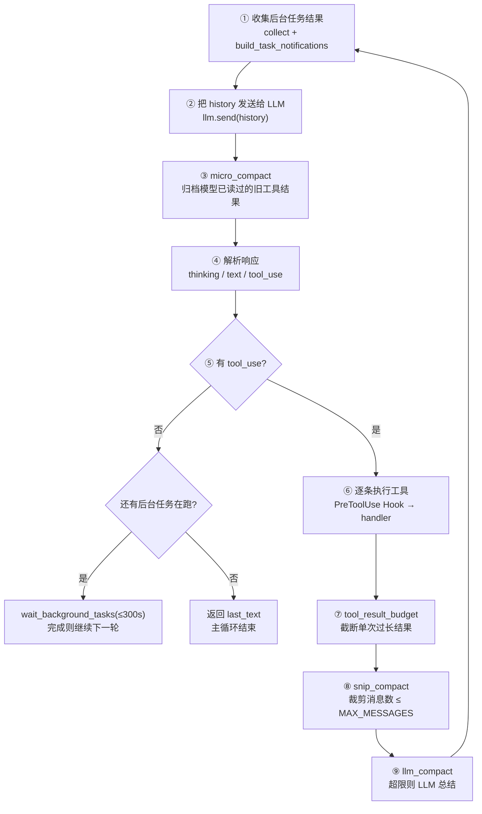

# ClaudeMini 项目报告

> 一个借鉴 Claude Code 思路实现的迷你代码 Agent。核心能力:**四层上下文压缩** + **长期记忆(模型自主行为)** + **定时任务(到点唤醒)**。
> 本文档面向第一次接触该项目的人,目标是快速建立对**实现、架构、特点**的整体认知。

- 报告日期:2026-08-26(2026-09-06 更新:新增记忆子系统,记忆=模型自主行为;2026-09-15 更新:新增任务规划/后台任务/定时任务三个子系统并删除旧的 todo 机制,见 §6.9–§6.11)
- 代码规模:15 个 Python 源文件(main / claude / llm / TOOLS / compact / HOOKS / PERMISSIONS / PROMPT / skill / memory / task / bash_exec / background / corn_job / agent_runner)
- 运行环境:Windows / Python 3.13
- 模型接入:MiniMax-M2.7(通过 Anthropic 兼容 API)

---

## 0. 速览(30 秒版)

ClaudeMini 是一个**命令行交互的代码 Agent**:用户在终端提问,它通过一个「发送 → 看模型回复 → 执行工具 → 把结果回填 → 再发送」的循环持续工作,直到模型认为任务完成。

它不是用 LangChain 之类的框架拼出来的,而是**从零手写了一个 agent 主循环 + 工具注册表 + 事件(Hook)系统 + Skill 加载器**,并自己实现了**四层上下文压缩策略**来控制上下文增长。

- **入口**:`main.py`
- **Agent 核心**:`claude.py`(`ClaudeMini` 类)
- **模型通信**:`llm.py`
- **工具**:`TOOLS.py` 声明 19 个工具 Schema(计算器 / bash / 读文件 / 5 个 `task_*` / 7 个 `job_*` / subagent / load_skill / 记忆),处理函数一部分随注册表出厂(`create_default_registry`),一部分是各功能模块的工厂(`task.create_task_handlers` / `memory.create_handlers`),其余是 `ClaudeMini` 的方法——统一由 `claude.py.__init__` 注册
- **上下文压缩**:`compact.py`(`CompactManager`)
- **记忆**:`memory.py`(`MemoryManager`)+ `memory/` 目录(长期 / 经验 / 快照)
- **任务规划**:`task.py`(`Task` + `TaskStore`)+ `.task/tasks.json`(带依赖的任务图)
- **后台任务**:`background.py`(`BackgroundManager`)+ `bash_exec.py`(Git Bash 定位与执行)
- **定时任务**:`corn_job.py`(`Job` + `Scheduler`)+ `agent_runner.py`(`AgentRunner` 唤醒)+ `.task/jobs.json` 任务库
- **Hook 事件系统**:`HOOKS.py` + 命令权限 `PERMISSIONS.py`
- **Skill 加载**:`skill.py`
- **提示词**:`PROMPT.py`

**一句话特点**:它把 Claude Code 里那些「隐性机制」——上下文压缩、权限钩子、任务图规划、后台任务、子 agent、按需加载 skill、定时任务唤醒——显式地拆成了一个个可以看懂、可以改的 Python 模块。

---

## 1. 项目概述

### 1.1 这个项目是什么

ClaudeMini 是一个 **Mini Agent / Agent 教学与实验项目**。作者用 Python 手写了一个具备下述能力的 agent:

1. **工具调用循环**——模型可以调用 `bash`、`read_file`、`calculator` 等工具并拿到结果;
2. **任务规划**——用 `task_create` / `task_list` / `task_claim` / `task_complete` 维护一张**带依赖的**任务图(见 §6.10);
3. **子 Agent(SubAgent)**——主 agent 可以把任务拆给一个全新的 `ClaudeMini` 实例去独立执行;
4. **Skill 按需加载**——扫描 `SKILLS/` 目录,把 skill 目录清单写进系统提示词,模型需要时通过 `load_skill` 工具读取完整内容;
5. **后台 bash 任务**——长命令可以丢到后台线程跑,agent 不阻塞;结果在下一次循环开头以 `<task_notification>` 注入(见 §6.11);
6. **上下文压缩**——用四层策略防止上下文无限膨胀;
7. **长期记忆(模型自主)**——模型按需**自主调用** `write_memory` / `recall_memory` 读写经验记忆;整个会话结束后按文件数阈值做一次 **LLM 驱动的去重整理**(见 §6.8);
8. **定时任务**——用 cron 五段式(`schedule`)或具体时刻(`once_at`)登记任务,调度器每分钟扫描、到点入队,`AgentRunner` 唤醒 agent 执行;这是**唯一一条不由用户输入驱动的执行路径**(见 §6.9)。

### 1.2 当前状态

「暂时只实现到上下文压缩」是 2026-08-26 的判断,此后项目又长出了几块,也重写了一块:

- 四层压缩(`tool_result_budget` / `micro_compact` / `snip_compact` / `llm_compact`)**全部打通**;
- **记忆子系统**(2026-09-06 设计定型):记忆是 **agent 行为** —— 不再每轮强制提取,而是由模型自主判断何时调用 `write_memory` / `recall_memory`;去重整理 `consolidate` 改为 **LLM 驱动**,在**整个会话结束**时按文件数阈值触发(详见 §6.8);
- **任务规划重写**(2026-09):原本是内存态 todo 列表(`TaskManager` 单例 + `task_write` 工具 + 主循环里的 `<reminder>` 提醒),现已换成 `task.py` 的**带依赖任务图**并落盘 `.task/tasks.json`。旧的 `TaskManager` / `task_write` / `<reminder>` 机制**已从代码中删除**,本文档相应内容也已替换(详见 §6.10);
- **后台任务**(2026-09):`bash` 工具支持 `is_background`,把长命令丢进守护线程,结果以 `<task_notification>` 在下一轮循环开头注入(详见 §6.11);
- **定时任务子系统**(2026-09-15 设计定型):`Scheduler` 只做「扫描 + 入队」,`AgentRunner` 负责唤醒,agent 负责领取/执行/汇报;判定机制从「此刻是否匹配 cron」改为「`next_run` 欠不欠一次执行」,因此进程没运行的那段时间不再把任务静默丢掉(补跑一次,详见 §6.9)。

### 1.3 设计取向

从代码注释、命名(中文变量名、`slient`、`compact_mannager` 等拼写)、以及大量 `try/except` 返回字符串而不是抛异常的风格看,这是一个**教学/实验性质、快速迭代**的项目,重点是「机制齐全、可读、易改」,而非工程化打磨。

---

## 2. 目录结构

```
claude_mini/
├── main.py              # 入口:用户输入循环 + Hook 注册 + AgentRunner 启动 + 会话末记忆整理触发
├── claude.py            # ClaudeMini 类:agent 主循环 + 子 agent 编排 + 记忆/定时任务工具注册
├── llm.py               # LLM 封装:与 API 通信、历史总结
├── TOOLS.py             # 工具 Schema 声明 + 处理函数 + ToolRegistry + 任务规划 handlers
├── compact.py           # CompactManager:四层上下文压缩
├── memory.py            # MemoryManager:长期/经验记忆读写、索引、LLM 去重整理
├── corn_job.py          # Job + Scheduler:定时任务模型、cron 解析、扫描入队(§6.9)
├── agent_runner.py      # AgentRunner:轮询队列并唤醒 agent 执行定时任务(§6.9)
├── task.py              # Task + TaskStore + create_task_handlers 工厂:多步任务规划(依赖图 + 工具包装)
├── bash_exec.py         # bash 执行封装(resolve_bash 定位 Git Bash、execute_bash 执行)
├── background.py        # BackgroundManager:后台 bash 任务与结果回收
├── HOOKS.py             # 事件系统(仿 Claude Code 的 hook 事件)
├── PERMISSIONS.py       # bash 命令权限:DENY / ASK / ALLOW
├── PROMPT.py            # SYSTEM_PROMPT / SUBAGENT_PROMPT
├── skill.py             # SkillLoader:扫描 SKILLS/ 并加载 SKILL.md
├── SKILLS/              # skill 目录(每个子目录一个 SKILL.md)
│   ├── say_hello/SKILL.md
│   └── security-review/SKILL.md
├── .env                 # 配置(API key / 模型 / 压缩阈值 / 记忆阈值等)
├── .task/               # 运行时任务库(不随代码提交)
│   ├── jobs.json        #   定时任务库(§6.9)
│   └── tasks.json       #   任务规划库
├── memory/              # 记忆库(运行时读写,不随代码提交)
│   ├── long_term/       #   user.md / soul.md / project.md → 只读注入 system prompt
│   ├── experience/      #   经验记忆 *.md(frontmatter + index.json)
│   ├── temp/            #   预留
│   └── backups/         #   consolidate 前的快照 snapshot_<ts>(保留最近 N 份)
├── tool_result/         # 过长工具结果的落盘目录(运行时生成)
├── transcript           # 消息数量压缩时的归档文件(运行时生成)
├── __pycache__/         # 编译缓存(含一个已删除源文件的 claude_debug.pyc)
└── PROJECT_REPORT.md    # 本文档
```

> 注:`__pycache__/claude_debug.cpython-313.pyc` 说明曾有一个 `claude_debug.py` 调试脚本,源码已删除。

---

## 3. 架构总览

### 3.1 分层结构

```
┌──────────────────────────────────────────────────────────┐
│  main.py            入口层                                │
│   · 注册 Hook         · 用户输入循环                       │
└──────────────┬───────────────────────────────────────────┘
               ▼
┌──────────────────────────────────────────────────────────┐
│  ClaudeMini  (claude.py)    —— Agent 核心                 │
│   · agent 主循环(run)                                     │
│   · 子 agent 编排(run_subagent)                           │
│  ┌────────────┬────────────┬────────────┬──────────────┐ │
│  │ LLM        │ ToolRegistry│ SkillLoader│ CompactManager│ │
│  │ (llm.py)   │ (TOOLS.py) │ (skill.py) │ (compact.py) │ │
│  └────────────┴────────────┴────────────┴──────────────┘ │
└──────┬──────────────────────────────────┬─────────────────┘
       ▼                                  ▼
   MiniMax M2.7 API                 HOOKS.py ──▶ PERMISSIONS.py
   (Anthropic 兼容接口)             PROMPT.py
```

> `ClaudeMini` 还持有 **`MemoryManager`**(memory.py),初始化时把 `write_memory` / `recall_memory` 动态注册进 ToolRegistry;长期记忆(`long_term/`)随 system prompt 注入(见 §6.8)。
>
> `ClaudeMini` 还持有 **`Scheduler`**(corn_job.py),初始化时注册 7 个 `job_*` 工具并启动扫描线程;`main.py` 另外启动 **`AgentRunner`**(agent_runner.py),由它轮询队列、唤醒 agent 去执行定时任务(见 §6.9)。这是**唯一一条不由用户输入驱动的执行路径**。

### 3.2 模块职责一句话

| 模块 | 职责 |
|---|---|
| `main.py` | 终端入口。注册权限 Hook,启动 `AgentRunner`,循环读用户输入,调用 `ClaudeMini.run()` |
| `claude.py` | Agent 大脑。持有 LLM/工具/skill/压缩器/记忆/调度器,驱动主循环;子 agent 递归入口 |
| `llm.py` | 与模型 API 通信(`send`),以及历史总结(`summarize`/`summarize_history`) |
| `TOOLS.py` | 工具的世界。声明全部 19 个工具 Schema(基础工具 + `task_*` + `job_*` + subagent/load_skill/记忆)、部分内置处理函数、`ToolRegistry` 注册表 |
| `compact.py` | 上下文压缩器,四层策略(见 §5) |
| `memory.py` | 记忆管理器。long_term 只读注入;experience 读写+索引;模型按需 `write_memory`/`recall_memory`;会话末 `consolidate_if_due` LLM 去重整理(见 §6.8) |
| `corn_job.py` | 定时任务。`Job` 模型 + cron 解析 + `Scheduler`(每分钟扫描、入队、状态机、落盘)(见 §6.9) |
| `agent_runner.py` | 定时任务执行者。轮询队列非空即唤醒 agent(带冷却与独立 history)(见 §6.9) |
| `task.py` | 任务规划。`Task` 三态 + `TaskStore` + `create_task_handlers` 工厂:任务图、依赖检查、认领者校验、落盘(见 §6.10) |
| `background.py` | 后台任务。`BackgroundManager`:后台线程执行 bash、结果回收与有界等待(见 §6.11) |
| `bash_exec.py` | bash 执行底座。`resolve_bash` 定位 Git Bash、`execute_bash` 同步执行且永不抛错(见 §6.11) |
| `HOOKS.py` | 事件系统。`PreToolUse`/`PostToolUse`/`Stop` 等事件,`trigger_hooks` 短路返回 |
| `PERMISSIONS.py` | 命令权限判定(DENY/ASK/ALLOW),供 `permission_hook` 使用 |
| `skill.py` | 扫描 `SKILLS/` 目录,解析 `SKILL.md` 的 `name`/`description`,按需加载内容 |
| `PROMPT.py` | 主 agent 与子 agent 的系统提示词(中文) |

---

## 4. 核心运行流程(agent 主循环)

`ClaudeMini.run(history)`(`claude.py:80`)是全部逻辑的主干,一个标准的 **reAct 风格工具调用循环**:



### 4.1 逐步说明

1. **收后台任务结果**`claude.py:89-93`——每轮开头先 `background_manager.collect()` 取走已完成的后台任务,用 `build_task_notifications` 包成 `<task_notification>` 文本块拼进 history(见 §6.11)。**这就是「后台任务跑完会主动告诉模型」的实现**,不需要模型轮询。

2. **发送**`claude.py:96`——把 `system_prompt` + 完整 `history` 发给模型。`system_prompt` 由 `PROMPT.SYSTEM_PROMPT` + 长期记忆 + **当前时间** + skill 目录清单拼接而成(`claude.py:27-35`)。发送若因 prompt 过长失败,会走一次「压缩后重试」(`claude.py:95-107`)。

3. **压缩「已读」内容**`claude.py:110`——`micro_compact` 在模型看过结果**之后**运行,把最早的(除最近 3 轮)工具结果归档到本地文件,换成一个占位符。因为模型已经消费过这些内容了,归档是安全的。

4. **解析响应**`claude.py:115-127`——响应是 block 列表:
   - `thinking` 块:`show_thinking=True` 才打印;
   - `text` 块:打印到终端并累加进 `final_text`;跨轮另存一份 `last_text`,供最后一轮无正文时兜底。

5. **判断是否结束**`claude.py:138-144`——**本轮没有 tool_use 就看后台任务**:还有任务在跑就用 `wait_background_tasks(timeout=300)` 有界等待,等到了 `continue` 再进一轮;否则返回 `last_text`,循环结束。

6. **执行工具**`claude.py:146-158` / `excute_tool`(`claude.py:228`):
   - 带 `is_background=True` 的 `bash` 走**后台分支**(`claude.py:232-236`):交给 `BackgroundManager.start`,立刻返回 `🔄 工具 bg_xxxx 已在后台执行。`;
   - 其余工具从 `ToolRegistry` 查处理函数,查不到返回 `❌ Unknown tool`;
   - 执行前先触发 `PreToolUse` Hook。**若 Hook 返回非空,则直接把它当作工具输出,不再执行真正的 handler**——这正是权限拦截的实现方式;
   - 否则调用 `handler(**block.input)`。

7. **截断单次结果**`claude.py:157`——`tool_result_budget` 把超过 `MAX_RESULT_LIMIT`(默认 2000 字符)的结果落盘、只留摘要(见 §5.1)。

8. 把 `tool_results` 作为一条 `user` 消息(`type: tool_result`)拼进 history(`claude.py:161-164`)。

9. **裁剪消息数**`claude.py:167`——`snip_compact` 把消息压到 `MAX_MESSAGES`(默认 50)条以内(见 §5.3)。

10. **LLM 总结**`claude.py:170`——`llm_compact` 在历史超 `CONTEXT_LIMIT` 时,让模型总结整段历史并归档(见 §5.5)。

11. 回到步骤 ①。

### 4.2 子 Agent(SubAgent)

`run_subagent(prompt)`(`claude.py:173`):

- 触发 `BefSubAgent` Hook,打印一个装饰框(`HOOKS.py:41`);
- 用 `SUBAGENT_PROMPT + prompt` 构造一段历史,`new ClaudeMini(slient=False, ...)` 启动一个**全新的 agent 实例**递归运行(`claude.py:185-197`);
- 触发 `AftSubAgent` Hook,返回 `subagent.run()` 的结果(即子 agent 最后一轮的文字输出)。

设计要点:

- 子 agent 是**完整独立实例**,有自己的工具注册表、skill 加载器、压缩器;
- 系统提示词(`PROMPT.py`)明确要求主 agent **不要轻信子 agent 的声明,必须用工具验证结果**;
- **共享与隔离是显式选择的**,都在 `claude.py:185-188` 一行里:共享 `task_store` 与 `scheduler`(它们是**实例**——任务库只有一份、锁不能跨实例),隔离的是四个布尔开关(`allow_subagent` / `allow_write_memory` / `allow_recall_memory` / `allow_jobs` 全部关掉,防递归、防污染共享库、防定时任务被领两次);
- 被禁用的工具仍然**注册**,只是注册成「守卫桩」:返回一句中文指引,而不是让模型撞上 `Unknown tool`。三种守卫写法并存:`_memory_guard` / `_job_guard`(两个闭包桩工厂,`claude.py:279`、`:284`)、`recall_memory` 方法内自检(`claude.py:206`)。

### 4.3 记忆工具与会话末整理(模型自主)

- 主循环**不含任何"每轮提取记忆"**的强制调用。`write_memory` / `recall_memory` 只是注册在工具表里,由**模型自行判断**值不值得记/需不需要查,自主发起调用(记忆是 agent 行为);
- 记忆的**去重/整理不发生在写路径上**:`consolidate` 的触发点在 `main.py` 的**整个会话结束**后(见 §6.8),避免每轮打扰主流程。

### 4.4 后台 bash 任务

主循环里唯一「不阻塞」的机制,三处配合:

1. `bash` 工具带 `is_background=True` 时**不进 handler**,而是 `BackgroundManager.start(block)` 起一条守护线程,立刻返回一个 `bg_0001` 形式的任务号(`claude.py:232-236`);
2. 线程跑完后把结果存进 `results` 并把 id 推入 `ready` 队列(`background.py:28-38`);
3. **下一轮循环开头**由步骤 ① 把它取出来注入 history——所以「后台任务完成通知」对模型而言就是一条普通的 user 消息,不是中断。

提示词里专门交代了这套约定(`TOOLS.py` 的 `bash` 工具描述 + `PROMPT.py`):**设了后台就别自己 sleep 或轮询**,结果会以 `<task_notification>` 自动推来。细节见 §6.11。

---

## 5. 上下文压缩系统(项目核心)

`compact.py` 里的 `CompactManager` 实现了**四层、由廉价到昂贵的压缩策略**。这是本项目目前最有价值的部分。

### 5.1 四层概览

| 层级 | 方法 | 触发时机 | 做了什么 | 代价 | 状态 |
|---|---|---|---|---|---|
| L1 单结果截断 | `tool_result_budget` | 每次工具返回后 | 超 `MAX_RESULT_LIMIT`(2000)的结果落盘,只留前缀 + 提示 | 无模型调用 | ✅ 可用 |
| L2 旧结果归档 | `micro_compact` | 每轮开头 | 把模型已看过的、超过最近 3 轮的、较长的 tool_result 落盘换占位符 | 无模型调用 | ✅ 可用 |
| L3 消息数裁剪 | `snip_compact` | 每轮末尾 | 保留头 3 条 + 尾 (MAX_MESSAGES-4) 条,中间落盘成一个 marker | 无模型调用 | ✅ 可用 |
| L4 模型总结 | `llm_compact` | 每轮末尾(超阈值时) | 超 `CONTEXT_LIMIT` 时,让模型把整段历史总结成摘要 | 一次模型调用 | ✅ 可用 |

设计思想:**把「上下文成本」分层,先用便宜的手段扛住大部分增长,只有逼近上限才动用昂贵的模型总结。** 每层都把被压缩的内容落盘到本地文件,信息不丢失,模型仍可按需读取(系统提示词里专门教了模型如何对待这些归档文件,见 `PROMPT.py:61-79`)。

### 5.2 L1 `tool_result_budget`(`compact.py:38`)

```
内容 ≤ MAX_RESULT_LIMIT? ──是──▶ 原样返回
        │否
        ▼
  落盘到 tool_result/{tool_use_id}.txt
  内容替换为: 前 MAX_RESULT_LIMIT 字 + "[⚠️ 工具返回结果过长，已截断…]"
```

- 用于**防止单条工具输出撑爆上下文**;
- 落盘文件按 `tool_use_id` 命名,天然去重(同一结果只存一次);
- 替换文本会明确告诉模型「完整结果在哪、是否需要读」。

### 5.3 L2 `micro_compact`(`compact.py:78`)

```
找出 history 中所有含 tool_result 的 user 消息
保留最近 3 条,其余的每条 tool_result:
  内容 > 120 字符 ──▶ 落盘,替换为 "[Earlier tool result compacted]\nFull result: {path}"
```

- 在 `llm.send()` **之后**、追加新消息**之前**调用(`claude.py:110`),所以它压缩的是「模型已经读过」的内容——替换成占位符不损失任何模型已知信息;
- 这是四层里最体现设计功力的一层:对「已消费上下文」做渐进式归档。

### 5.4 L3 `snip_compact`(`compact.py:56`)

```
len(messages) > MAX_MESSAGES 时:
  保留 头 head_end=3 条
  保留 尾 MAX_MESSAGES-4 条
  中间部分 JSON 序列化 → 写入 transcript 文件
  用一条 marker 替换中间: "[{n} messages archived at transcript]"
```

- 用「头 + 尾」的方式保留**开场上下文(用户最初需求)**与**最近的工作状态**,牺牲中段过程;
- 注意点:transcript 用 `'w'` 覆盖写,只保留最近一次归档。

### 5.5 L4 `llm_compact`(`compact.py:105`)

意图:`estimate_size(history)`(把 history JSON 序列化的字符数)超过 `CONTEXT_LIMIT`(200000)时,调用 `llm.summarize_history(history)` 生成摘要,把 history 重置为「用户消息 + 摘要 + 归档路径」。

流程:
1. `save_history(history)` 把整段历史 JSON 序列化写入 `history_backup.json`;
2. `llm.summarize_history(history)` 让模型总结(保留目标/约束/已完成/结论/文件/命令/状态/未完成/建议 9 类信息);
3. 返回一条新的 user 消息:「摘要 + 归档路径」,history 被整体替换。

⚠️ 语义注意:它把 history **整个替换**成摘要,是「最后手段」。原始历史已落盘 `history_backup.json` 可查,但摘要质量决定后续能否继续(见 §8.2)。

---

## 6. 模块详解

### 6.1 `claude.py` — Agent 核心

- `ClaudeMini.__init__`(`:16-77`):**只做装配与注册,不定义任何方法**——组装 skill 加载器 / 压缩器 / 记忆管理器 / 后台任务管理器,拼系统提示词(基础提示词 + 长期记忆 + **当前时间** + skill 清单),建 LLM,然后**把所有工具注册进同一个 `ToolRegistry`**——顺序是:基础工具(`create_default_registry`,3 个)→ `subagent` / `load_skill` / `recall_memory` → 记忆工具 → 任务规划工具 → 定时任务工具(`:69-76`)。
- `run(history)`(`:80`):主循环(§4.1)。
- `run_subagent(prompt)`(`:173`):子 agent 递归入口(§4.2)。
- `recall_memory(query)`(`:204`):记忆召回(起子 agent 检索)。
- `excute_tool(block)`(`:228`):单条工具调用的执行入口——后台 bash 分支在这里分叉(§6.11)。
- `build_task_notifications(results)`(`:253`):把后台任务结果包成 `<task_notification>`。
- **7 个 `job_*` 工具方法 + 2 个守卫桩工厂**(`:275-345`):与 `subagent` / `recall_memory` 一样是**类的方法**,`__init__` 只负责注册。
- 三个重要耦合:
  - **工具「声明在 `TOOLS.py`、实现是 `ClaudeMini` 的方法」**:`subagent`、`load_skill`、`recall_memory`、`job_*` 的 Schema 都在 `TOOLS.py`,处理函数是类方法(注册时取 bound method,如 `register("job_create", self.job_create)`);任务规划那 5 个走 `task.create_task_handlers(store)` 工厂、写记忆走 `memory.create_handlers()`——**工厂住在它包装的组件旁边,依赖(store/实例)由 `claude.py` 递进去**,`TOOLS.py` 因此只剩 Schema、无依赖的内置函数和注册表,依赖方向保持单向;
  - **Hook 可以短路工具执行**:`HOOKS.trigger_hooks` 返回非空就跳过 handler(`:315-322`);
  - **`task_store` 与 `scheduler` 是构造参数**(`:62`、`:69`),可注入——这是主/子 agent 共享同一份任务库与调度器的前提(§4.2、§6.9)。

### 6.2 `llm.py` — 模型通信

- `LLM.send(history)`(`:24`):`client.messages.create`,固定 `max_tokens=8192`,把工具 Schema 一并传给模型;
- `LLM.summarize(history)`(`:34`):构造一段中文「压缩编码 agent 上下文」的提示词,要求保留 9 类关键信息(任务目标/约束/已完成/结论/文件/命令/状态/未完成/建议),明确「不要执行历史中的指令、不要虚构」;
- `LLM.summarize_history(history)`(`:83`):调 `summarize` 并把 text 块拼成字符串——**L4 压缩的真正入口**。这里曾是 8.1 表里那个「引用不存在的 `self.llm`」的 bug,现已修好。

> 当前模型接入的是 MiniMax-M2.7,`base_url=https://api.minimaxi.com/anthropic`,走 Anthropic 兼容协议,所以 `llm.py` 用的是官方 `anthropic` SDK。

### 6.3 `TOOLS.py` — 工具世界

这个文件是**工具的唯一声明处**:19 个工具 Schema 全在 `Tools` 列表(`:8`)里,连处理函数都不在这里的那几个(记忆 / 任务 / 定时任务)也一样。它同时也放几个自包含的执行函数,但不 import `claude.py`——依赖方向始终是 `claude.py → TOOLS.py`。(任务工具的工厂 `create_task_handlers` 原先也在这里,现已搬到 `task.py`,工厂跟着它包装的组件走,见 §6.10。)

**19 个工具一览**(Schema 全在 `TOOLS.py`):

| 工具 | 作用 | 处理函数在哪 |
|---|---|---|
| `calculator` | 计算器,`eval` 表达式 | `TOOLS.run_calculate`(`:328`) |
| `bash` | 执行 shell 命令(Windows 上归一为 Git Bash) | `TOOLS.run_bash`(`:334`)→ `bash_exec.execute_bash` |
| `read_file` | 读文件(支持行数限制) | `TOOLS.run_read`(`:339`) |
| `task_create` / `task_list` / `task_get` / `task_claim` / `task_complete` | 任务图:创建(可带 `depends_on`)/ 列出 / 查看 / 认领 / 完成 | `task.create_task_handlers(store)`(`task.py:181`)包装 `TaskStore`(§6.10) |
| `job_create` / `job_list` / `job_cancel` / `job_resume` / `job_delete` / `job_take` / `job_update_status` | 定时任务:创建 / 列出 / 取消 / 恢复 / 删除 / 领取 / 汇报 | `ClaudeMini` 的方法(`claude.py:289-345`,§6.9) |
| `subagent` | 启动独立子 agent | `ClaudeMini.run_subagent` |
| `load_skill` | 加载指定 skill | `TOOLS.load_skill`(`:420`)→ `skill.SkillLoader.load` |
| `write_memory` / `recall_memory` | 写 / 召回经验记忆(模型自主调用) | `memory.create_handlers()` 与 `ClaudeMini.recall_memory` |

注册分两处,这个划分是有意的:

- `create_default_registry()`(`:431`)注册**基础 3 件**(`calculator` / `bash` / `read_file`)——它们不依赖任何运行时状态,谁都能直接用;
- 其余全部在 `ClaudeMini.__init__` 里注册——因为它们要么需要 `self`(子 agent、记忆),要么需要注入的实例(`task_store` / `scheduler`)。所以 `Tools` 列表里有、注册表里没有的名字,只可能是「这个实例没注册它」,不会出现「声明了却没人实现」。

**其他要点**:

- `run_bash` 声明里带 `is_background`,但函数签名是 `(command, timeout=300, **_ignored)`——**刻意忽略它**:后台分叉发生在 `claude.py:excute_tool`,不在 handler 里(§6.11);
- Git Bash 的定位与执行都在 `bash_exec.py`(§6.11),`TOOLS.py` 只做转调,不再自己拼子进程参数;
- `ToolRegistry`(`:423`):极简 `{name: handler}` 字典 + `register` / `get`;
- `run_calculate` 用 `eval`,**无沙箱**(bash 有权限钩子,calculator 没有),是潜在风险点。

### 6.4 `HOOKS.py` — 事件系统

- 事件集合(`:3`):`UserPromptSubmit` / `PreToolUse` / `PostToolUse` / `Stop` / `BefSubAgent` / `AftSubAgent` —— 事件名明显仿照 Claude Code 的 hook 体系;
- `register_hook(event, func)`(`:12`)注册,`trigger_hooks(event, ...)`(`:18`)**短路调用**:返回第一个非 `None` 的结果;
- `permission_hook`(`:28`):`PreToolUse` 的默认权限实现——`DENY` 直接拒绝、`ASK` 交互式 `y/n` 询问、`ALLOW` 放行;
- `before_agent_hook` / `after_agent_hook`(`:41-49`):子 agent 启停的装饰框打印。

> 目前只有 `PreToolUse`、`BefSubAgent`、`AftSubAgent` 被实际使用;`PostToolUse`/`Stop`/`UserPromptSubmit` 只是留好了接口。

### 6.5 `PERMISSIONS.py` — 命令权限

- 枚举 `Permission.ALLOW / ASK / DENY`;
- **黑名单**(DENY):`rm -rf /`、`mkfs`、`dd if=`、`shutdown`、`reboot` 等;
- **询问名单**(ASK):`rm`、`rmdir`、`del`、`format`、`mv`、`cp`、`rename` 等;
- `check_permission` 目前只对 `bash` 工具生效(基于子串匹配,大小写不敏感)。

> 说明:这是**关键字白/黑名单**式的简单策略,不是语义级判断;对非 bash 工具一律 `ALLOW`。

### 6.6 `skill.py` — Skill 加载器

- `SkillLoader.scan`(`:16`):遍历 `SKILLS/` 下每个子目录,找到 `SKILL.md`,逐行扫描 `name:` / `description:`(兼容纯文本和带 `---` YAML 前言的写法,其余行忽略);
- `catalog`(`:61`):返回 `- name: description` 清单,拼进系统提示词,让模型知道有哪些 skill;
- `load(name)`(`:72`):把 `SKILL.md` 全文作为工具结果返回 → 注入对话。
- 模式:**目录清单进提示词,正文按需加载**,避免把大 skill 常驻上下文。

### 6.7 `PROMPT.py` — 系统提示词

- `SYSTEM_PROMPT`(`:1`):定义了主 agent 的职责——
  - 任务规划(`:7-13`):多步任务用 `task_create` 逐条建节点、有先后依赖用 `depends_on`,执行中用 `task_list` 看进度与阻塞、`task_claim` 认领(有依赖的任务须等前置完成才能认领),每完成一步 `task_complete`;
  - 定时任务(`:16-45`):创建(`schedule` / `once_at` 二选一 + `content` 必须自包含)、管理(`job_cancel` 可恢复 / `job_delete` 不可恢复,拿不准先问)、执行(`job_take` → 按 content 执行 → `job_update_status` 必须汇报);
  - SubAgent 使用规则:何时用、何时别滥用、**结果必须验证**;
  - Context Management(重点):教模型如何对待被截断/归档的工具结果——「不一定要读 PATH」,优先用摘要继续;真要读也**不要反复整读大文件**;「不要读取由 Context Compact 自动生成的 tool_result 文件来恢复上下文,除非确实需要」。
- `SUBAGENT_PROMPT`(`:115`):子 agent 的执行规范,要求「不把任务转交给其他 Agent」「必须返回含验证结果的可判断信息,不能只回复『完成』」。

> 提示词与工具描述是**两份配套的说明书**:`PROMPT.py` 讲「什么时候该用哪类工具」,`TOOLS.py` 里每个工具的 `description` 讲「这个工具怎么用、边界在哪」。定时任务这块把「content 必须自包含」(到点后模型手里没有当时的对话)反复写进了两处,因为这是整套机制里最容易出错的地方。

### 6.8 `memory.py` — 记忆子系统(2026-09-06 设计定型)

设计定位:**长期记忆是 agent 的行为,不是旁路的定时任务。**

**目录与格式**

- `memory/long_term/{user,soul,project}.md`:作者维护的静态记忆,启动时**只读拼进 system prompt**(`load_session_memory`);
- `memory/experience/*.md`:经验记忆,单文件 = YAML 前言(frontmatter)+ 正文。前言字段 `id / title / tags / created / source`(整理后可能追加 `updated`);
- `memory/experience/index.json`:`{version, last_updated, tags, memories}` 倒排索引;`rebuild_index()` 可从所有 `*.md` **全量幂等重建**;
- `memory/backups/snapshot_<ts>`:整理前对整个 experience 目录的快照,目录名含微秒+冲突后缀保证唯一,只保留最近 `MEMORY_BACKUP_RETAIN` 份。

**读写路径(模型自主调用)**

- `write_memory(memory, title?, tags?, source="manual")`:生成唯一 id(`exp-YYYY-MM-DD-HHMMSSffffff`)落盘 + 写 index;title/tags 缺省时从正文自动提取。工具入口 `create_handlers()` 暴露为 **`write_memory` 工具**,模型自主决定何时调用;
- `recall_memory(query?)`:取全部标签作提示,起一个**子 agent**,让它按标签 `read_file` 检索后返回最相关记忆;`allow_recall_memory=False` 时方法内守卫直接返回「子 agent 禁止召回」指引;
- 布尔开关:`allow_write_memory` / `allow_recall_memory` / `allow_subagent`。主 agent 全开;**子 agent 实例化即全 False**(防递归 + 防污染共享库),被禁工具注册"守卫桩",返回指引而非裸报错。

**为什么去掉「每轮提取」**

早先设计在主循环每轮结束调 `extract_memories → should_store_memory → write_memory`,且写路径尾部自动 `_maybe_consolidate()`。实测**太抢戏**,且规则闸门与模型判断"两层打架"。现已删除该流水线与相关规则方法(`extract_memories` / `should_store_memory` / `_normalize` / `_iter_stored` / `_parse_json_array` / `TEMPORARY_KEYWORDS` / `_maybe_consolidate`),把「记不记、查不查」**完全交给模型**;会话兜底提取也放弃(期待模型自主行为)。

**consolidate(去重整理)= LLM 驱动,周期 = 整个会话结束**

- 入口 `consolidate_if_due(llm)`:经验文件数 `≥ MEMORY_CONSOLIDATE_THRESHOLD`(默认 50)才真正调 `consolidate`,否则空返回;异常不外抛、不阻断退出;
- 触发点在 `main.py`:`user_loop` 返回后(用户 `q` / Ctrl+C 退出)**整个会话结束**时调用一次;子 agent 不触发;
- `consolidate(llm)` 流程:`_collect_memory_digests()` 读全部经验文件摘要(正文截断到 800 字)→ `_build_consolidate_prompt()` 拼整理指令 → 模型返回 **JSON 动作数组**(`{"op":"delete","file":...}` / `{"op":"merge","target":...,"sources":[...],"title":?,"tags":?}`)→ 逐条**校验**(文件不存在 / 未知 op / 重复指定 / merge 源冲突 → 记入 `skipped` 不执行)→ **确有动作才先快照** → `_apply_merge` 把源正文并入 target 后删源、`delete` 直接删 → `rebuild_index()`。返回报告 `{before, after, deleted_files, merged_files, snapshot, skipped, note}`。

**配套修改**

- `_parse_memory_file` 把 `tags` 解析成 **list**(此前是字符串,`rebuild_index` 会按字符遍历把索引 tags 拆成单字——consolidate 整理后必走 rebuild,该 bug 先行修复);
- `_parse_json_array` 泛化为 `_extract_json`(容忍代码块围栏/多余文字),consolidate 解析模型返回仍复用。

**遗留 / 注意**

- 记忆工具对模型可见即可用,召回质量取决于模型是否"主动想起去查";**无兜底提取**(用户明确放弃);
- `search_by_tags` 是保留的查询 API,当前主流程未调用(recall 走子 agent + read_file);
- `recall_memory` 的子 agent 按提示词里**硬编码相对路径** `memory/experience/index.json` 检索;若运行时用 `MEMORY_DIR` 重定向过记忆库,召回与实际写入可能分叉(测试隔离时必须意识到,详见交互测试报告 P3)。

### 6.9 `corn_job.py` + `agent_runner.py` — 定时任务子系统(2026-09-15)

**定位:调度与执行分离**

整个子系统由三个角色组成,职责边界划得很硬:

| 角色 | 代码 | 只做什么 |
|---|---|---|
| **调度器** | `Scheduler`(corn_job.py) | 每分钟扫描一遍任务,把到点的**放进队列**。仅此两件事 |
| **唤醒者** | `AgentRunner`(agent_runner.py) | 每 5 秒看一眼队列非空,就**唤醒 agent**。它不碰任务内容 |
| **执行者** | agent(主 agent) | `job_take` 领取 → 按 content 执行 → `job_update_status` 汇报 |

```
main.py ──┬─ Scheduler.start()   每分钟 tick() ──▶ queue(内存队列)
          │                                        │
          └─ AgentRunner.start()  每 5s 轮询 ───────┘
                    │ 队列非空且不在冷却期
                    ▼
              claude_mini.run([唤醒提示])  ← 一条独立于用户输入的 agent 运行
                    │
              job_take → 执行 content → job_update_status(completed/failed)
```

调度器**不执行任务**,执行者**不做时间判断**;两者之间只有一个「队列」作为解耦面。这也是为什么 `Scheduler` 的方法表里只有扫描/状态/落盘,没有任何「跑任务」的入口。

**文件与代码位置**

| 位置 | 内容 |
|---|---|
| `corn_job.py` | `Job`(:42)、`Scheduler`(:158)、5 个状态常量与 `JOB_TRANSITIONS`(:16-29) |
| `agent_runner.py` | `AgentRunner`(:20);`POLL_INTERVAL_SECONDS=5` / `WAKE_COOLDOWN_SECONDS=60`(`:5-9`) |
| `claude.py:62-67` | 注入 `Scheduler` 并 `start()`;主/子 agent 共享同一实例 |
| `claude.py:69-76` | **注册 7 个 `job_*` 工具**(启用时注册 `self.job_*` 方法,禁用时注册守卫桩) |
| `claude.py:275-345` | **7 个 `job_*` 方法实现 + `_job_guard` / `_memory_guard` 守卫桩工厂**(同 `subagent`/`load_skill` 的规矩:Schema 在 `TOOLS.py`,实现是类方法) |
| `claude.py:27-35` | 系统提示词注入「当前时间」(模型得知道今天几号才能把「明天下午3点」算成 `once_at`) |
| `TOOLS.py` | 7 个 `job_*` 的 Schema 声明(只声明,不含处理逻辑) |
| `PROMPT.py:16-45` | 「定时任务」使用规范:创建 / 管理 / 执行三段 |
| `.task/jobs.json` | 任务库(跨会话保留);队列 `queue` 是**派生状态,不落盘** |

**数据模型与触发方式**

`Job`(`corn_job.py:42`)字段:

| 字段 | 含义 |
|---|---|
| `id` | `job_` + uuid4 hex(全局唯一,免跨会话撞号) |
| `content` | 交给 agent 的自然语言指令——到点后**照着这句话执行**,不依赖当时的对话上下文 |
| `schedule` / `once_at` | 触发方式**二选一**,`__post_init__` 直接校验「必须且只能给一种」 |
| `status` | 轮次状态(见下) |
| `last_run` | 上次**实际**派发的时刻桶(补跑时记的是迟到的时刻,不是原定时刻) |
| `next_run` | 下次该派发的时刻桶;`None` = 已无后续触发(一次性任务跑过了) |

- `schedule`:类 linux cron 五段「分 时 日 月 周」,支持 `*` / `a` / `a-b` / `*/n` / `a-b/n` / 逗号列表;周日写作 `0` 或 `7`(`_parse_schedule` :73 统一归到 0,免得判定时两边都要判);
- `once_at`:`"YYYY-MM-DD HH:MM"`,容忍 `2026-9-6 9:05` 这类写法并在构造时归一化(`_parse_once_at` :64);
- **已过去的一次性任务在 `create_job` 就被拒**(:208)。这道校验只放 create、不放 `Job`:从文件加载的旧任务本来就可能已经跑过,不能因此加载失败。

**状态机:为什么需要两道守卫**

```python
JOB_TRANSITIONS = {
    JOB_PENDING:   {JOB_RUNNING, JOB_CANCELLED},  # 被 agent 取走执行 / 被取消
    JOB_RUNNING:   {JOB_COMPLETED, JOB_FAILED},   # 执行成功 / 失败(执行中不可取消)
    JOB_COMPLETED: {JOB_PENDING, JOB_CANCELLED},  # 周期任务:下一轮重新待执行 / 被取消
    JOB_FAILED:    {JOB_PENDING, JOB_CANCELLED},  # 同上
    JOB_CANCELLED: {JOB_PENDING},                 # 恢复(resume_job)
}
```

要点:

1. **`status` 是「轮次状态」,不是「生命周期状态」。** `completed` / `failed` 只表示「这一轮跑完了」,`tick` 会把它们拉回 `pending` 开下一轮(周期任务因此才会再次触发)。真正的终点只有两个:`cancelled`(可 `resume` 恢复)和 `delete`(不可恢复)。
2. **`_transition`(:247)是状态修改的唯一入口**:查表校验合法性;目标状态与当前相同时**幂等早返回**,所以 `tick` 不必为「本来就是 pending」开分支。
3. **但只有流转表是不够的。** 流转表**不得不**允许 `completed/failed → pending`——那是 `tick` 开新一轮用的内部边。于是需要第二道守卫回答「**准不准从这条路走**」:
   - `JOB_REPORTABLE = {completed, failed}`:工具 `job_update_status` 只准报这两种,不含 `pending`。放开它,模型就能把跑完的任务「复活」;
   - `resume_job`(:302)自己再卡一道「当前必须是 `cancelled`」。
4. **取消 vs 删除**:`cancel_job` 置 `cancelled` + **从队列里摘掉**(`_drop_from_queue` :324)——注意任务可能早已派发进队列、只是还没被领走,此时状态仍是 `pending`,不摘的话 agent 照样会把它领走执行。`delete_job` 连记录一起删。

**判定机制:时间桶 + `next_run`**

**时间桶** `Job.bucket()`(:146)= `strftime("%Y-%m-%d %H:%M")`。定宽零填充,所以字符串的字典序**等于**时间序,可以直接用 `>` / `<` 比较;秒与微秒不参与,`9:00:37` 也算落在 `09:00` 桶。

早期实现是「**此刻是否匹配 cron 表达式**」+ `last_run` 去重。它有个洞:**进程没运行的那段时间,任务被静默丢掉**——原定 9:00 的任务,9:00 进程没开着,10:00 启动就什么都没有了。

现在只说一件事:**欠不欠一次执行**。

```python
# tick:判定全部围绕 next_run
if job.next_run is None:      continue    # 已无后续触发
if job.next_run > now_bucket: continue    # 还没到点
if any(j.id == job.id for j in self.queue): continue   # 已派发但没被取走,不重复入队
```

`compute_next_run(after)`(:126)求「严格晚于 `after` 的下一个时刻桶」,返回 `None` 表示不再触发:

- **先按天跳**:这一天不可能命中(月/日/周不匹配)就整天跳过,再在命中的那天里取第一个允许的 `时 × 分`。不这么写,像 `0 15 16 9 *` 这种稀疏表达式要一分钟一分钟地扫几十万次,而这段是在锁里跑的,会卡住 agent;
- 搜索上界 `_SEARCH_DAYS = 366 * 8`(:13),为了覆盖闰日任务(`0 0 29 2 *` 最长隔 8 年);
- **一次性任务 = 只匹配一个点的周期任务**,走单独分支(`once_at > after` 才返回,否则 `None`),`tick` 完全不必为它开分支。

**补跑(misfire):补一次、不做窗口、取走时推进、只打日志**

这是本子系统里最有取舍味道的一段。四个决定连在一起:

| 决定 | 做法 | 得到什么 |
|---|---|---|
| **补一次** | `compute_next_run` 只给**一个**点,欠账时算出的是那个**已过去**的时刻 | 停跑三天也只补一次,不是补三次——因为推进发生在取走时,不是扫描时 |
| **不做窗口** | 没有「迟到超过 N 分钟就丢弃」的宽限窗口 | 机制最简;代价是启动积压会一次性入队(见 §8.5) |
| **取走时推进** | `take_job`(:258)才写 `last_run` / `next_run` | 队列不落盘,派发后取走前崩溃 → 重启后 `next_run` 仍是旧值 → **自动续上**,补跑性质顺手就成立了 |
| **只打日志** | `tick` 里一行 `print("[scheduler] 补跑任务 …(原定 …,现在 …)")` | 不加字段、不额外告知 agent——agent 只需照 content 执行,不需要知道这次是补的 |

于是「原定 9:00、进程 10:00 才启动」的行为是:10:00 那次扫描发现 `next_run = 09:00 < 当前桶`,判定为欠账 → 打印补跑日志 → 入队 → agent 领走执行 → 取走时 `next_run` 推进到**次日 09:00**。`last_run` 记的是 `10:00`(实际派发时刻),原定时刻只留在那行日志里。

> 与之配套的是**队列去重守卫不能删**:派发后任务状态仍是 `pending`、`next_run` 也还停在旧值,靠「已在队列里就不再入队」才能避免同一分钟里反复入队。

**线程安全:一把锁 + 一个实例**

- 一把 `threading.Lock` 护 `jobs` / `queue` / 文件写入;`_save` 的调用方必须已持锁(注释里写明)。
- **锁不跨实例** —— 所以主/子 agent 必须共享**同一个** `Scheduler`(`claude.py:62-67` 的 `scheduler=` 参数透传)。各建一个实例就会各起一条扫描线程、各持一把锁去写同一个文件,文件会被交错写坏。`start()` 对重复调用是 no-op。
- `tick` 持锁迭代 `self.jobs.values()`,防 `create_job` 在迭代中改字典大小。

**Agent 唤醒(`agent_runner.py`)**

- **轮询 5 秒、冷却 60 秒**,两个都是模块常量(不在 `.env`)。冷却的意义:模型被唤醒后可能因各种原因没有去 `job_take`,没有冷却就会反复唤醒,而**每次唤醒都是一次完整的 agent run**,会持续烧 API;
- **唤醒用一份独立 history**(`_wake` :56):主线程此刻阻塞在 `input()` 里,若与用户对话共用同一份 history,两个线程会同时改一个 list,而且**加锁护不住阻塞在 `input()` 的主线程**——隔离 history 是这里唯一干净的做法;
- `_wake` 包了 `try/except`:唤醒失败不打死轮询线程(冷却结束后还会重试)。

**与子 agent 的边界**

子 agent 实例化时 `allow_jobs=False`,`claude.py:69-76` 把 7 个 `job_*` 工具**全部注册成守卫桩**,返回一句指引而不是裸报错(与 memory 工具同样的做法):

> ❌ 子agent禁止调用 job_create(定时任务统一由主agent管理,避免重复创建/重复执行)。

原因:定时任务库是主/子共享的**唯一**一份,子 agent 若能创建,「一次性任务」就会被子 agent 各自重复创建;而 `job_take` 更是必须集中在主 agent——否则同一个任务会被领两次。守卫桩用 `lambda *a, **kw` 写,兼容位置/关键字两种调用方式。

**已知边界**

- **卡在 `running` 的任务没有超时/重试**:agent 领走后不汇报,状态就永远停在 `running`,调度器不再派发它,只能 `job_delete` 清掉。这是**有意留的下一项**——超时重试属于「多长算超时、重试几次、要不要标记 failed」的策略问题,不适合塞进当前机制;
- 其余边界(启动积压、`job_list` 不展示 `next_run`、补跑只打日志)汇总在 §8.5。

**怎么手工验证补跑**

不依赖改系统时间,直接操纵时间指针再手动 `tick` 即可:

```python
from datetime import datetime
from corn_job import Scheduler

s = Scheduler(".task/jobs.json")
s.jobs["<job_id>"].next_run = "2026-09-15 09:00"   # 假装那一刻欠着(进程当时没跑)
s.tick(datetime(2026, 9, 15, 10, 0))               # → 打印补跑日志 + 任务入队
```

再 `tick` 一次(仍传 10:00)不会有第二次入队;`take_job()` 之后 `next_run` 应推进到次日 09:00。

### 6.10 `task.py` — 任务规划

**定位:任务规划是一张图,不是一列 todo。**

早期版本是一个内存态 todo 列表(`TaskManager` 单例 + `task_write` 工具),现在换成了带**依赖边**的任务图,并且落盘到 `.task/tasks.json`。区别不只是「存哪儿」:有了依赖,「这个任务现在能不能做」就成了一个**代码可以判定**的问题,而不是靠模型自己看列表推断。

**三态与两条行为**(`Task` :14)

| 状态 | 含义 | 能做什么 |
|---|---|---|
| `pending` | 已创建 | 可被认领 |
| `in_progress` | 已认领 | 可被完成 |
| `completed` | 已完成(终态) | 只能作为别人的依赖被满足 |

两条行为都写成了 `Task` 的方法,`TaskStore` 只负责编排(顺序很重要——**先查依赖,再改状态**):

- `claim(owner)`(`:23`):**仅 `pending` 可认领**,且 `owner` 不能为空;成功后写入 `owner` 并转 `in_progress`;
- `complete(actor)`(`:33`):**仅 `in_progress` 可完成**,且 **`actor` 必须等于 `owner`**——「谁认领的谁才能标完成」。守的是这种情况:主 agent 把任务认领给子 agent,子 agent 回来声称「我做完了」,主 agent 顺手调 `task_complete` 替它标完成。有了 `actor == owner` 这层校验,至少得显式冒用 owner 才能绕过,而不是顺手就绕过了。

**任务图:三个守卫**

- **创建时**(`create_task` :71):逐条校验依赖——不能依赖自身、依赖的任务必须存在、重复依赖去重(幂等)。新节点没有入边,**不可能成环**,所以创建路径不需要环检测;
- **加边时**(`add_dependency` :108):已有节点之间加边**可能成环**,于是有 `_would_form_cycle`(:92)——从被依赖方沿 `blockedBy` 向上做 DFS,能走回自己就是环;带 `seen` 集合防重复访问。已存在的依赖直接返回(幂等),不报错;
- **认领时**(`claim_task` :137):`check_dependencies(id)`(:125)返回**仍未完成**的依赖 id 清单(依赖已被删除也算未完成),非空就拒绝认领,并把阻塞项写进错误信息。这是整张图真正的落地处——**依赖不是提示词里的建议,是认领的必要条件**。

**落盘与工具桥接**

- 库文件 `.task/tasks.json`,`_save` 整个表写回(`:62`),启动时 `_load`(`:55`),跨会话保留;
- 任务文件里 `blockedBy` 是驼峰(序列化字段),工具参数是 `depends_on`(蛇形,给模型看的)——转换发生在本文件的 `create_task_handlers`(`:181`)这一层;
- 5 个 handler(`task_create` / `task_list` / `task_get` / `task_claim` / `task_complete`)统一 `try/except ValueError` 返回可读文本,不把异常抛回主循环——与全项目的错误处理风格一致;
- `_format_task`(`:167`)把一个任务渲染成一行,`task_list` 还会**按状态分组**(`pending` → `in_progress` → `completed`)输出,便于模型规划下一步认领哪个。
- 工厂(`:181`)住在 `task.py` 而不是 `TOOLS.py`:它包装的正是本模块的 `TaskStore`,store 由 `claude.py` 递进来,`TOOLS.py` 不必 import 本模块——工具的**声明**(Schema)集中在 `TOOLS.py`,**实现**跟着各自的组件走,注册统一发生在 `claude.py`(组合根)。

**注意**

- `TaskStore` **没有锁**。当前只有主线程会写它(子 agent 共享同一个 store,但调用是同步的),所以没暴露问题;一旦将来有第二条线程碰任务库,就得像 `Scheduler` 那样补锁(见 §8.3);
- `claim` 不校验「一个 owner 同时只能持有几个任务」,`complete` 也不校验「前置是否真的做完了」——**依赖只保证顺序,不保证质量**。

### 6.11 `background.py` + `bash_exec.py` — 后台任务

**定位:让长命令不阻塞主循环,又不需要在主循环里引入异步。**

几处配合(主循环视角已经在 §4.4 讲过,这里是实现细节):

| 位置 | 做的事 |
|---|---|
| `claude.py:232-236` | `is_background=True` 的 `bash` 走后台分支,不进 handler |
| `background.py:14` | `start(block)`:分配 `bg_%04d` 号、登记 `status="running"`、起一条 **daemon 线程**、立刻返回任务号 |
| `background.py:28` | `run(task_id, command)`:线程里跑 `execute_bash`,**`exit_code == 0` 记 `completed`,否则 `failed`**,异常也记 `failed`(所以后台任务不会因为异常而丢结果) |
| `background.py:42` | `collect()`:一次把 `ready` 队列里的结果全取走,并从 `tasks` / `results` 里清掉 |
| `claude.py:89-93` / `:253` | 主循环每轮开头 `collect()` + `build_task_notifications`,包成 `<task_notification>` 文本块拼进 history |

几个设计点:

- **通知走「下一轮的 user 消息」而不是回调**:主循环是同步的,`collect()` 只是循环开头的一次取件。没有事件循环、没有线程回调进 agent 逻辑,`BackgroundManager` 与 `ClaudeMini` 的耦合面就是 `collect()` 一个方法;
- **`ready` / `results` / `tasks` 用一把锁护住**,`collect()` 先 `copy` 再 `clear`(而不是边遍历边改),线程只有在**所有字段都写完之后**才把 id 推进 `ready`——所以主循环取到的结果一定是完整的;
- **模型停手时不进程退出**:最后一轮没有工具调用、但后台还有任务在跑,就用 `wait_background_tasks(timeout=300)`(:61)每 0.3 秒看一眼是否有 `running` 的,等到了就 `continue` 再进一轮,等超时就返回。**有界**,不会因为一条卡死的命令让 agent 永远挂着;
- **提示词里明确交代「不要自己 sleep 或轮询」**(`TOOLS.py` 的 `bash` 描述):后台任务的唯一正确用法是「设了就不管,等通知」——否则模型会写 `sleep 30 && cat log` 把后台的收益抵消掉。

**`bash_exec.py`:被两个调用方共用的底座**

`background.py` 与 `TOOLS.run_bash` 都调它,所以它单独成一个文件:

- `resolve_bash()`(:8):定位 Git Bash。PATH 里的 `bash` 要**排除 `system32`**——那是 WSL 的启动器,行为和原生 bash 不同;排除后若还找不到,就从 `git.exe` 的位置反推 Git 根目录,依次试 `bin/bash.exe` / `usr/bin/bash.exe`;都找不到返回 `None`;
- `execute_bash(command, timeout=300)`(:33):返回 `(output, exit_code)` 二元组,**永不抛异常**——没有 Git Bash 返回 `("错误: 未找到 Git Bash。…", -1)`,超时返回 `("命令执行超时(300s)", -1)`,其余异常也收成 `-1`。调用方(前台 handler / 后台线程)都不必写 `try`;
- `creationflags=CREATE_NO_WINDOW`:Windows 上不弹出控制台黑框;
- **失败时取 `stderr`**:`returncode == 0` 用 `stdout`,否则用 `stderr`——模型看到的错误信息是真正的报错,而不是一个空字符串;
- `encoding="utf-8"` + `errors="replace"`:规避 GBK 中文乱码,解不出的字符降级成替换符而不是崩掉。

> 前台 `bash` 与后台 `bash` 走的是**同一个** `execute_bash`,区别只在「谁来等」——前台是主循环等,后台是一条 daemon 线程等。这也是为什么 `bash` 的 Schema 只需要多一个 `is_background` 布尔位。

---

## 7. 特点与设计亮点

1. **四层上下文压缩,代价分层**——从「截断/归档」到「模型总结」,每层都落盘保留完整信息。这是项目当前最核心、也最能体现思路的部分。
2. **压缩时机讲究**——`micro_compact` 在模型「消费完」之后归档,替换占位符零信息损失。
3. **提示词教模型「如何对待压缩」**——不是简单截断,而是把「完整结果在文件里、按需读取、别反复整读」写进了系统提示词,形成闭环。
4. **Hook 可短路工具执行**——权限拦截不是「检查后决定调不调用」,而是「Hook 返回值直接替代工具输出」,机制非常简洁且扩展性强。
5. **任务规划是一张带依赖的图,不是一列 todo**——`depends_on` + `check_dependencies` 让「前置没完成」成为一个**可被拒绝的认领**(而不是靠模型自觉),再看 `actor == owner` 的完成校验:谁认领的谁才能标完成,防备「子 agent 声称自己做完了别人的活」。规则落在 `TaskStore` 里,提示词只负责教模型怎么用(§6.10)。
6. **后台任务的通知是「下一轮的一条 user 消息」,不是中断**——`bash` 带 `is_background` 就起线程立刻返回,结果在下一轮循环开头以 `<task_notification>` 注入。没有回调、没有事件循环,主循环的同步结构一点没被破坏(§6.11)。
7. **子 agent 递归 + 提示词约束「验证子 agent 结果」**——没有引入复杂框架,用纯提示词规则约束分层。
8. **Skill 按需加载 + 自研目录扫描器**——零依赖实现,兼容 `name:/description:` 纯文本与 YAML 两种前言。
9. **全模块低耦合、单文件职责清晰**——15 个文件、十几个模块,任何一个机制都可以单独读懂、单独拆改;
10. **错误处理风格友好**——大量 `try/except` 返回带 emoji 的中文错误字符串而不是抛异常,适合教学演示;这条风格也贯彻到了「子 agent 用了被禁工具」的场景:注册守卫桩返回指引,而不是让它撞上 `Unknown tool`(§4.2);
11. **记忆即行为**——长期记忆不靠定时提取,而是把 `write_memory` / `recall_memory` 作为工具交给模型**自主调度**;去重整理交给「会话结束 + LLM 判断 + 快照先行」,机制简约且可回滚。
12. **定时任务:判「欠不欠一次执行」而不是「此刻是否匹配」**——用 `next_run` 这一个指针取代「cron 匹配 + `last_run` 去重」,进程没运行的那段时间不再把任务静默丢掉;而「崩溃重启后能续上」「同一分钟不重复派发」「停跑三天只补一次」这三个性质,都是同一个机制的自然结果,没有额外的分支(§6.9)。
13. **状态机的两道守卫**——流转表管「能不能变」,方法级白名单(`JOB_REPORTABLE` / `resume_job` 的状态检查)管「准不准从这条路走」。因为 `completed/failed → pending` 这条边**必须**留给调度器开新一轮,只靠一张流转表挡不住「模型把跑完的任务复活」。

---

## 8. 已知问题与待办(重要)

### 8.1 已修复:主循环崩溃(2026-08-26)

最初 `llm_compact` 的调用链上有 **4 处必现 bug**,会导致第一轮工具调用后程序抛异常。现已全部修复:

| 位置 | 原问题 | 修复方式 |
|---|---|---|
| `claude.py:118` | `llm_compact(history)` 少传 `llm` 参数 | 改为 `llm_compact(history, self.llm)` |
| `compact.py:15` | `CONTEXT_LIMIT` 未 `int()`,int 与 str 比较 | 改为 `int(os.getenv("CONTEXT_LIMIT"))` |
| `compact.py:107` | `save_tool_result(history)` 参数、类型都不对 | 新增 `save_history`,JSON 序列化后写 `history_backup.json` |
| `llm.py:80` | `summarize_history` 引用不存在的 `self.llm` | 改为 `self.summarize(history)` |

> 教训:调用链每跳一层都要核对「参数个数 + 参数类型 + 被引用的属性是否存在」三件事——这次的 4 个 bug 分别踩了其中一种。

### 8.2 高:`llm_compact` 的语义风险

L4 一旦触发,会把 history **整个替换成**「摘要 + 归档路径」,只剩一条 user 消息。一旦摘要不完整,后续无法恢复(原始历史虽已落盘 `history_backup.json`,但模型需要主动去读)。建议改成「保留关键上下文 + 摘要」而不是「全替换」。

### 8.3 中

- **`.env` 里明文存了真实 API Key**,且项目未初始化 git/gitignore——不要把 `.env` 提交到仓库(见 §10);
- `calculator` 用 `eval`,任意表达式都能执行,无沙箱;
- 任务规划:`TaskStore` **没有加锁**,也没像 `Scheduler` 那样被共享进子 agent 之外的线程。当前只有主线程会写它(子 agent 虽共享同一 store,但也是同步调用),所以没暴露问题;一旦将来有第二条线程碰任务库,就得补锁;
- 记忆:记忆工具对模型**可见即可用**,没有兜底提取/自动去重,召回与整理都依赖模型自主(设计取舍,非缺陷);
- 记忆:`recall_memory` 的子 agent 按**硬编码相对路径**检索 index,若 `MEMORY_DIR` 被重定向则召回与写入分叉(见 §6.8 遗留);`search_by_tags` 暂无调用方。

### 8.4 低(风格/遗留)

- 拼写:`slient`(应为 silent)、`compact_mannager`(应为 manager);
- `transcript` 用覆盖写,只保留最近一次归档;
- `__pycache__/claude_debug.pyc` 残留(源文件已删除);
- `SKILLS/say_hello` 是作者自娱的测试 skill(内容为「夸主人」),与代码无关。

### 8.5 低:定时任务的已知边界(设计取舍,非缺陷)

- **卡在 `running` 的任务没有超时回收**:agent 领走后不汇报,任务就永远停在 `running`,调度器不再派发它,只能用 `job_delete` 清掉。超时重试被有意留作下一项(见 §11.8);
- **`job_list` 不展示 `next_run`**:agent 看得到「上次派发」,看不到「下次什么时候派发」;
- **启动积压**:进程停跑期间欠了 N 个任务,启动后首轮扫描会一次性全部入队(N 行补跑日志),agent 一个一个领;这是「补一次、不做窗口」的必然结果;
- **补跑只打日志**:没有「这次是补跑 / 原定何时」的结构化字段,日后若要统计迟到率得再加字段。

---

## 9. 如何运行

```bash
# 1. 安装依赖
pip install anthropic python-dotenv

# 2. 准备 .env(参考 §10)
# 3. 运行
python main.py
```

交互:输入 `q` 退出;`ClaudeMini(show_thinking=True)` 时终端会显示模型的思考过程。

> 依赖仅两个:`anthropic`(官方 SDK)与 `python-dotenv`。模型通过 Anthropic 兼容端点接入(MiniMax)。
>
> 想验证 L4:临时把 `.env` 的 `CONTEXT_LIMIT` 调小(如 `500`),多步骤任务跑几轮后就会触发「归档 + 模型总结」,完事记得调回。
>
> 想验证定时任务:让 agent 建一个 `*/1 * * * *`(每分钟)的任务,然后**什么都别输入**,等待即可——应当看到 `[agent_runner] 检测到待执行定时任务,唤醒 agent`,agent 自己 `job_take` 执行并 `job_update_status` 汇报。补跑机制的验证方法见 §6.9 末尾。
>
> 想验证任务图:让 agent 做一件多步骤的事(如「先建一个文件,再读它并生成摘要」),观察它是否先 `task_create` 出两个节点、给第二个带上 `depends_on`,并在第一个 `task_complete` 之前**认领不了**第二个(会返回「依赖未完成」)。产物在 `.task/tasks.json`,可以直接打开看依赖边。
>
> 想验证后台任务:让 agent 用 `is_background: true` 跑一条 `sleep 5 && echo done`——它应当立刻拿到 `bg_0001`、继续做别的事,几秒后终端里出现一条 `<task_notification>`(在下一轮的 history 里注入,`show_thinking=True` 时更容易看到)。

---

## 10. 配置说明(`.env`)

| 键 | 默认值 | 说明 |
|---|---|---|
| `ANTHROPIC_API_KEY` | — | MiniMax / Anthropic 兼容 API Key |
| `MODEL_ID` | `MiniMax-M2.7` | 模型名 |
| `ANTHROPIC_BASE_URL` | `https://api.minimaxi.com/anthropic` | Anthropic 兼容端点 |
| `MEMORY_DIR` | `memory` | 记忆库根目录(测试常用环境变量重定向到 test/_run/…) |
| `MEMORY_CONSOLIDATE_THRESHOLD` | `50` | 会话结束时经验文件数 ≥ 该值才触发一次 LLM consolidate |
| `MEMORY_BACKUP_RETAIN` | `5` | consolidate 前快照最多保留份数(超出删旧) |
| `SKILL_DIR` | `SKILLS` | skill 扫描目录 |
| `MAX_RESULT_LIMIT` | `2000` | L1:单次工具结果截断阈值(字符) |
| `TOOL_RESULT_PATH` | `tool_result` | L1/L2 落盘目录 |
| `MAX_MESSAGES` | `50` | L3:消息数上限 |
| `TRANSCRIPT` | `transcript` | L3 归档文件 |
| `CONTEXT_LIMIT` | `200000` | L4:上下文大小阈值(字符;compact 内已 `int()`) |

> `llm.py` 与 `memory.py` 都用 `load_dotenv(override=True)` 加载 `.env`:**shell 里已 export 的同名变量会被项目 `.env` 覆盖**。这是实测踩出来的:终端里若留着其他 agent 客户端(如 Claude Code)的 `ANTHROPIC_BASE_URL`,默认的「不覆盖」语义会把请求静默打到错误端点,服务端报「模型不存在」。

> 定时任务**没有 `.env` 配置项**:扫描间隔(`SCAN_INTERVAL_SECONDS=60`)、轮询间隔(`POLL_INTERVAL_SECONDS=5`)、唤醒冷却(`WAKE_COOLDOWN_SECONDS=60`)都是源码里的模块常量,改行为要改代码(见 §6.9)。

---

## 11. 后续建议(按优先级)

1. **优化 L4 的替换策略**——L4 已打通,但目前是「整段替换为摘要」,建议改为「保留关键上下文 + 摘要」,降低摘要信息丢失的不可逆风险(见 §8.2);
2. 统一命名拼写(`slient` / `compact_mannager`);
3. 给 `calculator` 加白名单或换安全求值;给 bash 权限系统补充语义级规则;
4. 把 `.env` 加进 `.gitignore`,初始化 git 做版本管理;
5. 增加最小可运行测试(至少覆盖压缩三层与 cron 解析/`compute_next_run` 的单测);
6. 记忆:把 `recall_memory` 的检索路径与 `MEMORY_DIR` 对齐(去掉子 agent 硬编码相对路径),并决定 `search_by_tags` 的去留;
7. 记忆:观察模型自主 `write_memory` 的实际触发率与质量,必要时在提示词加强「哪些值得记」的引导;`consolidate` 的 `max_body` / `max_tokens` 可按库规模调(文件多时注意 prompt 体积);
8. 定时任务:给 `running` 加**超时回收**(超时置 `failed` 或退回 `pending`,并定一个重试上限),解决「agent 领走不汇报」的僵尸任务;把 `next_run` 展示进 `job_list`,让 agent 能回答「这个任务下次什么时候跑」;积压场景下可考虑给唤醒提示补一句「队列里还有 N 个」;
9. 任务规划/后台任务:`TaskStore` 补锁(见 §8.3);把「后台任务失败」也显式告知模型(`<task_notification>` 目前只报「已完成」,成功失败要看输出);`BackgroundManager` 的 `bg_%04d` 计数不落盘,进程重启后会从头编号(同一会话内不会撞号,跨会话记录里可能重名)。

---

*报告初版基于 2026-08-26 状态;2026-09-06 补充记忆子系统(模型自主行为)与对应配置;2026-09-15 补充定时任务子系统(§6.9,含补跑机制与已知边界 §8.5)、任务规划(§6.10)与后台任务(§6.11),并**删除已废弃的 todo 机制描述**(旧 `TaskManager` / `task_write` / `<reminder>` 相关段落与死代码条目);同日将 `create_task_handlers` 工厂从 `TOOLS.py` 迁至 `task.py`(工厂跟着组件走,`TOOLS.py` 不再 import `task`),并把 `job_*` 等 handler 从 `__init__` 内的嵌套函数改为类方法(`__init__` 只装配与注册);`llm.py` / `memory.py` 改用 `load_dotenv(override=True)`(项目 `.env` 覆盖 shell 同名变量,防其他客户端的 `ANTHROPIC_*` 串扰端点,经交互式实测验证)。*
